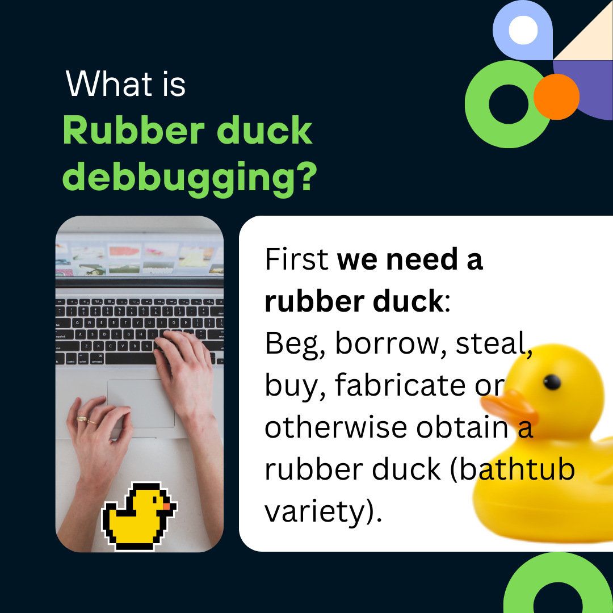

# Programming

Here I will try to put together a set of soft skills you need to have in order for you to be a successful software engineer.

## Debugging

Debugging is probably one of those things that is gonna be at some point far more important than knowing syntax or coding itself. You need to find the root cause, and know how to fix it. For that to happen you need to be equipped with arsenals like:

- Rubber duck debugging method.

  

  

  

  
