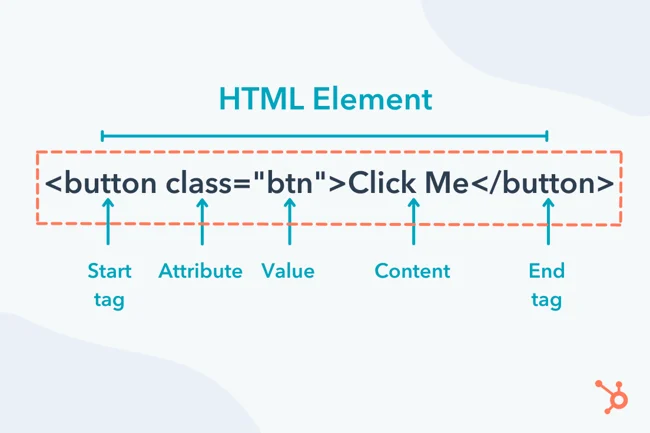

# HTML

- Stands for "**H**yper **T**ext **M**arkup **L**anguage".
- This markup language has its own dictionary, you can find it [here](https://html.spec.whatwg.org/).
- It is _semantic_. In fact originially it was intended to add meaning to scientific documents and describing them; **meaning it was intended to be semantic from the beginning**!
- We folks who write HTML are called _HTML Author_.
- HTML is World Wide Web's core ML.

- **Markup**: Marks that provides additional instructions or information for a document, so basically a markup describes a document.
  - **Tag**: A way to markup a document. Each tag and every is about meaning. And we can specify some **extra infos** via _attributes_.
- **Markup Language**: A consistent vocabulary that everyone knows what they intended to mean. So literally what this mean is that HTML by itself from the beginning was designed to communicate meaning.
- **Semantic**: Trying to convey a meaning, describing a document conceptually.
  - _HTML5_ is a buzzword referring to the modern technologies!
- **Author**: To contribute to write a document. We are adding meaning. So when we add tags we are authoring HTML; and we can be called HTML author

HTML = Document = Text document.

VSCode = Text editor = IDE stands for Integrated Development Environment.

**User Agent**: A software that acts on user's behalf.

- Agent: Someone who acts one someone's behalf.
- User wants HTML documents, user agent sits between user and that info, facilitating making the request and delivering the response.
- User Agents types:
  - Browsers (Showing info visually).
  - Screen Readers (Reading those info).
  - Googlebot (Categorizing and making infos available in Google search engine).

**Specification**:

- A precise piece of requirements which is being accepted as a standard.
- We have a specification for every technology; HTML Specification, CSS Specification, ...
- It is kinda our dictionary.
- They are living standards; obviously because they change.
- Normative: Things that are establishing a standard.
- Non-Normative: Things that are not establishing a standard, but rather explaining the spec for us.
- Author VS Implementor:
  - Authors: Devs who write HTML code.
  - Implementors: Those engineers that build browsers or other tools that interpret HTML documents.
- Content Model: What the specification says you can put inside an element.
  Different kind of contents: Metadata, Flow, Sectioning, Heading, Phrasing, Embedded, Interactive.

# FAQ

- Tag VS Element: Element is, the tag + tag's content + tag's attributes.
  
- Is HTML the only ML: MLs are everywhere, for instance change a `.docs` file and change its extension to `.zip`. Now extract it. Open the extracted folder in VSCode and there you have it, it is a bunch of XML files.
- And the following code is a different ML

  ````markdown
  # This is the biggest possible header

  This is a code:

  ```html
  <html>
    <head></head>
    <body>
      Hello world
    </body>
  </html>
  ```

  This is a single line code: `<html></html>`

  This is an ordered list:

  1. Number 1

     - temp 1
     - temp 2

  2. Number 2
  3. Number 3

  This is an unordered list:

  - One
  - Two
  - Three
  ````

# DOCTYPE

Its sole purpose is to prevent a browser from switching into so-called "quirks mode" when rendering a document ([ref](https://developer.mozilla.org/en-US/docs/Glossary/Doctype)).
What is _Quirks Mode_? A way of differantiating between HTML standards, **used by browsers** ([ref](https://developer.mozilla.org/en-US/docs/Web/HTML/Quirks_Mode_and_Standards_Mode)).

DOCTYPEs are for backward compatibility and preventing browsers from using something that they deem better.

```html
<!-- https://www.w3.org/wiki/Doctypes_and_markup_styles -->
<!-- 4.01 -->
<!DOCTYPE html PUBLIC "-//W3C//DTD HTML 4.01//EN" "http://www.w3.org/TR/html4/strict.dtd">
<!-- 5 -->
<!DOCTYPE html>
```

# html

The html element represents the root of an HTML document. Authors are encouraged to specify a lang attribute on the root html element, giving the document's language.

- Category: None.
- Contexts in which this element can be used:
  - As document's document element: This means that the `<html>` element is used as the root element of an HTML document. It is the topmost element that contains all other elements.
  - Wherever a subdocument fragment is allowed in a compound document: This refers to scenarios where a smaller HTML document (a fragment) can be embedded within another document. A common example of this is using an `<iframe>` to embed a separate HTML document within a larger HTML document. The embedded HTML document within the `<iframe>` will also have its own `<html>` element as the document element.
- Content model: A `head` element followed by a `body` element.


# head

The `head` element represents a collection of metadata for the Document.

- Categories: None.
- Contexts in which this element can be used: **As the first element** in an `html` element.
- Content model: One or more elements of _metadata content_.

# body

The `body` element represents the contents of the document.

- Categories: None.
- Contexts in which this element can be used: **As the second element** in an `html` element.
- Content model: Flow content.

# meta

What is metadata? Metadata refers to data that provides information about other data within an HTML document.

In other word Metadata is data that explains what some other data means. E.g. title, style, meta, etc

- Categories: Metadata content.
- Contexts in which this element can be used:

  If the `charset` attribute is present: in a `head` element.

  If the `name` attribute is present: where _metadata content_ is expected.

- Content model: Nothing.

## Charset

It is used to specify the _character encoding_ for the HTML document. Character encoding is essential for correctly displaying text on web pages. And `UTF-8` covers almost all languages and symbols.

### ASCII

An acronym for **A**merican **S**tandard **C**ode for **I**nformation **I**nterchange, is a character encoding standard for electronic communication. Each character was mapped to a number between 0 to 256, stored in 8 bits of memory.

- 8 bits = 1 byte
- ```py
  # Python
  print(ord("\n"))
  print(ord("A"))
  print(ord("a"))
  ```
  ```js
  // JavaScript
  console.log("\n".charCodeAt());
  console.log("A".charCodeAt());
  console.log("a".charCodeAt());
  console.log(String.fromCharCode(10));
  ```

### Modern area

ASCII was not up to the task so we come up with **Unicode character set**.

- It contains billion of characters, as such it can support pretty much any character that you want.
- Characters of most languages in the world can be used simultaneously.


BUT it is way too large, 4 times larger than what we had with ASCII. So we tried to compress this.

- UTF-32: **Fixed length** .The full unicode.
- UTF-16: **Fixed length** .A subset of unicode, used in some countries.
- UTF-8: **Dynamic length**; 1-4 bytes. Best practice when we wanna transfer data between computers. It does the job of UTF-32.
  But is way more compressed than UTF-32. With an over lap of ASCII.

[Visual presentation](https://www.linkedin.com/posts/kasir-barati_ascii-unicode-standard-activity-7212033903266537473-m9Ox?utm_source=share&utm_medium=member_desktop). You can see the ASCII codes [here](https://en.wikipedia.org/wiki/ASCII).

# title

The `title` element represents the document's title or name. For example it is shown in a user's history or bookmarks, or in search results. There must be no more than one `title` element per document.

- Categories: Metadata content.
- Contexts in which this element can be used: In a `head` element containing no other `title` elements.
- Content model: Text that is not inter-element whitespace.
