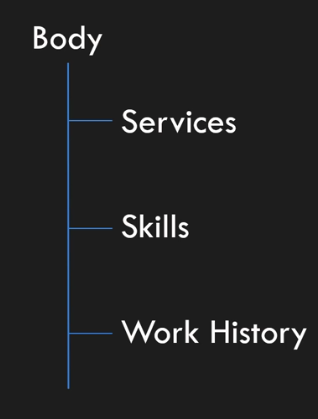
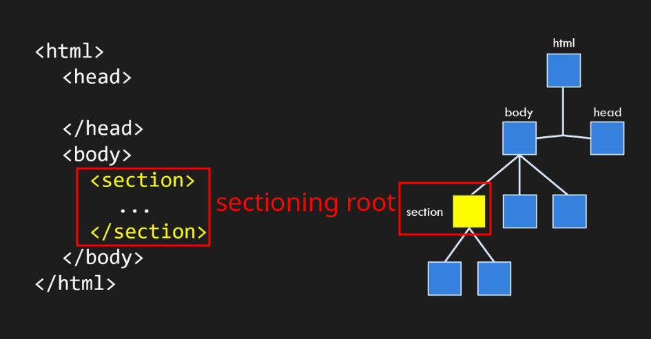
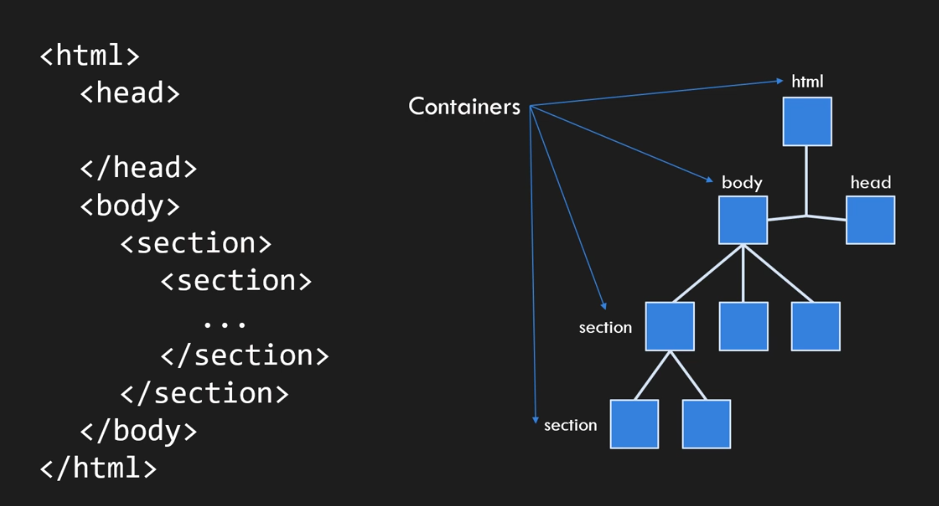
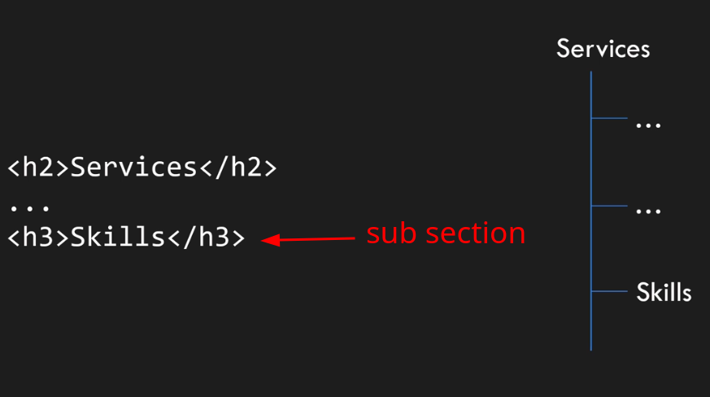
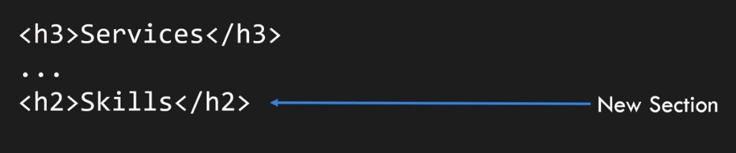
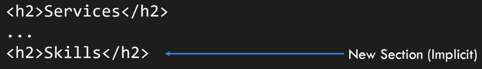
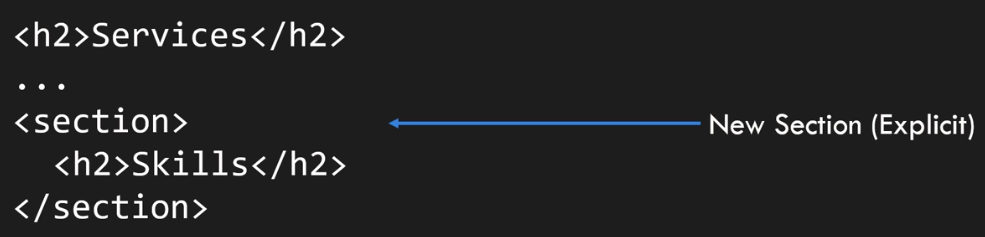

# Intro

_index.html_ usually is the default page that will be shown to the user.

# Outline

- `body` is a section.
- **Sections** create the outline of our HTML document. Some tools will create an outline for us from our HTML documents.
  
- **Sectioning root**: A node in the tree that represents the root of a new section in document
  
- **Container**: An element with nested elements inside it, e.g. `body` element or `html` element itself
  

## `section`

Thematic grouping of content: all the contents inside this element should go together. A general rule is that the `section` element is appropriate only if the element's contents would be listed explicitly in the document's outline.

- Categories: _Flow content_, Sectioning content, Palpable content.
- Contexts in which this element can be used: Where _sectioning content_ is expected.
- Content model: _Flow content_.

## `article`

The article element represents a complete, or self-contained, composition in a document, page, application, or site and that is, in principle, independently distributable or reusable, e.g. in syndication.

Some content examples that we can put inside an `article` element: This could be a forum post, a magazine or newspaper article, a blog entry, a user-submitted comment, an interactive widget or gadget, or any other independent item of content.

- **Self-contained composition**: It is complete in and of itself. Meaning if we separate it and put it in a new document.
- Categories: Flow content, Sectioning content, Palpable content.
- Contexts in which this element can be used: Where sectioning content is expected.
- Content model: Flow content.

## `header`

The `header` element represents a group of introductory or navigational aids. This element contains the sections heading elements: but it is not always wrapping h1-6 tags.

- Categories: Flow content, Palpable content.
- Contexts in which this element can be used: Where flow content is expected.
- Content model: Flow content, but with no `header` or `footer` element descendants.

## `h1`-`h6`

These elements represent headings for their sections. The heading level corresponds to the levels of nested sections. So `h1` has highest ranking and it's sub sections can take lower rank heading elements; `h2`-`h6`.

- A lower rank heading element implies a sub section:
  
- Using similar rank or higher implies start of a new section.
  

Headings and rank: They define the header of a section, you can markup and specify sections with this element in 2 ways:

1. Implicit: Like what we are doing here with Resume.
   
2. Explicit: Like how we are marking up the services or skills section's header
   

## `footer`

It is footer for its nearest sectioning content ancestor.
it is important to note that it is saying "sectioning content ancestor", and not any ancestor!
It contains about its section; who wrote it, license, etc

It is a _Flow content_ and Palpable content.
Cannot use a header or footer element inside it!

## `address`

It represents the contact info for the nearest `body` or `article` ancestor.
In this example this address "Schokoladenstraße 13, 12134, Berlin" is the contact info for the `body`, and `body` is a resume.

> [!CAUTION]
>
> **DO NOT** assume that you can wrap every address with an address tag since its description is clear: "the contact info for the nearest body or article ancestor".

- Categories: Flow content, Palpable content.
- Contexts in which this element can be used: Where flow content is expected.
- Content model:
  - Flow content,
  - **BUT NO** _heading content_ descendants, no _sectioning content_ descendants, and no `header`, `footer`, or `address` element descendants.

## `aside`

It represents a section of our page, and that content is tangentially related to the content around it but also can be considered separate. For example, if the main content is an article about climate change, an `aside` element might include a brief biography of a climate scientist mentioned in the article or a small fact box about recent climate statistics.

> [!NOTE]
>
> It's not appropriate to use the aside element just for parentheticals, since those are part of the main flow of the document.Parentheticals refers to additional information that is included within the main content flow of a document. These are usually brief, supplementary pieces of information that enhance the primary content but are still considered part of the main narrative or discussion. They are often enclosed in parentheses or dashes within the text.
> For example, consider the following text with a parenthetical:
>
> "HTML (HyperText Markup Language) is the standard language for creating web pages."
>
> In this sentence, the phrase "HyperText Markup Language" is a parenthetical because it provides additional information about what "HTML" stands for, but it is still part of the main flow of the text.

- Categories: Flow content, Sectioning content, Palpable content.
- Contexts in which this element can be used: Where sectioning content is expected.
- Content model: Flow content.
