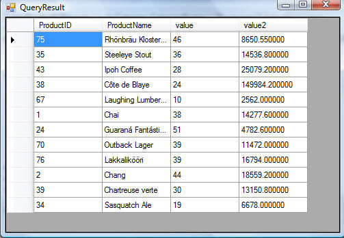

# Intro

- script-supporting elements are: `script` and `template`

# `p`

It represents a paragraph.

- A bunch of sentences about a particular topic (A group of sentences that are around a specific subject).
- We can also use `p` for general thematic grouping.

- Categories: Flow content, Palpable content.
- Contexts in which this element can be used: Where flow content is expected.
- Content model: Phrasing content.

# `blockquote`

It represents a section that is quoted from another source.

> [!CAUTION]
>
> You should put the source of quote outside of the `blockquote`, in case you wanna mention it.

- Categories: Flow content, Palpable content.
- Contexts in which this element can be used: Where flow content is expected.
- Content model: Flow content.

# `ul`

It represents a list of items where **the order of items is not important** (unordered list).

- Categories:
  - Flow content
  - if it has at least one `li` children: Palpable content.
- Contexts in which this element can be used: Where flow content is expected.
- Content model: Zero or more `li` and script-supporting elements.

# `ol`

It represents a list of items where **the order of items mater** (ordered list).

- `reversed` attribute: Number the list backwards
  - It is a boolean attribute: its presence means `true` and its absence means `false`.
- Categories:
  - Flow content
  - if it has at least one `li` children: Palpable content.
- Contexts in which this element can be used: Where flow content is expected.
- Content model: Zero or more `li` and script-supporting elements.

# `li`

It represents a list item.

- Categories: None.
- Contexts in which this element can be used:
  - Inside `ol` elements.
  - Inside `ul` elements.
  - Inside `menu` elements.
- Content model: Flow content.

# Association lists

Here we talk about `dl`, `dt`, `dd`.

## `dl`

It represents the term/name part of a _term description group_ in a _description list_ (`dl`) -- an association list.

- name-value group: A value or set of values, identified by a name/names.
- `dt` comes first and then `dd` elements.

- Categories:
  - Flow content.
  - If it has at least one _name-value group_ as children: Palpable content.
- Contexts in which this element can be used: Where flow content is expected.
- Content model:
  - Either: Zero or more groups each consisting of one or more dt elements followed by one or more `dd` elements, optionally intermixed with script-supporting elements.
  - Or: One or more `div` elements, optionally intermixed with script-supporting elements.

## `dt`

It represents the term/name, part of a term-description group in a description list (`dl` element).

- Categories: None.
- Contexts in which this element can be used:
  - Before `dd` or `dt` elements inside `dl` elements.
  - Before `dd` or `dt` elements inside `div` elements that are children of a `dl` element.
- Content model:
  - Flow content.
  - but with no `header`, `footer`, _sectioning content_, or _heading content_ descendants.

## `dd`

It represents the actual value/description/definition part of a term-description in a description list (`dl`).

- Categories: None.
- Contexts in which this element can be used:
  - After `dt` or `dd` elements inside `dl` elements.
  - After `dt` or `dd` elements inside `div` elements that are children of a `dl` element.
- Content model: Flow content.

# `main`

It represents the dominant content. A document **must not** have more than one main element that does not have the hidden attribute specified.

- Categories: Flow content, Palpable content.
- Contexts in which this element can be used: It's ancestor should be:
  - `html`.
  - `body`.
  - `div`.
  - `form` without an accessible name.
    - Having an accessible name means to have Accessible Rich Internet Applications or `aria-*` attributes.
  - Autonomous custom elements.
    ```html
    <!DOCTYPE html>
    <html lang="en">
      <head>
        <meta charset="UTF-8" />
        <meta name="viewport" content="width=device-width, initial-scale=1.0" />
        <title>Custom Element Example</title>
      </head>
      <body>
        <my-container>
          <main>Main content here</main>
        </my-container>
        <script>
          class MyContainer extends HTMLElement {
            constructor() {
              super();
              // Custom behavior or structure can be defined here
            }
          }
          customElements.define("my-container", MyContainer);
        </script>
      </body>
    </html>
    ```
- Content model: Flow content.

# `table`

It represents data with more than one dimension, in the form of a table.

- Tabular: Consisting of or presented in columns or tables.
- Categories: Flow content, Palpable content.
- Contexts in which this element can be used: Where flow content is expected.
- Its content model is a bit picky, It accept these in this exact order:
  1. Optionally a `caption` element
  2. Followed by zero or more `colgroup` elements
  3. Followed optionally by a `thead` element,
  4. Followed by either zero or more `tbody` elements, or one or more `tr` elements
  5. Followed optionally by a `tfoot` element,
  6. optionally intermixed with one or more script-supporting elements.

## `caption`

It represents the title of the `table` that is its parent. A `caption` can introduce context for a `table`, making it significantly easier to understand.

- Categories: None.
- Contexts in which this element can be used: As the first element child of a table element.
- Content model:
  - Flow content.
  - **BUT WITH NO** descendant `table` elements.

## `thead`

It represents the header of a table (column labels).

- Categories: None.
- Contexts in which this element can be used:

  We can use it only as a child of a `table` element,

  after any `caption`, and `colgroup` elements

  and before any `tbody`, `tfoot`, and `tr` elements,

  but only if there are no other `thead` elements that are children of the `table` element.

- Content model: Zero or more `tr` and script-supporting elements.

## `tbody`

It represent the body of a table.

- Categories: None.
- It can only be used as a child of a `table` element,

  after any `caption`, `colgroup`, and `thead` elements,

  but only if there are no `tr` elements that are children of the `table` element.

- Content model: Zero or more `tr` and script-supporting elements.

## `tfoot`

It represents footers for the parent `table` element.

- Categories: None.
- Contexts in which this element can be used:
  As a child of a `table` element,

  after any `caption`, `colgroup`, `thead`, `tbody`, and `tr` elements,

  but **only if** there are no other `tfoot` elements that are children of the `table` element.

- Content model: Zero or more `tr` and script-supporting elements.

## `tr`

It represents a row of cells in a table.

- Categories: None.
- Contexts in which this element can be used:
  - `thead`
  - `tbody`
  - `tfoot`
  - `table` if there are no `tbody`, and it should be after `caption`, `colgroup`, and `thead`.
- Content model: Zero or more `td`, `th`, and script-supporting elements.

## `td`

It represents a data cell in a table.

- Categories: None.
- Contexts in which this element can be used: As a child of a `tr` element.
- Content model: Flow content.

## `th`

Represents a header cell in a table.

- Categories: None.
- Contexts in which this element can be used: As a child of a `tr` element.
- Content model: Flow content, but with no `header`, `footer`, _sectioning content_, or _heading content_ descendants.
- The `th` element may have an `abbr` content attribute specified:
  - An alternative label for the header cell, to be used when referencing the cell in other contexts (e.g. when describing the header cells that apply to a data cell).
  - Typically an abbreviated form of the full header cell.
  - Can also be an expansion, or merely a different phrasing.

# Representing data in a `table` in the wrong way

You have a database. Then you wanna show your database data to the user. And you write a very complicated query to get that data.

Now the HTML author might have a tendency to representing them as they are in the database!

### Structure VS Semantic

Data structure is different than tag semantics. We have a database and in that database data is stored in tables but we should not map these two to each other. `table` element in HTML is not always the best way to represents data that we receive as response to our request to a backend, 3rd party API, etc.

So once we put the hat of a HTML author we should forget about the database and code. We must focus on how our users need those data:

- What device they will consume these data on?
- What is best way to present it to the user?
- What they'll be looking for?
- How they will use those data?

So maybe an **ordered list**, **unordered list**, **association list**, or a **card** would be the best option. With the HTML author hat on our head only user and user agent should be present in our head.

All those codes and work in the database and backend code was done so that we can fade them in the background. Now it is time for user experience.

Do not default to `table` element just because it was saved in tables in database.

> [!NOTE]
>
> I am not saying to completely throw `table` element in the dust bin. When `table` element is appropriate, use it. But use it judiciously, use it sparingly.

# `div`

First let's talk about `div`: `div` element has no special meaning at all. It represents its children. Authors are strongly encouraged to view the div element as **an element of last resort**, for when no other element is suitable.

- Categories: Flow content, Palpable content.
- Contexts in which this element can be used:
  - Where flow content is expected.
  - As a child of a dl element.
- Its content mode:
  - If it is a child of a `dl` element: one or more `dt` elements followed by one or more `dd` elements, optionally intermixed with script-supporting elements.
  - If it is not a child of a `dl` element: flow content.

So methodically, systematically, carefully moving through HTML specification and thinking about our document will help us to be a HTML author who markup a document like this:


And not like this:


This authoring is completely wrong, and it is happening because **they are too focused on making things work visually** -- thinking and spending too much time only for one user agent. So they are using HTML elements as hooks for CSS. So good HTML authors use elements to **add meaning** to the document.

## Correct use case of `div` element

```html
<article>
  <h1>My use of language and my cats</h1>
  <p>
    My cat's behavior hasn't changed much since her absence, except that she
    plays her new physique to the neighbors regularly, in an attempt to get
    pets.
  </p>
  <div lang="en-GB">
    <p>
      My other cat, coloured black and white, is a sweetie. He followed us to
      the pool today, walking down the pavement with us. Yesterday he apparently
      visited our neighbours. I wonder if he recognises that their flat is a
      mirror image of ours.
    </p>
    <p>
      Hm, I just noticed that in the last paragraph I used British English. But
      I'm supposed to write in American English. So I shouldn't say "pavement"
      or "flat" or "colour"...
    </p>
  </div>
  <p>I should say "sidewalk" and "apartment" and "color"!</p>
</article>
```
