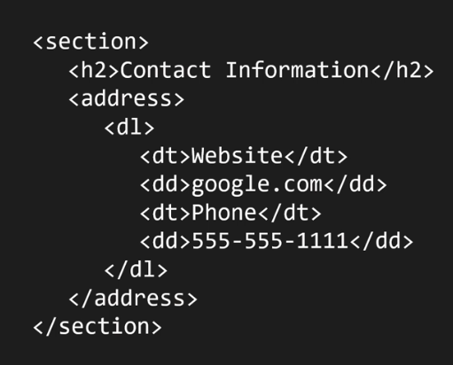
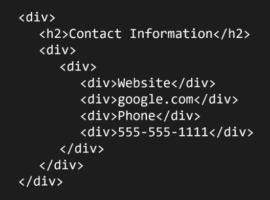

# Intro

- script-supporting elements are: `script` and `template`

# `p`

It represents a paragraph.

- A bunch of sentences about a particular topic (A group of sentences that are around a specific subject).
- We can also use `p` for general thematic grouping.

- Categories: Flow content, Palpable content.
- Contexts in which this element can be used: Where flow content is expected.
- Content model: Phrasing content.

# `blockquote`

It represents a section that is quoted from another source.

> [!CAUTION]
>
> You should put the source of quote outside of the `blockquote`, in case you wanna mention it.

- Categories: Flow content, Palpable content.
- Contexts in which this element can be used: Where flow content is expected.
- Content model: Flow content.

# `ul`

It represents a list of items where **the order of items is not important**.

- Categories:
  - Flow content
  - if it has at least one `li` children: Palpable content.
- Contexts in which this element can be used: Where flow content is expected.
- Content model: Zero or more `li` and script-supporting elements.

# `ol`

It represents a list of items where the order of items mater.

- `reversed` attribute: Number the list backwards
  - It is a boolean attribute: its presence means `true` and its absence means `false`.
- Categories:
  - Flow content
  - if it has at least one `li` children: Palpable content.
- Contexts in which this element can be used: Where flow content is expected.
- Content model: Zero or more `li` and script-supporting elements.

# `li`

It represents a list item.

- Categories: None.
- Contexts in which this element can be used:
  - Inside `ol` elements.
  - Inside `ul` elements.
  - Inside `menu` elements.
- Content model: Flow content.

# Association lists

Here we talk about `dl`, `dt`, `dd`.

## `dl`

It represents the term/name part of a _term description group_ in a _description list_ (`dl`).

- Categories:
  - Flow content.
  - If it has at least one _name-value group_ as children: Palpable content.
- Contexts in which this element can be used: Where flow content is expected.
- Content model:
  - Either: Zero or more groups each consisting of one or more dt elements followed by one or more `dd` elements, optionally intermixed with script-supporting elements.
  - Or: One or more `div` elements, optionally intermixed with script-supporting elements.

# Representing data in a `table` in the wrong way

You have a database.
Then you wanna show your database data to the user. And you write a very complicated query to get that data.
Now the HTML author might have a tendency to representing them as they are in the database!

## Structure VS Semantic

Data structure is different than tag semantics. We have a database and in that database data is stored in tables but we should not map these two to each other. `table` element in HTML is not always the best way to represents data that we receive as response to our request to a backend, 3rd party API, etc.

So once we put the hat of a HTML author we should forget about the database and code. We must focus on how our users need those data:

- What device they will consume these data on?
- What is best way to present it to the user?
- What they'll be looking for?
- How they will use those data?

So maybe an **ordered list**, **unordered list**, **association list**, or a **card** would be the best option. With the HTML author hat on our head only user and user agent should be present in our head.

All those codes and work in the database and backend code was done so that we can fade them in the background. Now it is time for user experience.

Do not default to `table` element just because it was saved in tables in database.

> [!NOTE]
> I am not saying to completely throw `table` element in the dust bin. When `table` element is appropriate, use it. But use it judiciously, use it sparingly.

# Using `div` element, the wrong way!

First let's talk about `div`:

- What does it mean? The `div` element has no special meaning at all. It represents its children.
- Authors are strongly encouraged to view the div element as an element of last resort, for when no other element is suitable.
- It is Flow content and Palpable content.
- Its content mode:
  - If it is a child of a `dl` element: one or more `dt` elements followed by one or more `dd` elements, optionally intermixed with script-supporting elements.
  - If it is not a child of a `dl` element: flow content.

So methodically, carefully moving through HTML specification and thinking about our document will help us to be a HTML author who markup a document like this:

And not like this:

This authoring is completely wrong, and it is happening because **they are too focused on making things work visually** -- thinking and spending too much time only for one user agent. So they are using HTML elements as hooks for CSS. So good HTML authors use elements to **add meaning** to the document.
