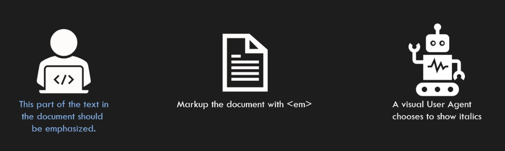
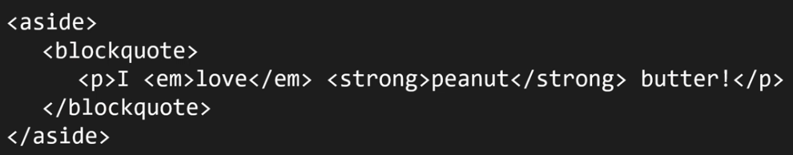
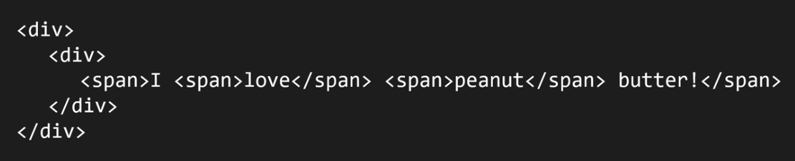

# `em`

It represents stress emphasis of its contents and **the placement of stress emphasis changes the meaning of the sentence**. Wrap a piece of content with multiple `em` to increase the level of stress. E.g.

```html
<p><em>Cats</em> are cute animals.</p>

<p>
  The simplest way to describe a function is with a
  <em>function type expression</em>. These types are syntactically similar to
  arrow functions:
</p>

<em>
  <em>I am stressed 2 times.</em>
</em>

<!-- .... -->
<em>
  <em>
    <em>I am stressed 3 times!</em>
  </em>
</em>
```

- Categories: Flow content, Phrasing content, Palpable content.
- Contexts in which this element can be used: Where phrasing content is expected.
- Content model: Phrasing content.

## The wrong way of using `em` element

This is not the correct thought process:


But you should be thinking like a true HTML author:



# `i`

It represents a span of text in an alternate voice or mood.

- It is representing a different quality of text, e.g.

  - A taxonomic designation:

  ```html
  <p>The <i>Homo sapiens</i> species emerged around 300,000 years ago.</p>
  ```

  - A technical term

  ```html
  <p>
    The function <i>setTimeout</i> in JavaScript is used to execute a function
    after a specified number of milliseconds.
  </p>
  ```

  - An idiomatic phrase from another language

  ```html
  <p>
    The concept of <i>いたちごっこ (itachigotsuko)</i> in Japanese culture
    refers to a game of tag.
  </p>
  ```

  - Transliteration

  ```html
  <p>
    The traditional Japanese martial art <i>judo</i> emphasizes skillful
    technique and discipline.
  </p>
  ```

  - A thought

  ```html
  <p>
    As she stared out the window, she couldn't help but think,
    <i>What if things had turned out differently?</i>
  </p>
  ```

- Categories: Flow content, Phrasing content, Palpable content.
- Contexts in which this element can be used: Where phrasing content is expected.
- Content model: Phrasing content.

# `strong`

It represents strong importance, seriousness, or urgency for its contents. It can be used in a _heading_, _caption_, or _paragraph_ to distinguish the part that really matters from other parts.

- Categories: Flow content, Phrasing content, Palpable content.
- Contexts in which this element can be used: Where phrasing content is expected.
- Content model: Phrasing content.

# `b`

It represents a span of text to which **attention is being drawn** for utilitarian purposes **without conveying any extra importance** and **with no implication of an alternate voice or mood**, such as key words in a document abstract, product names in a review, actionable words in interactive text-driven software, or an article lede.

- What is lede? In the context of journalism and writing, especially in newspaper or online articles, "lede" (sometimes spelled "lead") refers to the opening sentence or paragraph of an article. Its primary purpose is to grab the reader's attention and summarize the main point or theme of the article.
- Categories: Flow content, Phrasing content, Palpable content.
- Contexts in which this element can be used: Where phrasing content is expected.
- Content model: Phrasing content.

# `small`

The `small` element represents side comments such as _small print_.

- _Small print_ typically features disclaimers, caveats, legal restrictions, or copyrights.
- Do not wrap multiple paragraphs, lists, or sections of text with it (only for short runs of text).
- Categories: Flow content, Phrasing content, Palpable content.
- Contexts in which this element can be used: Where phrasing content is expected.
- Content model: Phrasing content.

# `br`

It represents a line break. `br` elements must be used only for line breaks that are actually part of the content, as in poems or addresses.

> [!CAUTION]
>
> A style sheet or user agent might change how line breaks are rendered, for instance as green dots, or as extra spacing.

- Categories: Flow content, Phrasing content.
- Contexts in which this element can be used: Where phrasing content is expected.
- Content model: Nothing.

# `span`

The `span` element **doesn't mean anything on its own**. Can be useful when used together with the global attributes, e.g. `class`, `lang`, or `dir`. It represents its children.

- Categories: Flow content, Phrasing content, Palpable content.
- Contexts in which this element can be used: Where phrasing content is expected.
- Content model: Phrasing content.

## The wrong way of using `span` element

Here is a marked up document with HTML and it is a meaningful, complying document with the HTML specification.



And now you can see the same document, but this time marked up in a way that is wrong:


