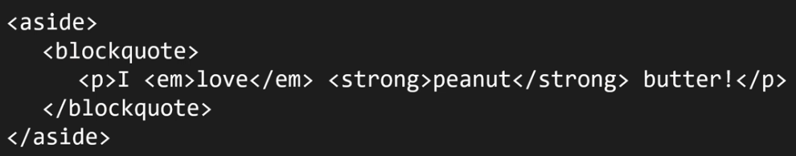
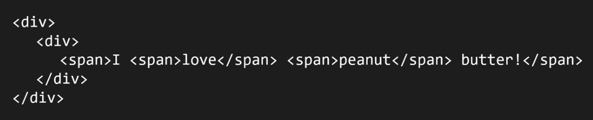

# The wrong way of using `em` element

This is not the correct thought process:

But you should be thinking like a true HTML author:

# The wrong way of using `span` element

Here is a marked up document with HTML and it is a meaningful, complying document with the HTML specification.

And now you can see the same document, but this time marked up in a way that is wrong:

