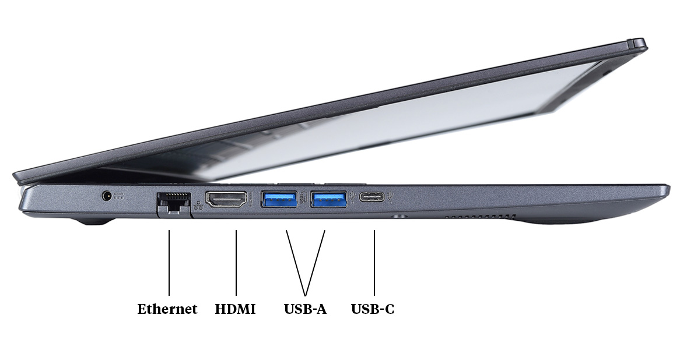

# TCP/IP model

- It is a layered architecture.
- It sorta runs our network.
- A protocol stack.

## First step, you, sending a request across the network


## Second step, server, responding with a response


## The entire process in one picture


## Pipe

- [Tin can telephone](https://en.wikipedia.org/wiki/Tin_can_telephone)
- We are gonna think that there is a nice reliable pipe that allows us to communicate.
- A program can talk to another program in another computer through this pipe.


## Socket

- In nerd terms we call them **socket**.
- Two process running on different computers.
- A bi-directional protocol of data (which is a series of data phone calls) between application.
- These applications can be anything, but the main point is that we are making a **phone call** to them from your computer with your application to another application in another computer:
  - On your computer it could be _telnet_, or your _browser_
  - On the other side it can be _web server_; _IIS_ (Internet Information Service), _Apache_, etc.
- So that **phone call** is what we call it a socket.


- But we also need to decide to which service/process we wanna talk to.

  - We can specify that with something called **port numbers**.

    

    We can think of them also as extension of the phones, when you call a company they usually ask you to enter the extensions of the party you'd like to talk to. Servers do the same, they ask you to enter extension of the _process_ you like to talk to.

    

- As always we have **standards** for port numbers, these are the ones **commonly** used for various network applications that serves us data ([List of TCP and UDP port numbers](https://en.wikipedia.org/wiki/List_of_TCP_and_UDP_port_numbers)).
- Here is a simple program/process that shows how it might looks when we are coding:

  

## Application protocol

- So we know that we have a socket.
- Our _application_ (process) ask the _socket layer_ to make a socket for it.
- So what we are gonna send and what we're gonna get back is what we call **Application protocol**.
  

### What is HTTP?

- It stands for Hypertext Transfer Protocol.
- It is the dominant protocol on the internet.
- It defines a set of rules to allow different applications to communicate with the server; e.g. browsers retrieve HTML documents from server over the internet with this _protocol_.

### What is Protocol?

- Protocol is a system of rules for two entities to communicate. In this case: how to transfer text from computer 1 (server) to computer 2 (client).
  
- A protocol is just things like the rules we have when talking over the phone:

  - Who talks first?
  - What you should say first?
  - What if the person does not answer?

- So HTTP protocol is really something like which side of the road should road in:
  

### Hypertext

- It is text that references other texts which the _user agent_ enables the user to immediately access them.
- **In simpler words**: A text that references others in other documents.
- Imagine you write a blog and then in it put some links to some other HTML documents that exits out there on the Internet.
- So basically **hypertext is just text that is not your normal text, but text that goes beyond being a simple text.**

  

### URL

- It stands for Uniform Resource Locator.

- It is the address of a unique resource on the internet.

  

- A URL is composed of different parts, some mandatory and others optional.

  

  - You might think of a URL like a regular postal mail address:
    - The scheme represents the postal service you want to use.
    - The domain name is the city or town.
    - The port is like the zip code.
    - The path represents the building where your mail should be delivered
    - The parameters represent extra information such as the number of the apartment in the building.
    - The anchor represents the actual person to whom you've addressed your mail.

- It's schema is like this:

  `scheme://host[:port]/path[?query]`

  - It's max length is 2083 character.
    - Some routers, or browsers might truncate the URL that goes beyond `2083`.
    - Receive a 414 status code if URL is too long (`414-URI too long`).
  - Case-sensitive except for the `scheme` and `host`.
    - Enforce case-sensitivity.
    - Or sanitize it.
  - Query parameters order is insignificant and do not matter.
  - Legal chars in a URL:

    - `A-Z`.
    - `a-z`.
    - `0-9`.
    - `-`, `~`, `_`, and `.` are the special valid characters in a URL.
    - You can use `/`, `?`, `#`, `[`, `]`, `@`, `!`, `$`, `&`, `'`, `(`, `)`, `*`, `+`, `;`, `=` and `,` too. But depending on where they've used you might need to URL escape them.

      - That's where percent-encoding comes into the picture. For example if you need to have a URL like this:

        `http://example.com/api/users?name=kasir&barati`.

        You need to percent-encode it to:

        `http://example.com/api/users?name=kasir%26barati`.

        You can see a list of them [here on Wikipedia](https://en.wikipedia.org/wiki/Percent-encoding#Reserved_characters).

### An HTTP request needs

1. URL: like we already talked about it, it is identifying a resource on a server. Since it is logged we **usually** do not include things like password in it.
2. Method: It specifies how a resource should be manipulated.
3. Headers: Key-value pairs that can be used for purposes such as proxies, caching, authentication, etc.
4. Body: Usually the state of resource that you intend to create or modify.

#### What is _server_?

A computer that manages access to resources; text, image, videos, etc.

> [!NOTE]
>
> Like we said here a server can send more than just text files, as such we have a general concept called hypermedia which means everything that is transferred in the internet. But remember that they are still text even though user agent interpret them as image, video or other formats of media.

#### what is _client_?

It can be your computer or a software that request resources or a service from the server.

### So what does a HTTP request look like


### Can you show me a response too

As you can see in the following image response can be anything; a HTML document, CSS files, JS files, image, etc.
And also if you are wondering what is that `<CRLF>` I can say it is a new like basically. And is there to separate _HTTP header_ from the _HTTP body_.


### Simplified version of a what happens when you go to a website

So all in all HTTP is a set of rules that specifies how clients and servers can communicate with each other -- send text back and forth. And these text are usually "marked up" (described, given meaning) with a markup language called HTML.


### Request response cycle in a browser


- https://www.dr-chuck.com/page2.htm
- So this is what is called a request response cycle and it is governed by a series of standards. These standards were established and to this day maintained and developed by a group called [IETF](https://www.ietf.org/).
  - IETF make those RFC documents which stands for request for comment (It is pretty ironic that even though that we've used these standards for decades we are still open to comments and rooms for improvements).
  - E.g. we can learn more about HTTP [here](https://datatracker.ietf.org/doc/html/rfc7230)

### Request response cycle with `openssl s_client` application/process/program

1. `openssl s_client -connect www.dr-chuck.com:443`
2. ```cmd
   GET https://www.dr-chuck.com/page1.htm HTTP/1.0
   Host: www.dr-chuck.com
   ```


### Request response cycle with `telnet` application/process/program

1. `telnet www.dr-chuck.com 80`
2. `GET http://www.dr-chuck.com/page1.htm HTTP/1.0`


### If you are really curious on how exactly it works here is a gif that might be more interesting


[Ref](https://www.linkedin.com/posts/brijpandeyji_we-all-know-typing-a-url-leads-us-to-a-website-activity-7206981158016839681-xVj3?utm_source=share&utm_medium=member_desktop)

> [!TIP]
>
> <a href="tcpIpVsTcpVsIp">#</a> <b>TCP/IP VS TCP VS IP</b>:
>
> - TCP: [a transport layer](https://www.rfc-editor.org/rfc/rfc793).
> - IP: [a network layer protocol](https://www.rfc-editor.org/rfc/rfc791).
> - TCP/IP:
>   - A protocol stack.
>   - Contains different protocols required for the data transfer from sender to receiver.
>
> &mdash; [Ref](https://stackoverflow.com/a/34545857/8784518).

# User Agents


## Browsers

These are all different type of browsers: Google Chrome, Firefox, Internet Explorer, Edge, Opera, Brave, Tor, Vivaldi, etc. But all of these browsers have these components in common, they are like subprograms:

- Networking: Dealing with the HTTP request.
- Storage: Storing things that have been downloaded.
- **Rendering Engine**: A software that converts HTML to visual representations.
- JavaScript Engine: Codes that manipulate the web page and many more things.


### A simple browser in Python

```py
from socket import socket, AF_INET, SOCK_STREAM

socket_1 = socket(AF_INET, SOCK_STREAM)

port = 80
host = "data.pr4e.org"
socket_1.connect((host, port))

# CRLF: \r\n
request = "GET http://data.pr4e.org/romeo.txt HTTP/1.0\r\n"
request = request + f"Host: {host}"
request = request + "\r\n\r\n"
encoded_request = request.encode(encoding="utf-8")

socket_1.send(encoded_request)

while True:
    response = socket_1.recv(512)
    if (len(response) < 1):
        break
    decoded_response = response.decode(encoding="utf-8")
    print(decoded_response)

socket_1.close()
```

#### Encode decode model of communication


#### Visualization of this piece of code


And if you run this program with python you'll see this in your terminal


# `a`

When we specify the `href` _attribute_ it represents a hyperlink (a hypertext anchor) labeled by its contents.

- `id` attribute: A **unique** value to a element in our HTML document.

  An element's **unique identifier** can be used for a variety of purposes, most notably as a way to link to specific parts of a document using [fragments](https://url.spec.whatwg.org/#concept-url-fragment), as a way to target an element when scripting, and as a way to style a specific element from CSS.

  

- Categories:
  - Flow content.
  - Phrasing content.
  - Palpable content.
  - If the element has an `href` _attribute_: Interactive content.
- Contexts in which this element can be used: Where phrasing content is expected.
- Content model:
  - Transparent.
  - **BUT NO** interactive content descendant, a element descendant, or descendant with the `tabindex` _attribute_ specified.

## Why it is called **anchor**?


### Rendering Engine

Browser's rendering engine will translate the HTML document into a visual representation; A web page. So it need to read the HTML document, and it is done by the _Parser_ which is a part of rendering engine. E.g.

- [WebKit](https://webkit.org/)
- [Blink](https://www.chromium.org/blink/)
- [Gecko](https://firefox-source-docs.mozilla.org/overview/gecko.html)

#### Parser

- Parse: analyze text, character by character.
- Parser parses the HTML document; it lookup for special characters in the given text in order to understand what it should do. _Parse_ means to analyze text character by character.


[All the credits go to this blog post](https://dev.to/arikaturika/how-web-browsers-work-parsing-the-html-part-3-with-illustrations-45fi)

##### Special characters

If you need to use characters such as `<` or `>` in HTML you'll probably soon realize that it is not as straight forward as you imagined. Therefore we came up with the idea of [named character references](https://html.spec.whatwg.org/multipage/named-characters.html#named-character-references).


# Document Object Model

> [!IMPORTANT]
>
> An object is a collection of data + _code_ that can accomplishes something. The data and those code together represent a thing.

> [!IMPORTANT]
>
> A model is a representation of a thing.

> [!IMPORTANT]
>
> Object Model is a collection of objects that represent a thing and provide access to change and examine that thing.

So back to the main topic: We call it DOM to shorten it. It is **an Object Model** that **represents an HTML document**. Then we can change/examine **what is presented via user agent** with it. So we are **NOT** changing the actual original HTML document. And since DOM is originated from HTML document it is also a tree and sometimes we refer to it as _The DOM tree_.

> [!NOTE]
>
> User agent build the DOM.

## Example

```html
<!DOCTYPE html>
<html lang="en">
  <head>
    <meta charset="UTF-8" />
    <meta name="viewport" content="width=device-width, initial-scale=1.0" />
    <title>Understanding the Critical Rendering Path</title>
  </head>
  <body>
    <header>
      <h1>Understanding the Critical Rendering Path</h1>
    </header>
    <main>
      <h2>Introduction</h2>
      <p>Some intro</p>
    </main>
    <footer>
      <small>Copyright 2017</small>
    </footer>
  </body>
</html>
```


# Developer Tools or Dev Tools

This a set of developer tools that help us to edit pages on the fly and diagnoses your documents in order to help us build better websites and build them faster. Learn more [here](https://developer.chrome.com/docs/devtools/overview).

## Inspector

We can see things like http request and responses in _network_ tab, generated DOM in _elements_ tab, and many more tabs which each one of them have their own purpose and objectives.


Refs:

- [Python for Everybody](https://youtu.be/8DvywoWv6fI?t=23040)
