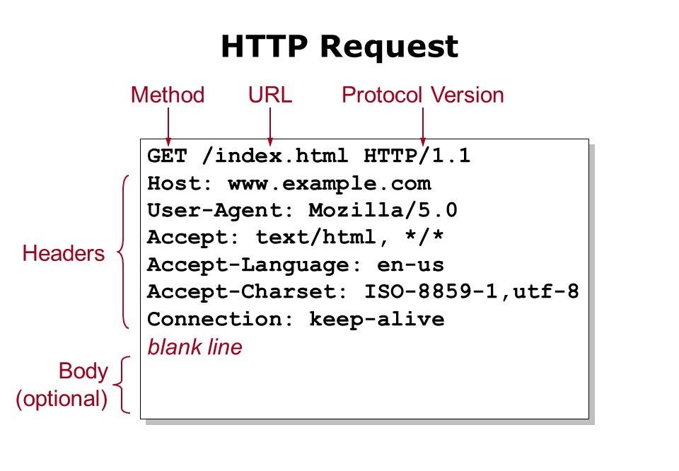

https://youtu.be/8DvywoWv6fI?t=23040

# What is HTTP?

It stands for Hypertext Transfer Protocol.

## What does Hypertext mean?

It is text that references other texts which the user agent enables the user to immediately access.

**In simpler words**: A text that references others in other documents, let's imagine you write a blog and then in it put some links to some other HTML documents that exits out there on the Internet.

So basically **hypertext is just text that is not your normal text, but text that goes beyond being a simple text.**

## What is Protocol?

Protocol is a system of rules for two entities to communicate. How to transfer Text from computer 1 (server) to computer 2 (client).

### What is server?

A computer that manages access to resources; text, image, videos, etc.

> [!NOTE]
> Like we said here a server can send more than just text files, as such we have a general concept called hypermedia which means everything that is transferred in the internet. But remember that they are still text even though user agent interpret them as image, video or other formats of media.

### Then what about client?

It can be your computer or a software that request resources or a service from the server.

## So what does a HTTP request look like

## Can you show me a response too

As you can see in the following image response can be anything; a HTML document, CSS files, JS files, image, etc.
And also if you are wondering what is that `<CRLF>` I can say it is a new like basically. And is there to separate _HTTP header_ from the _HTTP body_.

## Simplified version of a what happens when you go to a website

So all in all HTTP is a set of rules that specifies how clients and servers can communicate with each other -- send text back and forth. And these text are usually "marked up" (described, given meaning) with a markup language called HTML.

### If you are really curious on how exactly it works here is a gif that might be more interesting

[ref](https://www.linkedin.com/posts/brijpandeyji_we-all-know-typing-a-url-leads-us-to-a-website-activity-7206981158016839681-xVj3?utm_source=share&utm_medium=member_desktop)

# User Agents

## Browsers

These are all different type of browsers: Google Chrome, Firefox, Internet Explorer, Edge, Opera, Brave, Tor, Vivaldi, etc. But all of these browsers have these components in common, they are like subprograms:

- Networking: Dealing with the HTTP request.
- Storage: Storing things that have been downloaded.
- **Rendering Engine**: A software that converts HTML to visual representations.
- JavaScript Engine: Codes that manipulate the web page and many more things.

### Rendering Engine

Browser's rendering engine will translate the HTML document into a visual representation; A web page. So it need to read the HTML document, and it is done by the _Parser_ which is a part of rendering engine.

#### Parser

Parser parses the HTML document; it lookup for special characters in the given text in order to understand what it should do. _Parse_ means to analyze text character by character.

# Document Object Model

> [!IMPORTANT]
> An object is a collection of data + function that can accomplish things. The data and those functions together represent a thing.

> [!IMPORTANT]
> A model is a representation of a thing.

> [!IMPORTANT]
> Object Model is a collection of objects that represent a thing and provide access to change and examine that thing.

We call it DOM usually though. It is an Object Model that represents an HTML document. Then we can change **what is presented via user agent** with it. So we are not changing the actual HTML document.

And since DOM is originated from HTML document it is also a tree and sometimes we refer to it as _The DOM tree_.

> [!NOTE]
> User agent build the DOM.

# Developer Tools or Dev Tools

This a set of developer tools that help us to edit pages on the fly and diagnoses your documents in order to help us build better websites and build them faster.

## Inspector

We can see things like http request and responses in _network_ tab, generated DOM in _elements_ tab, and many more tabs which each one of them have their own purpose and objectives.
