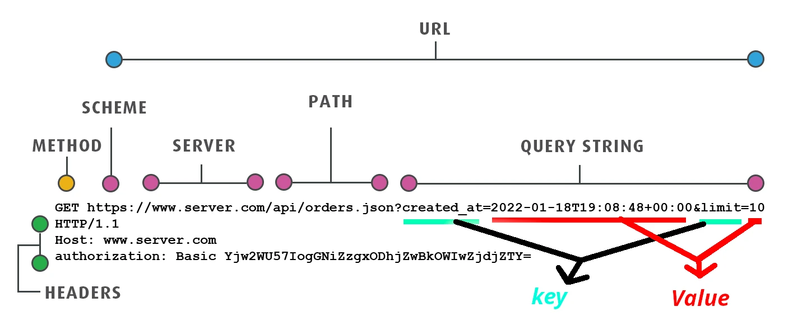
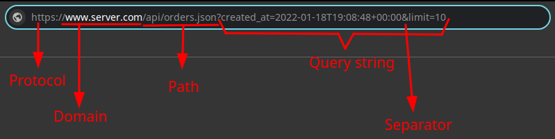
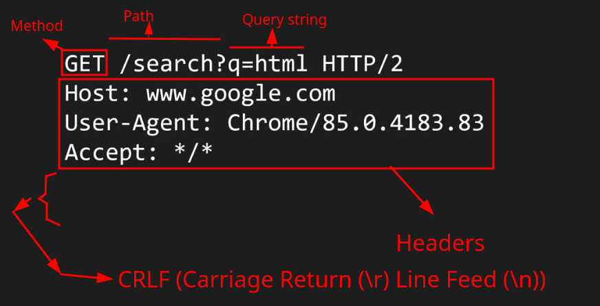
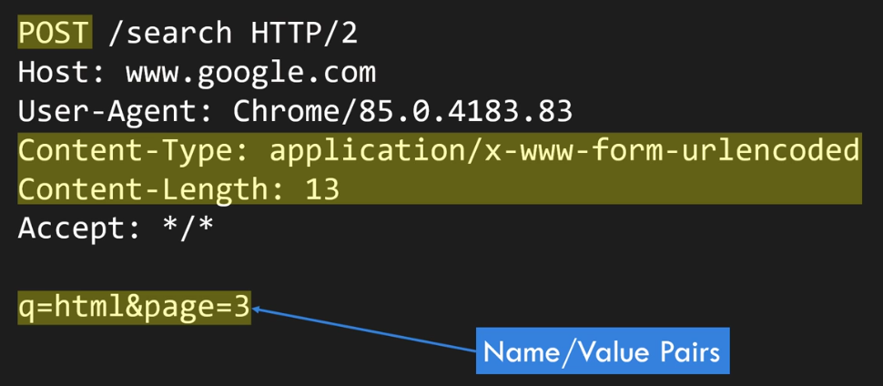

# `nav`

It represents a section of a page that links to other pages or to parts within the page. In simpler terms it is a section with navigation links.

> [!NOTE]
>
> Not all groups of links, its primarily use case is when we wanna markup a group of link that specifies major navigation in a page. E.g. `footer` usually have links to other pages such as about us or contact us, although the `footer` element can be sufficient by itself in that scenario too.

- We can have more than one `nav` element in our page. One could be primary and the other secondary.
- You do not have to use only lists inside it, you can use prose (paragraphs of text) too, as long as it is semantically your websites navigation section.

  ```html
  <nav>
    <h1>Navigation</h1>
    <p>
      You are on my home page. To the north lies <a href="/blog">my blog</a>,
      from whence the sounds of battle can be heard. To the east you can see a
      large mountain, upon which many <a href="/school">school papers</a> are
      littered. Far up thus mountain you can spy a little figure who appears to
      be me, desperately scribbling a <a href="/school/thesis">thesis</a>.
    </p>
    <p>
      To the west are several exits. One fun-looking exit is labeled
      <a href="https://games.example.com/">"games"</a>. Another more
      boring-looking exit is labeled
      <a href="https://isp.example.net/">ISP™</a>.
    </p>
    <p>
      To the south lies a dark and dank <a href="/about">contacts page</a>.
      Cobwebs cover its disused entrance, and at one point you see a rat run
      quickly out of the page.
    </p>
  </nav>
  ```

  It shows how you can use `nav` creatively, and that it is not restricted to just containing lists of links. The description is more narrative and immersive compared to a typical navigation menu.

  - **Narrative** means that the navigation links are embedded within a story or descriptive passage rather than being listed plainly. The example uses a storytelling approach to describe the different sections of the website. It talks about directions (north, east, west, south) and what the user might find there, akin to a journey or adventure.
  - **Immersive** means that the content draws the user into a more engaging and interactive experience. The prose creates a vivid mental image and a sense of exploration. Users can imagine themselves navigating through different regions (north, east, west, south) as if they are on an adventure.

- Categories: Flow content, Sectioning content, Palpable content.
- Contexts in which this element can be used: Where sectioning content is expected.
- Content model: Flow content.

# Engine

Here is how a GET HTTP request looks like:



And this is what you enter inside your browser:



This is a similar example:



Here is how a POST HTTP request looks sent by `form` element when its method is `post`:



# `form`

What is a form in general?

1. A component of a web page that has _form controls_, such as text, buttons, checkboxes, range, or color picker controls.
2. User interact with a form; provides data that can then be sent to the server for further processing.

How we can create a form?

1. Add a `form` element.
2. Add controls, most of them can be added with `input` element.
3. Label the control with `label` element.
4. Each part of a form is considered a paragraph, as such we put them all inside an `p`.
