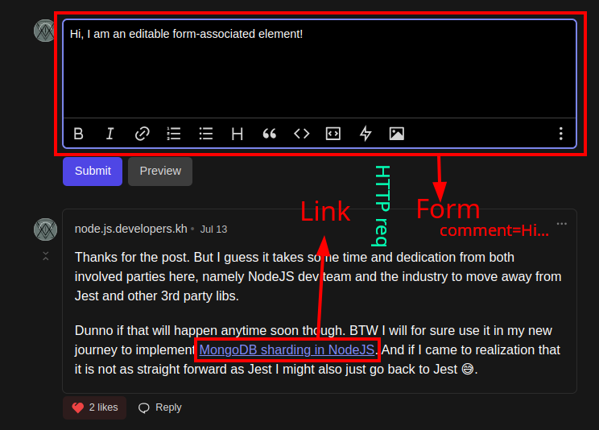
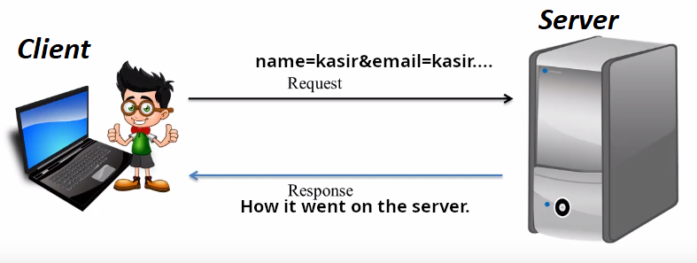
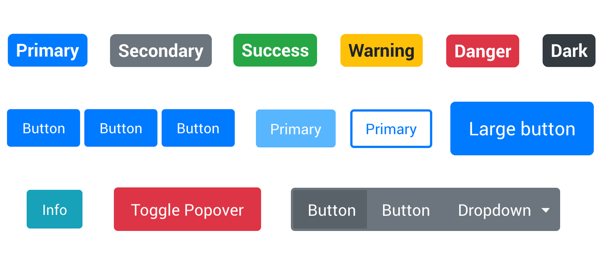

# `nav`

It represents a section of a page that:

- links to other pages.
- to parts within the page.

> [!NOTE]
>
> Although it is a section with navigation links, but not all groups of links.
>
> Its primarily use case is when we wanna markup a group of link that specifies major navigation in a page.

- `footer` usually have links to other pages such as about us or contact us, although the `footer` element can be sufficient by itself in that scenario too.
- We can have more than one `nav` element in our page. One could be primary and the other secondary.
- Only lists? Nope, you can use prose (paragraphs of text) too, as long as it is semantically your websites navigation section.

  ```html
  <nav>
    <h1>Navigation</h1>
    <p>
      You are on my home page. To the north lies <a href="/blog">my blog</a>,
      from whence the sounds of battle can be heard. To the east you can see a
      large mountain, upon which many <a href="/school">school papers</a> are
      littered. Far up thus mountain you can spy a little figure who appears to
      be me, desperately scribbling a <a href="/school/thesis">thesis</a>.
    </p>
    <p>
      To the west are several exits. One fun-looking exit is labeled
      <a href="https://games.example.com/">"games"</a>. Another more
      boring-looking exit is labeled
      <a href="https://isp.example.net/">ISP™</a>.
    </p>
    <p>
      To the south lies a dark and dank <a href="/about">contacts page</a>.
      Cobwebs cover its disused entrance, and at one point you see a rat run
      quickly out of the page.
    </p>
  </nav>
  ```

  You can use `nav` creatively. The description is more narrative and immersive compared to a typical navigation menu.

  - **Narrative**: Navigation links are embedded within a story or descriptive passage. A storytelling approach to describe the different sections of the website.

    It talks about directions (north, east, west, south) and what the user might find there, akin to a journey or adventure.

  - **Immersive**: Content draws the user into a more engaging and interactive experience. The prose creates a vivid mental image and a sense of exploration.

    Users can imagine themselves navigating through different regions (north, east, west, south) as if they are on an adventure.

- Categories: Flow content, Sectioning content, Palpable content.
- Contexts in which this element can be used: Where sectioning content is expected.
- Content model: Flow content.

# HTTP Request

## `GET` request

Here is how a GET HTTP request looks like:

HTTP verb


- Name/value pair: A data with its label.

  <code>
  firstName=Kasir<span style="color:black;">&</span>lastName=Barati
  </code>

And this is what you enter inside your browser:


This is a similar example:


### `GET` request limitations

- You're average user can see what is being sent to the server.
- The more data you add to the query string, the longer the URL becomes.

  > It is RECOMMENDED that all senders and recipients support, at a minimum, URIs with lengths of 8000 octets in protocol elements [ref](https://www.rfc-editor.org/rfc/rfc9110#section-4.1-5).

  - Octet: A unit of digital information that consists of eight bits.
  - 8 bits = 1 byte.
  - **One character** is typically represented by **one byte**.
  - **BUT** extremely long URLs are usually a mistake in real world. URLs over 2,000 characters will not work in the most popular web browsers.

  [Learn more](https://stackoverflow.com/a/417184/8784518).

## `POST` request

Here is how a POST HTTP request looks sent by `form` element when its method is `post`:


Does not matter the **method** you're using, they key objective here is to send data (name/value) from the client to the server via HTTP.

> [!TIP]
>
> In the modern era usually JavaScript sends these HTTP requests to the server.

# `form`

It represents a _hyperlink_.

This _hyperlink_ **can** be manipulated through a collection of _form-associated elements_, some of which can represent editable values that can be submitted to a server for processing.

- Categories: Flow content, Palpable content.
- Contexts in which this element can be used: Where flow content is expected.
- Content model:
  - Flow content.
  - **BUT** with no form element descendants.



## What is a form in general?

1. A component of a web page that has _form controls_.
   - Text, buttons, checkboxes, range, or color picker controls.
   - They are also known as fields.
2. User interact with a form; provides data that can then be sent to the server for further processing.

### Field VS Control

- We usually use them interchangeably.
- But they also have their own connotation:
  - We say field when we are talking about data itself
  - And control when we are talking about what user sees in their browser.

## How we can create a form?

1. Add a `form` element.
2. Add controls, most of them can be added with `input` element.
3. Label the control with `label` element.
4. Each part of a form is considered a paragraph, as such we put relevant `label`s and `input`s all inside an `p` element.

## Form-associated elements

Elements with _form_ owner. Form owner here means nearest ancestor `form` element.

This is how browser generates the query string or request body in case of a HTTP request with _POST_ method.

# `input`

It represents a typed data field. It is typed, meaning it helps users to know what kind of info they should enter. We can specify attributes such as:

- `min`: Minimum value.
- `max`: Maximum value.
- `name`: Name of the element to use for form submission and in the `form.elements` API.
- `required`: Whether the control is required for form submission.
- `maxlength`: Maximum length of value.
- `autocomplete`: Hint for form autofill feature

- Categories:
  - Flow content.
  - Phrasing content.
  - `type` is not `hidden`:
    - Interactive content.
    - Palpable content.
    - Listed, labelable, submittable, resettable, and autocapitalize-inheriting form-associated element.
  - `type=hidden`: Listed, submittable, resettable, and autocapitalize-inheriting form-associated element.
- Contexts in which this element can be used: Where phrasing content is expected.
- Content model:Nothing.

# `label`

- Represents a caption in a user interface.
  - **Caption** refers to a descriptive or explanatory text associated with a user interface element.
- It can be associated to a _control_ using:
  - The `for` attribute.
  - Or by putting the _form control_ inside the `label` element itself.
- Categories: Flow content, Phrasing content, Interactive content, Palpable content.
- Contexts in which this element can be used: Where phrasing content is expected.
- Content model:
  - Phrasing content
  - NO descendant labelable elements unless it is the element's labeled control
  - No descendant label elements.

# Submitting data

We wanna send the data to the server:



## So we need buttons


## Not that one :joy:



### `input` element with `button` type

- A button with **no** default behavior.
- A label for the button must be provided in the `value` attribute.

### `input` element with `submit` type

- A button that, when activated, submits the form.
- A `value` attribute is the label of the submit button.

> [!NOTE]
>
> Caveats of these two elements is that we cannot have more granular control over the label.

### `button`

A `button` labeled by its contents. And the `type` attribute controls the behavior of the `button` when it is activated.

- Categories:
  - Flow content.
  - Phrasing content.
  - Interactive content.
  - Listed, labelable, submittable, and autocapitalize-inheriting form-associated element.
  - Palpable content.
- Contexts in which this element can be used: Where phrasing content is expected.
- Content model:
  - Phrasing content.
  - No interactive content descendant.
  - No descendant with the `tabindex` attribute specified.

# `select`

Represents a control for selecting amongst a set of options.

- Categories: Flow content, Phrasing content, Interactive content, Palpable content.
- Contexts in which this element can be used: Where phrasing content is expected.
- Content model: Zero or more `option`, `optgroup`, `hr`, and script-supporting elements.

## `option`

An `option` in a `select` element or as part of a list of suggestions in a `datalist` element.

- Attributes:

  - The `selected` attribute is a boolean attribute. It represents the default selectedness of the element.
  - The `label` content attribute, if specified, must not be empty.

    If the label attribute is missing or empty, the `label` for the `option` element defaults to the text content of the `option` element.

- Categories: None.
- Contexts in which this element can be used:
  - Child of a `select` element.
  - Child of a `datalist` element.
  - Child of an `optgroup` element.
- Content model:
  - If the element has a `label` attribute and a `value` attribute: Nothing.
  - If the element has a `label` attribute but no `value` attribute: Text.
  - If the element has no `label` attribute and is not a child of a `datalist` element: Text that is not inter-element whitespace.
  - If the element has no `label` attribute and is a child of a `datalist` element: Text.

> [!CAUTION]
>
> Tempted to use custom controls?
>
> User agents already have done extensive work to implement and render HTML native controls. So when we do that as a programmer we might receive users complains later. Because each form-associated control is implemented differently in each user agent and when we have a custom control it might works well with mouse and keyboard BUT poorly when they are being shown in another user agent; cell phones, etc.

# `textarea`

A multiline plain text edit control for the element's raw value.

- Attributes:
  - The `cols` attribute specifies the expected maximum number of characters per line.
  - The `rows` attribute specifies the number of lines to show.
- Categories:
  - Flow content.
  - Phrasing content.
  - Interactive content.
  - Palpable content.
- Contexts in which this element can be used: Where phrasing content is expected.
- Content model: Text.

# `input` element with the `radio` type

1. A bunch of `input` controls.
2. With the `type=radio` (They form a radio button group).
3. Where **only** one of them can be checked.
4. Since they all have the same `form` parent.
5. And same `name` attribute value.

# `input` element with the `checkbox` type

A two-state control that represents the element's checkedness state. On/off, check/unchecked.

# Grouping multiple controls

To group a batch of controls together, we can use the `fieldset` element. The title of such a group of controls is given by the first element in the `fieldset`, which has to be a `legend` element.

## `fieldset`

Represents a set of form controls (or other content) grouped together, optionally with a caption. Caption is given by the first `legend` element.

- Categories: Flow content, Palpable content.
- Contexts in which this element can be used: Where flow content is expected.
- Content model:
  - Optionally a `legend` element
  - followed by flow content.

## `legend`

Represents a caption for the rest of the contents of the legend element's parent `fieldset` element.

- Categories: None.
- Contexts in which this element can be used: As the first child of a fieldset element.
- Content model:
  - Phrasing content.
  - Optionally intermixed with heading content.
