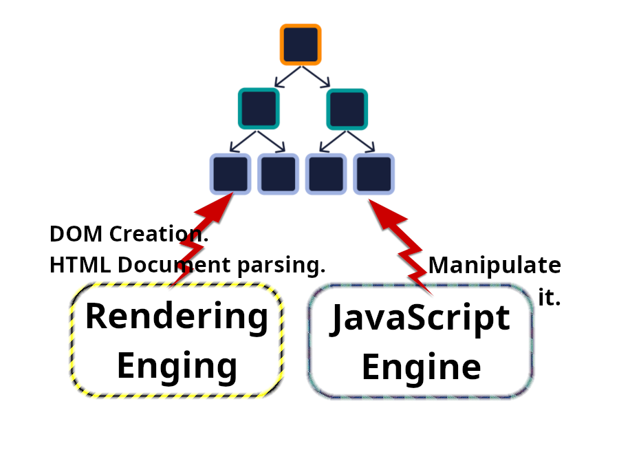
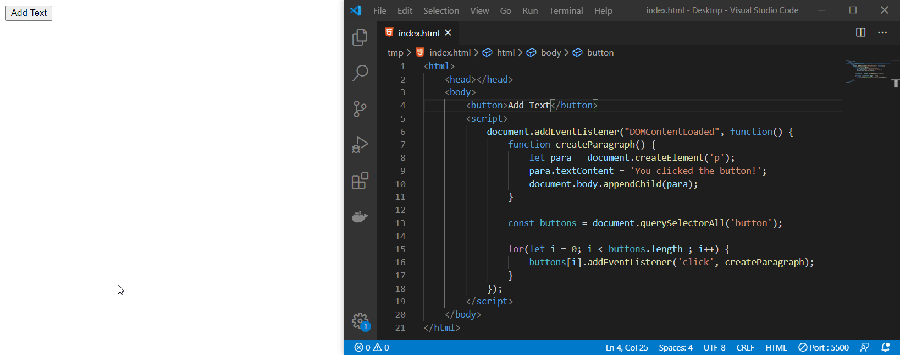
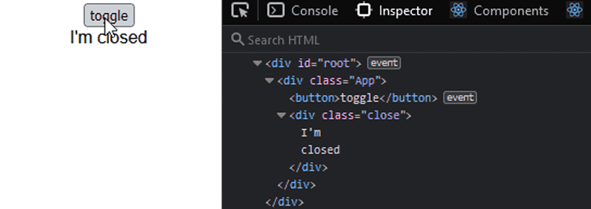

# JavaScript frameworks

So this is one of the topics that we might come across when we are authoring a HTML document. But not directly, rather when we are using frameworks or libraries that enables us to _manipulate DOM_ with JavaScript.

## DOM manipulation

Changing the DOM after it has been created from the HTML document ([parser](../05-the-browser-and-the-dom/README.md#parser)).

### Two component of a browser

#### HTML Parser

It is a sub-component of each rendering engine.

### An example of DOM manipulation through JS

Here we are only adding new element to the DOM.

In this example we are editing an element's content and its class.

## Most popular JS frameworks

These are the main stream frameworks: ReactJS, Angular, Vue. They all have HTML templates in order to manipulate DOM. They might look a bit different from one another but they're all working towards same goal.

| Framework | Code in the JS framework                                                               | Final HTML                               |
| --------- | -------------------------------------------------------------------------------------- | ---------------------------------------- |
| ReactJS   | https://github.com/kasir-barati/html-css/tree/main/07-frontend-frameworks/react.tsx    | `
Hello なると. What's up?
` 　 |
| VueJS     | https://github.com/kasir-barati/html-css/tree/main/07-frontend-frameworks/vue.vue      | `
User updated!
` 　            |
| Angular   | https://github.com/kasir-barati/html-css/tree/main/07-frontend-frameworks/angular.html | `
Purple luggage.
`　           |

These HTML templates might look a bit different but the point here is that the result is still ultimately a HTML document. So here is the most important question: <strong>Is the manipulated DOM still semantic?</strong>

So now that we realized that what ever we talked about it up until still applies. But when you're using these frameworks you might need to put some code to do something somewhere. That's probably why you might code like this. But is it the only viable option?

| Framework | Code in the JS framework                                                                      |
| --------- | --------------------------------------------------------------------------------------------- |
| ReactJS   | https://github.com/kasir-barati/html-css/tree/main/07-frontend-frameworks/better-react.tsx    |
| VueJS     | https://github.com/kasir-barati/html-css/tree/main/07-frontend-frameworks/better-vue.vue      |
| Angular   | https://github.com/kasir-barati/html-css/tree/main/07-frontend-frameworks/better-angular.html |

So, when we make good choices while marking up our documents it is going to improve readability and as a result maintainability.
