# CSS

CSS is **a language** for describing the rendering of structured documents (such as HTML and XML) on screen, on paper, [in speech](https://www.w3.org/TR/css-speech-1/), etc.

But before starting to learn ways of CSS we kinda should look at the topic of trees once more.

## Tree

So we wanna style part of our tree in a specific way. And to that end we need to know how to "query" that part.

> [!NOTE]
>
> Query: Asking a question about DOM (a collection of data).

So in other word each element is holding data and we traverse the DOM tree to find the element/s we are looking for.

Some examples:

- elements with a specific attribute value.
- a certain type elements.
- elements that are descendants of a particular element.
- all elements with a specific attribute which are direct children of another element.
- ...

### Selection

So querying is simply asking user agent to go through my DOM tree and select all the nodes that fullfil the requirements.

## CSS Specification

Like what we did in HTML we need to understand the [CSS spec](https://www.w3.org/Style/CSS/specs.en.html). And W3 is a group of people who maintains the CSS specifications. They are called [CSS Working Group](https://www.w3.org/groups/wg/css/participants/).

But first let's see what does "style sheet" mean in Cascading Style Sheet? Style sheet is **a collection of stylistic rules**.

### Modules

We **DO NOT** have only one CSS spec unlike HTML spec. They are **separated into modules**. And that's why we have _snapshots_.

> [!NOTE]
>
> CSS new features are designed in a way to not contradict or deprecate previous CSS features.

#### Snapshots

They collect all the specs/modules that define the current state of CSS in one snapshot. And we have a new snapshot almost every year. Note that it's primary audience is CSS implementors but it is beneficial for us as well to set/reset our mental model to what is accurate and correct.

##### Possible states of a spec/module:

They are sorted ascendingly. Meaning that the last item is the final stage.

1. **Working Draft**: working on it.
2. **Candidate Recommendation**: ready to be implemented **but** there might be some changes as they receive feedback from implementors.
3. **Recommendation**: ready to be implemented **but** this does not mean that it has been implemented in the browser too.

> [!TIP]
>
> For example you can look at [the blink's codebase](https://chromium.googlesource.com/chromium/src/+/refs/heads/main/third_party/blink/renderer/core/css/) to see their core CSS supported feature.

##### Possible state of a module's/spec's stability and implementation experience

Here we are sorting them descendingly. Meaning the first item is the last state for a module/spec (and the highest state too :slightly_smiling_face:).

1. **Stable**: everyone has implemented it, it had gone through various rigorous process.
2. **Fairly stable**: do not have actual testing in the browsers.
3. **Rough interoperable**: the implementations are similar enough to work well in most production websites, despite some differences, they can be considered _interoperable_.

##### CSS levels

Cascading Style Sheets does not have versions in the traditional sense; instead it has levels:

- **CSS Level 1**: Features defined in the original CSS.
- **CSS Level 2**: Adds more features to what was already in CSS Level 1.
- **CSS Level 2.1**: A revision of CSS Level 2 that fixes problems and clarifies things.
- **CSS Level 3**: And this one was build on top of the CSS Level 2 while it is using CSS2.1 spec as its core.

  > Each module adds functionality and/or replaces part of the CSS2.1 specification.

  And then it says:

  > The CSS Working Group intends that the new CSS modules will not contradict the CSS2.1 specification: only that they will add functionality and refine definitions.

###### CSS3?

By now you should have realized it that CSS3 is another buzzword favored by the crowd. Modules can move independently from level 1 to higher levels. And **the language as a whole does not have level anymore**.

> [!CAUTION]
>
> I misunderstood something after I read the spec. I though at some point in time all CSS Level 1 modules should've been moved independently to higher levels, therefore we will have an empty CSS level 1. But that is not the case. CSS Level 1 stays as the foundation for CSS and we just add new features on top of it.

> [!TIP]
>
> Modularity was added in CSS Level 3. Before that CSS was developed and released as a monolithic document. So CSS Level 3 divided the CSS into modules\*, updating and releasing them independently.
>
> \*Smaller pieces, focusing on specific areas like selectors or flex box.

## User agents stylesheet

It is a collection of stylistic rules that browser follows when displaying a HTML document.

But why we have it? To answer it we need to read [CSS PhD thesis section 1.3](https://www.wiumlie.no/2006/phd/#h-33). There it states that we needed to negotiate how things should be presented to the reader visually and there are times that author do not wanna define the presentation. So that's where we decided that browsers need default presentation of HTML.

In General 3 sources can define styles that should be applied to a document:

1. **Authors**: Developers/Programmers who author CSS.
2. **Readers**: End users can change styles, applied to a page in a browser with browser extensions or other tools(e.g. [Stylish](https://chromewebstore.google.com/detail/fjnbnpbmkenffdnngjfgmeleoegfcffe?hl=en)).
3. **Browsers**: [Here](https://chromium.googlesource.com/chromium/src/+/HEAD/third_party/blink/renderer/core/html/resources/html.css) is where our lovely blink is defining its default presentation for HTML documents.

### CSS core concept

Here is a break down of CSS language syntax.

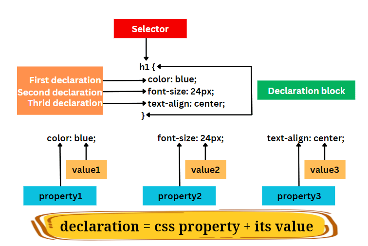

## CSS Level 2.1

In general we can focus on this level since it is the core of CSS Level 3 and we need to read the changed modules in their respective pages.

## Selectors module

- They're **pattern matching** mechanism.
- As of the time of writing this part (24.07.2024) **it is Level 3**.
- **NOTE**: read them from right to the left.

### Typed selectors

Match or find elements in the DOM based on their types, things like `p`, `section`, `article`, etc. E.g.

```css
p {
  font-size: 2rem;
}
```

Here for example we have the DOM, generated by Parser. And then the process of looking up for the patterns and then applying styles. We know that HTML data structure is a tree. And CSS utilized this feature of HTML in order to efficiently find/query/search HTML elements.

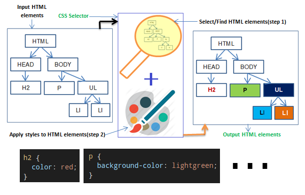

> Style sheet languages and structured document formats are mutually dependent on each other.

\- [Ref](https://www.wiumlie.no/2006/phd/#ch-structure).

So when we have one or multiple declarations in a declaration block, browser:

1. Traverses the DOM based on the selector.
2. And then applies the declarations to the previously selected elements.

### CSS Cascading and Inheritance

- ATM (19.07.2024) it is CSS Level 4.
- Inheritance means that **children inherit properties from their parents and, possibly their ancestors**.

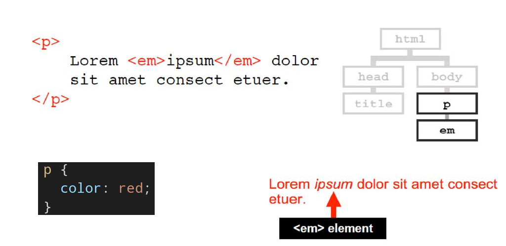

# Let's do some styling

- We can now call ourselves CSS authors.
- And we are authoring CSS.
- We need `link` element

## `link` element

So we wanna link our HTML document to an external document. The `link` element allows authors to link their document to other resources.

> [!NOTE]
>
> We can use resources/documents interchangeably. You only need to keep in mind that we transfer all kinds of files over the Internet.

- Attributes:
  - `href`: The address of the link(s).
  - `rel`: The types of link indicated (the relationships).
    - It accepts an _unordered set of unique space-separated tokens_: A set of space-separated tokens where none of the tokens are duplicated.
    - The link types are defined [here in section 4.6.7](https://html.spec.whatwg.org/multipage/links.html#linkTypes).
- Categories: _Metadata content_.
- Contexts in which this element can be used: Where _metadata content_ is expected.
- Content model: Nothing.

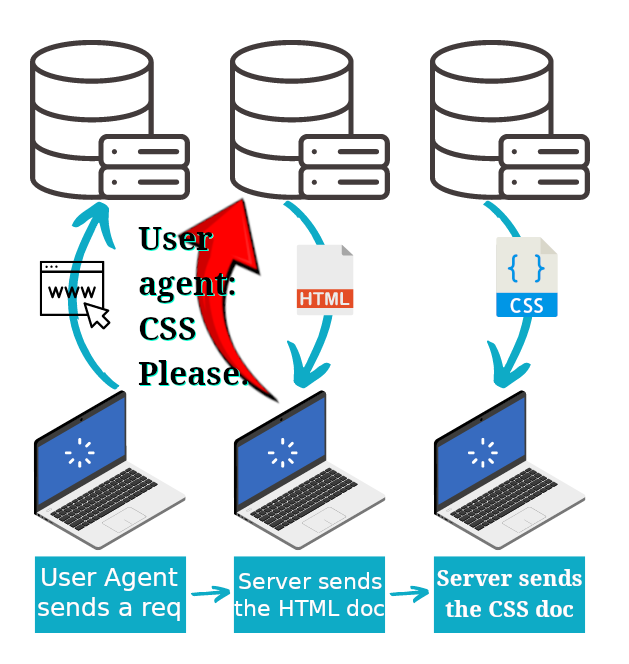

> [!NOTE]
>
> Because we can link our styles to the HTML document then we do not feel compelled to change my markup just for visual reasons.
>
> > authors would get their fair share of influence over the presentation and would not feel compelled to use presentational HTML and other tricks.
>
> \- [Ref](https://www.wiumlie.no/2006/phd/#h-33)

### Some performance considerations

In the contemporary era we use technologies such as [ReactJS](https://react.dev/) or [NextJS](https://nextjs.org/) to build our frontend applications but nonetheless knowing these things definitely won't hurt. On the contrary will help you to gain a deeper understanding of how modern technologies work:

1. Minify your CSS in order to have faster page load time.
2. Bundle all css files in one file to prevent multiple HTTP requests (although with HTTP version 2 we do not have to worry about this. [Ref](https://stackoverflow.com/a/49397312/8784518)).

# Universal selector

It represents any single element in the document tree in any namespace. In simpler word it selects the everything in the DOM tree.

```css
* {
  color: red;
}
```

# Attribute selectors

Enables us to look for elements who have a particular attribute or that attribute with a specific value.

## `[attribute]`

We care only about the attribute, and not value.

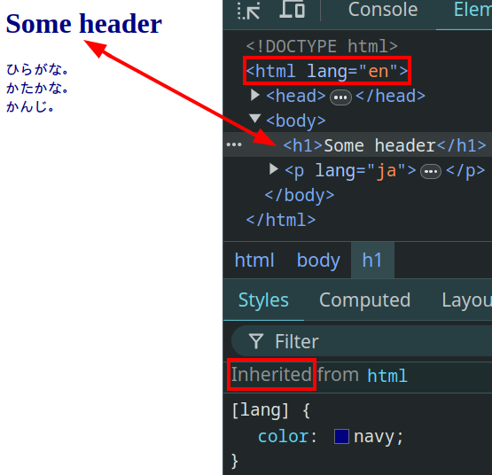

## `[attribute=value]`

```css
[lang="en"] {
  font-weight: bold;
}
```

Apply the _directions_ to all elements with the `lang` attribute and its value must be "en" and nothing else.

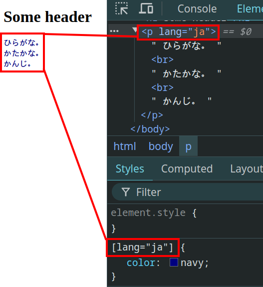

### `class` global attribute

A set of space-separated tokens[^1] representing the various classes that the element belongs to.

## `[attribute~=value]`

We use this selector to elements whose specified attribute value is a list of space-separated words, one of which matches the given value exactly. Like `class` attribute.

If "val":

- Contains whitespace, it will never represent anything.
  ```css
  [lang~="ja de"] {
    color: navy;
  }
  ```
- Is the empty string, it will never represent anything.
  ```css
  [lang~=""] {
    color: navy;
  }
  ```

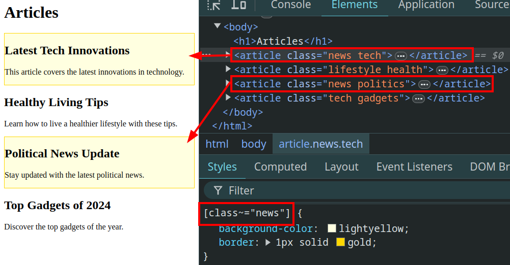

# ID selector

We could find it with [Attribute selector](./README.md#attribute-selectors) but since it is really common we have a simpler way to select them.

| ID selector       | Attribute selector      |
| ----------------- | ----------------------- |
| `#someId { ... }` | `[id="someId"] { ... }` |

## ID attribute in HTML spec

Its value:

1. must be unique amongst all the IDs in the element's tree.
2. must contain at least one character.
3. must **NOT** contain any ASCII whitespace[^2].

Besides those aforementioned regulations we do not have anything else from the HTML spec. But since they have use cases such as:

- linking to a particular part of the page it is good to have something that can be used in the URL.
- and we might wanna use them in JS it is a good idea to choose something easier to work with in JS.
- and do not start with the following characters, technically you can but then need to be wary of it all the time (in JS, CSS, and web APIs):
  - `.` since it is a css selector.
  - `-`.
  - `-` and then numbers.
  - numbers.
- and this is just what **I** do, follow `camelCase` convention for picking an ID.

# Class selector

Authors may use the "period"[^3] notation as an alternative to the attribute selector.

| Class selector          | Attribute selector              |
| ----------------------- | ------------------------------- |
| `aside.sidebar { ... }` | `aside[class~=sidebar] { ... }` |

> [!IMPORTANT]
>
> When you do not specify the element before it will assume your intention is to select all elements with that class. But this is also quite common.
>
> | Original form    | shorter form    |
> | ---------------- | --------------- |
> | `*.card { ... }` | `.card { ... }` |

Another part in the CSS spec is interesting is when they say that authors should not resort to using all `div` and `span` elements in order to do whatever they want as such those two do not have any meaning and little to no default styles. The reason for that is about meaning and the fact that each tag in HTML comes with its intrinsic meaning while our classes most of time have meaning only for us at best.

> [!TIP]
>
> ```css
> p.pastoral.marine {
>   color: red;
> }
> ```
>
> This rule matches when `class="pastoral blue aqua marine"` but does not match for `class="pastoral blue"`.

## Class attribute in HTML spec

> [!IMPORTANT]
>
> Authors are encouraged to use values that describe the nature of the content, rather than values that describe the desired presentation of the content.
>
> \- [Ref](https://html.spec.whatwg.org/multipage/dom.html#classes)

I also feel the necessity of helping you with something else too. And that is css class names, check out [this](https://www.youtube.com/watch?v=SLjHSVwXYq4) YouTube video on BEM. Although I personally prefer Tailwindcss.
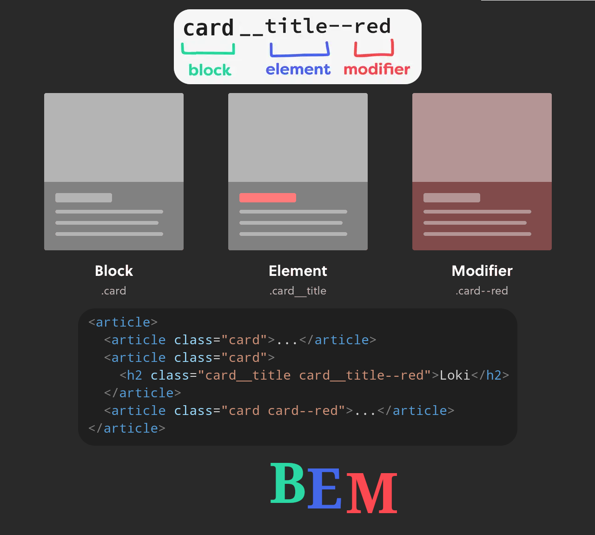

# Group a couple of selectors

Instead of duplicating code you can group them. It is a comma-separated list of selectors.

> [!TIP]
>
> This selector is called "Selector Lists" in CSS Level 4. That shows again that we do not need to worry too much about the CSS Levels.
>
> \- [Ref](https://www.w3.org/TR/selectors-4/#grouping).

```css
ul,
ol {
  font-family: monospace;
}

[lang="ja"],
article.card {
  direction: ltr;
}
```

> [!CAUTION]
>
> If one of the selectors is invalid the whole selector is invalid. Thus no stylistic rule for anyone.

# Combinator

We use them to be more flexible in terms of selecting different elements.

## Descendant combinator

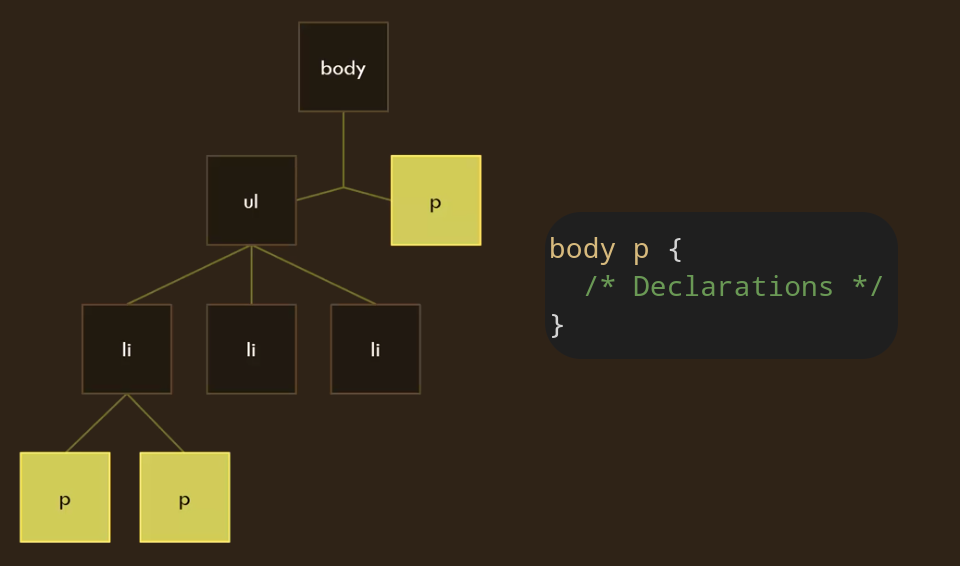

```css
section p a {
  color: darkgray;
}
```

Here we are saying to select all `a` elements within any `p` where the `p` is inside `section`. We do not wanna be supper specific about which child or descendant.

> [!CATION]
>
> Keep an open eye for [CSS inheritance](./README.md#css-cascading-and-inheritance) mechanisms.

## Child combinator

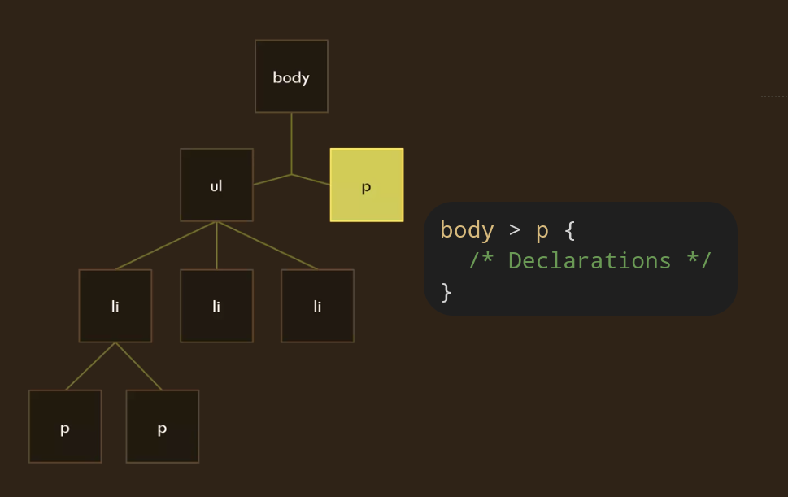

It is about the childhood relationship between two element.

```css
ul.list > li {
  font-size: 2rem;
}
```

Here it means that we are targeting all `li`s who are direct children of every `ul` while it has `list` as its class.

## Sibling combinators

### Next-sibling combinator

It is shown by a plus sign.

```css
article.card__title + p {
  /* declarations */
}
```

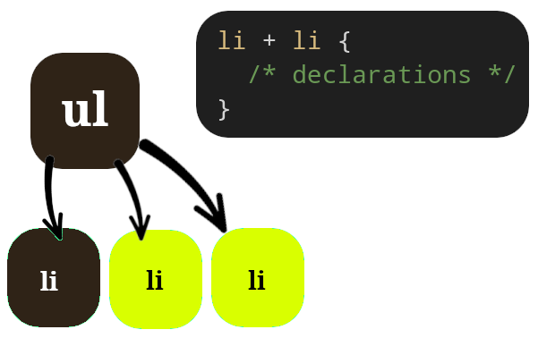

### Subsequent-sibling combinator

Selecting any element that comes after the sibling. Does not matter have many elements comes between the first sibling and the targeted sibling. it will be selected with this selector.

```css
article.card__title ~ pre {
  /* Declarations */
}
```

For example here we have our default style for the description but wanna add a border in case that this product was a featured one.

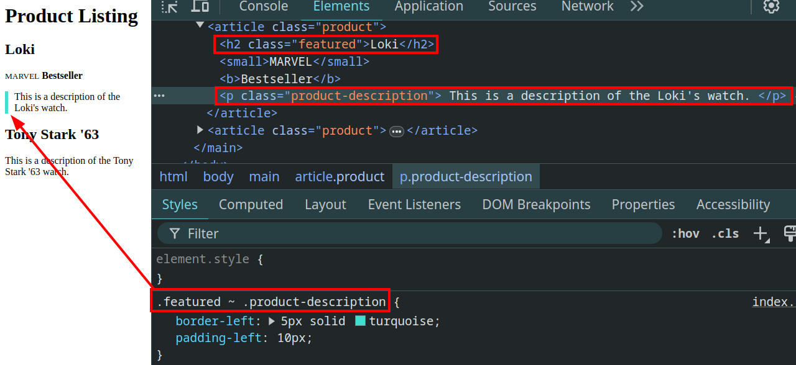

# How to see what's coming next to be one step ahead of others

So we can [go to the CSS spec, under "PAR­TIC­I­PATE / DRAFTS"](https://www.w3.org/Style/CSS/current-work) you can see what's the CSS working group is ready for being tested by implementors, and those who are still drafts.

## Browser supports

We wanna stay ahead of others in the game. Thus we need to check whether some working draft or candidate recommendation available in which browser? Yes, you check it out with [caniuse](https://caniuse.com/).

> [!NOTE]
>
> Sometimes we are limited to what business or our users need. In fact most of the times we cannot use the latest features, but rather checking what you can start using.

# Tree-Structural pseudo-classes

| Term         | meaning                                                                                                |
| ------------ | ------------------------------------------------------------------------------------------------------ |
| Pseudo       | Something that is not real                                                                             |
| Pseudo-class | Selectors that are not in the DOM tree, but instead calculated, it is the result of analyzed DOM tree. |

## `:root` pseudo-class

It represents an element that is the root of the document. E.g. in HTML this would be the `html` element.

## Child-indexed Pseudo-classes

We call them pseudo since there is nothing in DOM tree, and browser has to compute them.

### `:nth-child()` pseudo-class

```css
:nth-child(An + B [of S]?) {
  /* declarations */
}
```

- It selects elements based on a formula (`An + B`) within a group of siblings.
  - `An+B` is what is called microsyntax in CSS.
    - It helps us with determining indexes in a list.
    - `A`: integer step. Divide the list into groups of `A` elements.
    - `B`: offset. The starting point for the selection within each step.
      - if `B > 0` The first element has an index of 1 (**NOT** 0).
    - `n`: any positive integer or zero.
- `S`: Apply the `:nth-child` logic only to siblings that match a given selector (`S` selector).
  - If `S` is omitted, all siblings are considered.
- `even` keyword: `2n+0` (selects every even element).
- `odd` keyword: `2n+1` (selects every odd element).

| CSS                                                                                                                               | HTML                                                                                                                              | Visual outcome                                                     |
| --------------------------------------------------------------------------------------------------------------------------------- | --------------------------------------------------------------------------------------------------------------------------------- | ------------------------------------------------------------------ |
| https://github.com/kasir-barati/html-css/blob/6a77e0007cd1bfaf71b690034726adf570c028c0/08-css/pseudo-class-nth-child.css#L1-L9    | https://github.com/kasir-barati/html-css/blob/6a77e0007cd1bfaf71b690034726adf570c028c0/08-css/pseudo-classs-nth-child.html#L1-L11 | 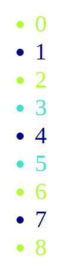    |
| https://github.com/kasir-barati/html-css/blob/6a77e0007cd1bfaf71b690034726adf570c028c0/08-css/pseudo-class-nth-child-of.css#L1-L3 | https://github.com/kasir-barati/html-css/blob/6a77e0007cd1bfaf71b690034726adf570c028c0/08-css/pseudo-classs-nth-child.html#L1-L11 | 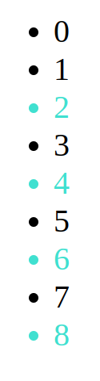 |

#### Caniuse `nth-child(An+B of S)`

### `:first-child`

Selects an element, if it is first among its inclusive siblings. This one is a bit tricky. In fact I made a mistake myself on this one. Let's see an example:

```html
<style>
  dl:first-child {
    color: turquoise;
  }
</style>
<dl>
  <dt>First Term.</dt>
  <dd>First Term's value</dd>
  <dt>Second Term</dt>
  <dd>Second Term's value</dd>
  <dt>Third Term</dt>
  <dd>Third Term's value</dd>
</dl>
```

What do you think it will do? It will apply the declarations inside the declaration block to the dl itself. But I wanted to apply it only to the first `dt`, "First Term". So I went straight to the CSS specification for Selectors Level 4, and then I found out my issue. Here is the revised version:

```css
dl *:first-child {
  color: turquoise;
}
```

[Can I use nth-child-of](./caniuse-nth-child-of.png)

## Typed Child-indexed Pseudo-classes

Exactly similar to the [Child-indexed Pseudo-classes](./README.md#child-indexed-pseudo-classes) **BUT** among elements of the same type.

### `nth-of-type()` pseudo-class

It acts like `nth-child(An+B)` (dividing them into groups and selecting, starting from B) but with the condition that the elements have have same type.

Here in [this example](https://github.com/kasir-barati/html-css/tree/main/08-css/nth-of-type.html) we are selecting `article`s within the comments section, and applying a little different style to the odd ones. Note that if we were using `#comments:nth-child(odd)` we would have get `h2` as our first selection since it do not care about type, all it is concerned with is whether the element is child of an element with "comments" ID or not.

#### How invalid HTML can get us into trouble

Here is a non-conforming HTML

```html
<article id="aboutMe">
  <header>
    <h2>
      <a href="#aboutMe">#</a>
      About me
    </h2>
    <p>
      Hi, I am Mohammad Jawad Barati, you're dungon master with an
      <em>insatiable</em> interest <strong>in tech</strong>.
      <aside>
        <small>
          Love to read
          <span lang="ja">まんが</span>
          but cannot do it now! I Need to learn
          <span lang="ja">にほんご</span>
          first.
        </small>
      </aside>
    </p>
    <p>Do NOT give up is my motto!</p>
  </header>
</article>
```

And let's try to apply some stylistic rules to the odd `p`s:

```css
#aboutMe p:nth-of-type(odd) {
  font-weight: bold;
}
```

And here is what you get, as you can see the _rendering engine_ of browser did a weird[^4] thing for us. It added an empty `p` element and the `aside` element is not inside the `p` element like we authored it in our HTML document:

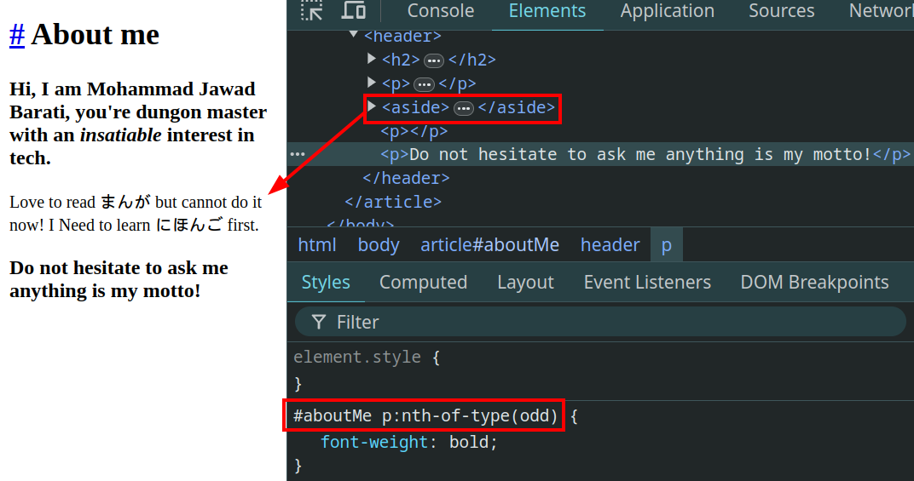

And here is the fixed version:

```html
<article id="aboutMe">
  <header>
    <h2>
      <a href="#aboutMe">#</a>
      About me
    </h2>
    <p>
      Hi, I am Mohammad Jawad Barati, you're dungon master with an
      <em>insatiable</em> interest <strong>in tech</strong>.
    </p>
    <aside>
      <small>
        Love to read
        <span lang="ja">まんが</span>
        but cannot do it now! I Need to learn
        <span lang="ja">にほんご</span>
        first.
      </small>
    </aside>
    <p>Do not hesitate to ask me anything is my motto!</p>
  </header>
</article>
```

# Location Pseudo-classes

Selectors that allow us to target hyperlink.

## `:link` & `:visited`

- The `:link` pseudo-class applies to links that have not yet been visited.
- The `:visited` pseudo-class applies once the link has been visited by the user.

> [!NOTE]
>
> After some amount of time, **user agents** may choose to return a visited link to the unvisited state.

> [!IMPORTANT]
>
> Even though we do not refresh the page UA knows that it needs to refresh the visual representation. It knows that since an event occurs and UAs are programmed to do specific things when an event occurs. In this example after we _click_ (event) on a link UA is programmed to apply the new style to the DOM in case the link was point to another part of the same HTML document.

Imagine you have a website with a navigation menu, and you want to style the unvisited links to make them stand out.

```css
a:link {
  color: lightblue;
  font-weight: bold;
}
a:visited {
  color: purple;
}
```

> [!INFO]
>
> Since it is possible for style sheet authors to abuse the `:link` and `:visited` pseudo-classes to determine which sites a user has visited without the user’s consent, UAs may treat all links as unvisited links or implement other measures to preserve the user’s privacy while rendering visited and unvisited links differently.

# User Action pseudo-classes

UA updates visual representation when certain events are triggered, user might be the initiator of those events.

## `:hover`

When you hover your mouse over the elements. Imagine you have a website with a navigation menu, and you want to highlight the menu items when the user hovers over them.

```css
nav a:hover {
  color: black;
  border-radius: 5px;
  background-color: yellow;
}
```

## `:focus`

And when you focus on an element which is focusable stylistic rules defined in this pseudo-class will be applied to the element/s. Imagine you have a form on your website, and you want to highlight the input fields when they receive focus to make it clear to users which field they are currently interacting with.

```css
input[type="text"]:focus,
input[type="email"]:focus,
textarea:focus {
  border-color: blue;
  box-shadow: 0 0 5px rgba(0, 0, 255, 0.5);
}
```

# Logical Combinations

## `:not`

This pseudo-class is useful when we wanna apply some stylistic rules to all elements that are selected by it but there are a few exception. So we can skip them with this selector.

Imagine you have a to-do list, and you want to style all items with a green background except those that are marked as "completed."

```css
li:not(.completed) {
  background-color: lightgreen;
  padding: 5px;
  margin: 2px 0;
}
.completed {
  background-color: lightgray;
  text-decoration: line-through;
}
```

Here is another example 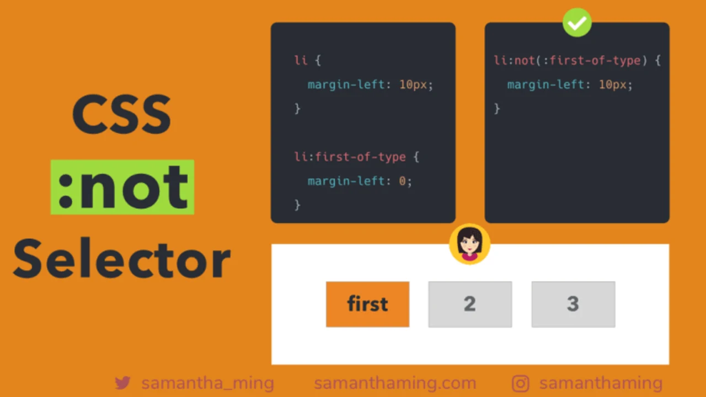

# Pseudo-elements

Similar to the idea of pseudo-classes, these are also non-existential elements in the actual DOM. But UAs are able to select something with it and tamper with its stylistic rules. In other word they are element beyond those elements explicitly created by the document language.

## `::first-letter`

Selects the very first letter. Imagine you have a blog or article, and you want to style the first letter of first paragraph to make the content visually appealing.

```css
p.first-paragraph::first-letter {
  float: left;
  color: #333;
  font-size: 2rem;
  font-weight: bold;
  margin-right: 0.3rem;
}
```

[^1]: i.e. A bunch of words separated by spaces.
[^2]: ASCII whitespace are TAB (U+0009), LF (U+000A), FF (U+000C), CR (U+000D), SPACE (U+0020).
[^3]: AKA full stop, U+002E, "."
[^4]: It is not so much weird. Remember when we said how _Parser_ reads the document character by character in order to create the DOM tree. It did just that and since according to HTML we cannot have an `aside` element inside a `p` element it assumed that we have skipped the closing `p` tag. So it closed it automatically for us and then added the `aside` as the next element. But then it saw a closing `p` tag while processing our HTML document. So it decided to open a `p` with no content and use that closing tag to close it ([LinkedIn Post](https://www.linkedin.com/posts/kasir-barati_html-css-debugging-activity-7220412882683858944-x-7-?utm_source=share&utm_medium=member_desktop)).

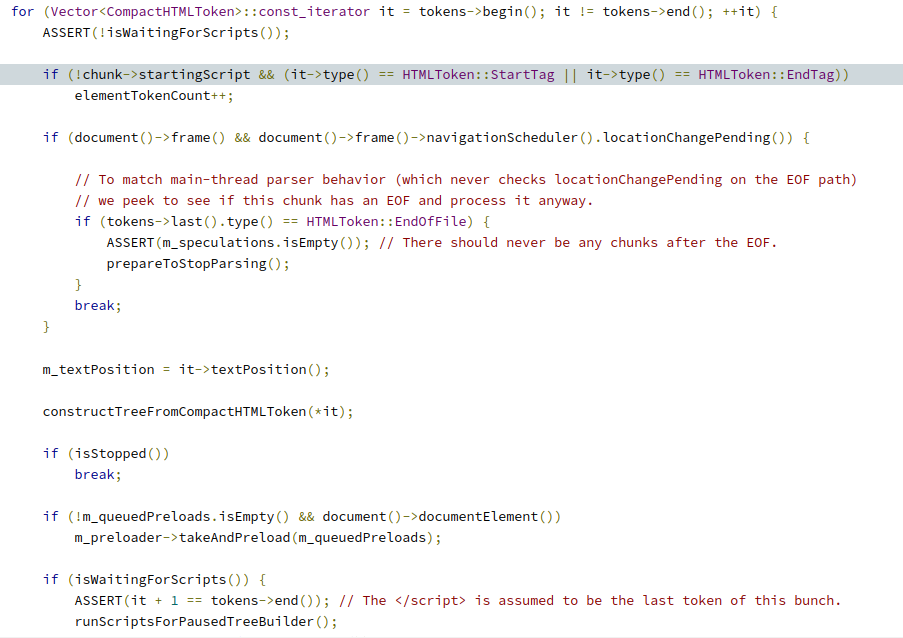

\- [Ref](https://chromium.googlesource.com/chromium/blink/+/refs/heads/main/Source/core/html/parser/HTMLDocumentParser.cpp#483)
