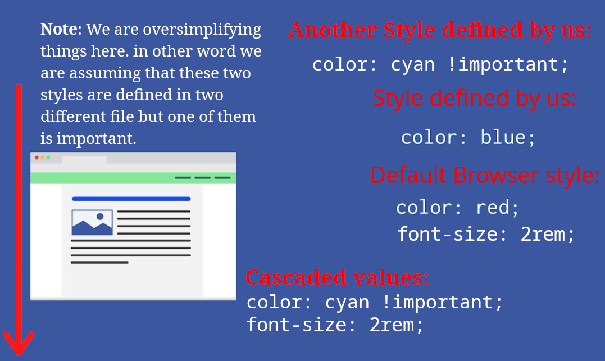

# Cascade

CSS stands for **C**ascading **S**tyle **S**heet. So let's first get something straight, inheriting properties from parents, or descendent is **NOT** cascade.


Here is what the Håkon Wium Lie had written in CSS thesis:

> The proposed scheme supplies the brower with an **ordered list** (cascade) of style sheets.

\- [Ref](https://www.wiumlie.no/2006/phd/#h-33)

And its definition is:

> The process of combining several style sheets and resolving conflicts between them.

\- [Ref](https://www.wiumlie.no/2006/phd/#cascading)

So here is it means in one sentence: It means that when we are trying to select same element in different CSS files or locations we have rules to decide which one should take precedence over which one and who will be the final winner.

So let's head to the [CSS Working Group Editor Drafts](https://drafts.csswg.org/) to construct a cement, concrete mental model:

1. The cascade takes an **unordered list** of declared values for a given property on a given element.
2. It **sorts them** by their declaration’s precedence as determined below **in descending order** of precedence:
   <details>
     <summary>
       Cascade Sorting Order
     </summary>
     <p>
       So the one that is on top (first item) will be the cascaded value.
       <br />
       The other important thing to pay attention to is that declarations should be resolved and not selectors, and that make sense. We can select a specific element if many ways. And what we are really concerned about is the declarations and not anything else.
       <br />
       
     </p>
     <figure>
       <ol>
         <li>Transition declarations</li>
         <li>Important user agent declarations</li>
         <li>Important author declarations</li>
         <li>Animation declarations</li>
         <li>Normal author declarations</li>
         <li>Normal user agent declarations</li>
       </ol>
       <figcaption>
         We are gonna ignore user declarations since they are out of our control zone and we really cannot do anything about them.
       </figcaption>
     </figure>
   </details>
3. Finally it **outputs a single cascaded value**.

## Picking the cascade value

When we have multiple declarations for same element in different place UA sort declarations based on their:

1. Origin.
2. Importance.
3. Specificity.
4. Order of appearance.

### Origins

| Origin        | Example                                             |
| ------------- | --------------------------------------------------- |
| User Agent    |  |
| Style element |  |
| External CSS  |    |
| Inline CSS    |        |

- We won't talk about User Origin here. But know this much that the user may be able to specify style information for a particular document ([learn more](https://superuser.com/a/560541)).
- And Conforming user agents _must_ apply a default style sheet.
- The rest all comes from authors.


> [!NOTE]
>
> We did not said overwritten, but rather ignored. It is because you can think about it that way but it is really ignored.
>
> We also ignored our "another style defined by us" for now. But we will get back to it later in order of appearance. So for now assume we only have one external CSS file.

### Importance

So here we are gonna talk about `important` vs "normal" styles. So here are a few notes:

- In fact we usually group the origin and importance together ([ref](https://drafts.csswg.org/css-cascade-4/#cascade-origin)).
- The UA's important styles take precedence over our styles:exclamation:
- It is very hard to manage. So use it only if:
  - You do not have much control over CSS, e.g. FusionAuth login page.

```css
h1 {
  color: cyan !important;
}
```

And here is how the UA sort them descending. Keep in mind that the first item is at the top of this pyramid.



### Specificity

So up until now we assumed we do not have conflicts at the same level. But if there is we have specificity to decide which stylistic rule should take precedence over the others.


> [!TIP]
>
> VSCode help us with calculating specificity: 

> [!CAUTION]
>
> Sometimes VSCode and similar tools might calculate specificity of a selector wrong. We will talk about `:where` later but just keep in mind that it's specificity should've been 0. While we are still on the subject, lemme clarify something, and that is that this is an older version of VSCode.
>
> But you get the idea, when you're dealing with latest features tools and browser might not have implemented them completely. That's where you need to go to the spec.
>
> 

```html
<style>
  /* Type selector (low specificity) */
  /* Selector Specificity: (0, 0, 1) */
  p {
    color: blue;
  }
  /* Class selector (higher specificity than type) */
  /* Selector Specificity: (0, 1, 0) */
  .highlight {
    color: green;
  }
  /* ID selector (higher specificity than class) */
  /* Selector Specificity: (1, 0, 0) */
  #special {
    color: red;
  }
</style>

<!-- Inline style (highest specificity) -->
<p id="special" class="highlight" style="color: purple;">
  This is a paragraph demonstrating CSS specificity.
</p>
```

### Order of appearance

Do you remember I said in the origin that we are ignoring the fact that we had two external CSS file. Here we are gonna talk about that. Assume if we try to apply a declaration to something and they all come from same origin, have same specificity, and importance. Then the one that comes last wins.


### Conclusion

When UA wants to determine the cascade value:

1. It looks at their origin (who is applying it) **AND** important declarations.
2. Then if still there was some sort of conflicts betweens declarations it will compare their specificity.
3. Lastly UA resorts to order of appearance.

## Cascade layers and `@import`

### `@import`

It enables us to import CSS files inside each other. It is very useful for being more flexible, modular, maintainable, and readable.

> [!NOTE]
>
> It should precede all other CSS rules.

Its accepts a _url_ or _string_.

```css
@import "some-local-file.css";
@import url("http://www.example.org/stylesheet2.css");
```

#### `url`

It is a resource locator. And we can pass a string to it.

```css
body {
  background: url("http://www.example.com/pinkish.gif");
}
```

> [!TIP]
>
> If you need to use CSS variables you need to use `src` instead of `url`. The reason for this is that `url` tries to parse the passed value to a [url-token](https://drafts.csswg.org/css-syntax-3/#typedef-url-token). As such we can do this instead:
>
> ```css
> :root {
>   --foo: "http://www.example.com/pinkish.gif";
> }
> body {
>   background: src("http://www.example.com/pinkish.gif");
>   background: src(var(--foo));
> }
> ```

##### Environment variables

Authors can define variables and use their value whenever needed by calling `var` function. Variable names are `custom-property-name`s, and start with `--` per standard for custom identifiers.

###### Defining Custom Properties

- Custom properties are properties where their name starts with `--*`, e.g. `--width`.
- They are case-sensitive, thus `--width` is different than `--WIDTH`.

###### Using Cascading Variables

The value of a custom property can be substituted into the value of another property with the `var()` function.

> [!TIP]
>
> Define default value for when `var` could not find the env variable by adding an comma after variable name. E.g. `var(--a,)`.

### Cascade layer

They help us by giving us a more structured way of organizing declarations within a particular cascade stylesheet. So we define layers and then define who should win over whom.

> [!NOTE]
>
> Unlayered CSS rules have higher weight when we compare them to the layered CSS rules..
