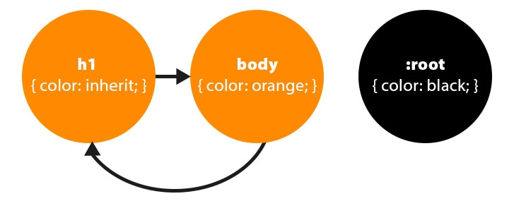
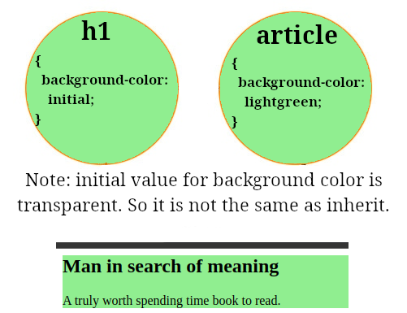

# Inherit

- The idea is that elements inherit CSS properties from the parents, or descendants.
- All the properties cannot be inherited.



# Initial

- What if it has not inherited anything? Then that's where CSS specifications defined initial values come in handy.
- You can change the value from inherit to initial:
  ```html
  <style>
    p {
      font-family: sans;
    }
    a {
      font-family: initial;
    }
  </style>
  <p>Some text and a <a href="#">link</a></p>
  ```
  In this case initial value totally depends on the UA.
- Another interesting CSS property is `background-color`:
  ```html
  <style>
    article {
      background-color: lightgreen;
    }
  </style>
  <article>
    <h1>Man in search of meaning</h1>
    <p>A truly worth spending time book to read.</p>
  </article>
  ```
  

## `outline` property

You might wanna add outline to a button, active form fields, image maps, etc to make them stand out. They are different from borders:

1. They do **NOT** take up space.
2. They can be non-rectangular.
3. They contribute to the ink overflow area.
4. UAs often render them when the element is in `:focus-visible` state.

Notes:

- This is a shorthand syntax.
- Elements won't inherit it from their parents unless you say it.
- No initial value defined in the UA's default stylesheet.

# Specified values

So now that we talked about specificity, cascade values, and initial/inherited value we reach to the last station and our destination. After UA goes through all of those previous steps it comes up with the specified value for a property.
