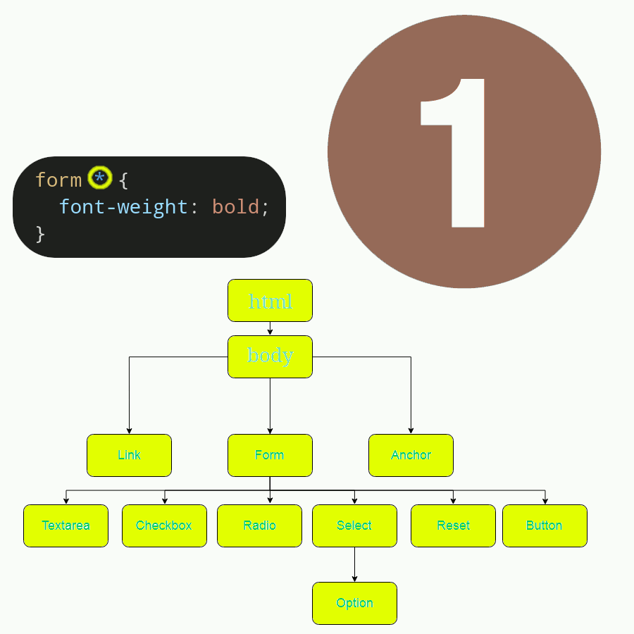

# Efficient selectors

How we can write optimized selectors?

- We know that UAs traverse the DOM tree and then try to find all the elements who matches our elements.
- Then we've been reading selectors from right to left: `form *`. And the browser also does the same thing.
- Key selector: the last selector.
- UA reads the key selector and then goes from the right to left to filter DOM tree nodes.



> [!TIP]
>
> So the key take away from this part is that if you really wanna be more efficient in your selectors you need to do it at the _key selector_.
>
> Meaning, adding more combinators is not the solution for having a more efficient selector. But rather a more specific _key selector_.
>
> E.g.
>
> ```css
> section p.post__published-at {
>   font-size: 0.3em;
> }
> #mainMenu {
>   position: fixed;
> }
> ```

And this optimizations can be really impactful in big web applications with a really huge DOM tree.
