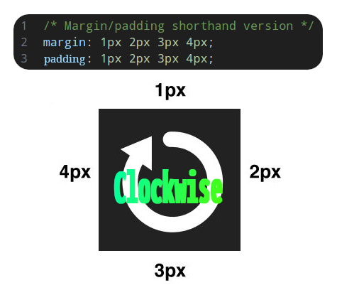
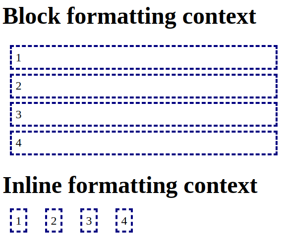

# Render tree

So we know that we have DOM based on our HTML document and a CSSOM which rules over which declaration should've applied to an element. And these two trees are combined by the UA into "render tree". And browser traverse this "render tree" to present it on the screen, so in other word after it constructed the "render tree" it'll:

1. Layout: Decide where each element should go, AKA Skeleton of our webpage.
2. Painting: Displaying elements on screen.


## Visual formatting model

An approach, a set of ideas taken, to render a [document tree](https://www.w3.org/TR/CSS2/conform.html#doctree) for a visual media.

- Media: Means of communication.
- How we are taking an abstract idea such as [document tree](https://www.w3.org/TR/CSS2/conform.html#doctree), and present it in a repeatable, organized and consistent way. We are determining how render tree should be shown to the user.
- It has been around since CSS level 2 ([ref](https://www.w3.org/TR/CSS2/visuren.html#visual-model-intro)).
- In [CSS thesis](https://www.wiumlie.no/2006/phd/#h-301) we can see different approaches and proposals that each had their own VFM. And CSS had certain objectives in mind:
  1. Visual richness beyond HTML alone capabilities.
  2. Simple enough for UAs to be implemented.
  3. Implementable for a wide range of devices.
  4. Support dynamic and static output devices (screens, printers).
  5. Consistent in different browsers: It should be specific enough so that all browsers shows the same thing.

# Box model

If you where going to design a way of taking a document tree and describing it in a consistent way to others, in a manner that for the most part everyone can comprehend the same thing, what you would do? You could:

<strong>Break it down into smaller parts.</strong>


> [!TIP]
>
> So in the context of CSS **every element** in a structured tree is a box, thus each one is a box.
> How boxes are layed out? It- is determined by:
>
> - Their size.
> - Their type.
> - Their position.
> - ...
>
> 

## Viewport & coordinates

When you're scrolling up and down a web page what's your mental model? We could either have a:

- Paged media: This of a book where you flip pages, you go from page one to page two.

  

- Continuous media: Think of an ancient scroll where we do not have the concept of pages, but rather at any given point in time we are focusing and seeing a portion of that scroll.

  

  You can look at [this example](./scroll.html) for understanding how scroll works. Basically all info are laid out in one page. It is not segmented into chunks. And we can scroll up and down to see new portions of it.

  

  And here is where the concept of coordinates comes into picture. Each element in a document tree, the page itself, the browser, and screen has a coordinate.

  

## Layout

1. User agent has the render tree.
2. And each element has its own box.
3. And now user agent by combining the first two ingredient can lay out elements in a web page on screen in the continuous media.


### Pixel


- The smallest controllable element on a device screen.
- A group of pixels will ultimately equate to a real world [dimension](https://www.w3.org/TR/css-values-4/#dimension) (centimeter, inch, or other metric units). And how many pixel is in that real world physical measurement is called "pixel density".

  - Higher pixel density = better quality (higher resolution. A clearer, more refined screen).
  - Its unit is "Pixels per inch (PPI)" or "Dots per inch (DPI)"

  

> [!NOTE]
>
> That's the reason why CSS ain't use pixel as unit of measurement. A `1px` tall font on a device might be readable while on another device it would be extremely tiny. Instead we have what is called [reference pixel](https://www.w3.org/TR/css-values-3/#reference-pixel). So in this way we're gonna have approximately same physical sizes on different devices.
>
> 
>
> ```css
> h1 {
>   font-size: 16px;
> } /* font-size = 16 * (1/96 inch) */
> ```

### CSS Values and Units Module

Units and values which each CSS property accepts is defined in [this CSS module](https://www.w3.org/TR/css-values-4).

#### Distance units

There are two types of length units: [relative](https://www.w3.org/TR/css-values-4/#relative-lengths) and [absolute](https://www.w3.org/TR/css-values-4/#absolute-lengths).

- Relative length: is measured relative to another length.
  - `em`: computed value of the `font-size` property of the element on which it is used. You can learn more by opening [this html file](./em.html) in your browser.
  - `rem`: computed value of the `em` unit on the root element (not from its parent).
- Absolute length: fixed in relation to each other and anchored to some physical measurement.

> [!TIP]
>
> Have you been wondering why you can skip specifying units for zero lengths? Because according to CSS spec "for zero lengths the unit identifier is optional".

## Value processing in CSS

The final value of a CSS property for a given element or box is the result of a multi-step calculation:


&mdash; [Ref](https://drafts.csswg.org/css-cascade-4/#value-stages).

## Intrinsic sizing

- Determines sizes **based on the contents** of an element, without regard for its context.
- UA calculates the size of each box and then if we've specified other intrinsic values it is gonna use them.
- `min-content` means shrink it AMAP until it can contain its content, in the following example longest word.
- `max-content` means grow indefinitely until you can cover all your content, in the following example the entire paragraph.

```html
<style>
  .w-min {
    width: min-content;
  }
  .w-max {
    width: max-content;
  }
</style>
<p class="w-min">
  Lorem, ipsum dolor sit amet consectetur adipisicing elit. Voluptatum sapiente
  iusto laborum, veniam ducimus eius ut nisi deleniti accusamus nobis voluptas
  praesentium vero quae incidunt blanditiis quia laboriosam ipsam libero?
</p>
<p class="w-max">
  Lorem ipsum dolor sit amet consectetur adipisicing elit. Ipsa culpa debitis,
  repellat quis voluptatem beatae impedit assumenda quisquam officiis illum
  similique, veritatis minima neque perferendis voluptatibus! Id nemo pariatur
  illo!
</p>
```

## Box sizing

These three modules are responsible in laying out the size of a box in a UA:

- [CSS Box Model Module](https://drafts.csswg.org/css-box-3/).
- [CSS Box Sizing Module](https://drafts.csswg.org/css-sizing-3/).
- [CSS Backgrounds and Borders Module](https://drafts.csswg.org/css-backgrounds-3/).

To summarize things we could say that we have:

1. Content: Where every elements content reside.
2. Border: The border around the content of the element.
3. Padding: The space between "border box" and "content box".
4. Margin: The space between the element and other elements.


> [!NOTE]
>
> Where `outline` css property stands in the CSS box sizing?
>
> 

> [!TIP]
>
> Usually in CSS we have these shorthand thingies that help us to write less markup:
>
> 
>
> ```css
> body {
>   /* all margins set to 2em */
>   margin: 2em;
> }
> body {
>   /* top & bottom = 1em, right & left = 2em */
>   margin: 1em 2em;
> }
> body {
>   /* top=1em, right=2em, bottom=3em, left=2em */
>   margin: 1em 2em 3em;
> }
> ```

### [`box-sizing` CSS property](https://drafts.csswg.org/css-sizing-3/#box-sizing)

| Name       | `box-sizing`                                 |
| ---------- | -------------------------------------------- |
| Value      | `content-box` or `border-box`                |
| Initial    | `content-box`                                |
| Applies to | all elements that accept `width` or `height` |
| Inherited  | no                                           |

- When we are saying `box-sizing: border-box` it means that it should reduce padding and border width from the width & height automatically, leaving us with only the specified values for the width and height + margin.
- What you can do usually is to use universal selector and change the initial value for all elements in your html document.

## `auto`

This is a keyword that we're gonna use for different CSS properties. And it behaves differently, reflecting for which CSS property it is being used.

### `width` & `height`

| Name        | `width`, `height`                                                                          |
| ----------- | ------------------------------------------------------------------------------------------ |
| Value       | `auto` , `min-content`, `max-content`, `fit-content`, `calc-size()`, `10%` or other units. |
| Initial     | `auto`.                                                                                    |
| Applies to  | All elements except non-replaced inlines.                                                  |
| Inherited   | no.                                                                                        |
| Percentages | relative to `width`/`height` of containing block.                                          |

For example for `width` and `height` the `auto` keyword behaves differently based on whether the element is block level or inline level.

- For block level elements such as `p`: it expands to occupy all available horizontal space within its containing block, reducing the padding and border width from the calculated width.
- For inline elements such `span`: It does nothing since they're size is defined based on the content withing it.

### [`overflow`](https://drafts.csswg.org/css-overflow-3/)

| Name       | `overflow-x`, `overflow-y`, `overflow-block`,`overflow-inline` |
| ---------- | -------------------------------------------------------------- |
| Value      | `visible`, `hidden`, `clip`, `scroll`, `auto`                  |
| Initial    | visible                                                        |
| Applies to | block containers, flex containers, grid containers             |
| Inherited  | no                                                             |

- Handles scrollable overflow in visual media.
- The contents of a box that extend outside one of that box’s edges (i.e., its content edge, padding edge, border edge, or margin edge).
  - `hidden`: the box’s content is clipped to its padding box with no scrollbar.
  - `clip`: the box’s content is clipped to its overflow clip edge with no scrollbar.
  - `scroll`: the content is clipped to the padding box with scrollbar.
  - `auto`: Like `scroll` when the box has scrollable overflow; like `hidden` otherwise.
- Two type:
  - ink overflow: the part of that box and its contents that creates a visual effect outside of the box’s border box. E.g. `text-decoration`, `box-shadow`.
  - scrollable overflow: the set of things extending outside of that box’s padding edge for which a scrolling mechanism needs to be provided.

### `margin`

| Name       | `margin-top`, `margin-right`, `margin-bottom`, `margin-left` |
| ---------- | ------------------------------------------------------------ |
| Value      | `2px`, `-2rem` or other units, `auto`.                       |
| Initial    | `0`.                                                         |
| Applies to | All elements except internal table elements.                 |
| Inherited  | no.                                                          |

- Here and in `padding` too `auto` means to fill all available spaces between the elements, or border and the content respectively. So that's why `margin: 0 auto;` centralizes the content.

## Three near concepts

- Container: In most cases we are talking about ancestor or parent element.
- Containing block:
  - Might be ancestor/parent element.
  - Or what a box is laid out relative to.
- Formatting context: An approach to laying out boxes.

  - Block formatting boxes: stack on top of each other while filling the entire available width.
  - Inline formatting boxes: their size is calculated based on their content and elements sits next to each other.

  

CSS calls this formatting context "normal flow" which is also the oldest one. We have other methods for laying out boxes in CSS too.

<!-- ### Example 1:

In the following example:

1. The inner `aside` behaves as `width: auto` while calculating the _width_ of the outer `article`.
2. And the `article`'s _width_ is the width of the "LOOOOOOOOOOOOOOOOOOOONG" word.
   - Why is that? Because the `article`’s _width_ didn’t depend on "real" layout. but rather an intrinsic sizing unit.
3. The `aside`'s width is half that of the `article`.
   - Why? Because here `article`’s _width_ is treated as definite.

```html
<article style="width: min-content">
  <aside style="width: 50%;">LOOOOOOOOOOOOOOOOOOOONG</aside>
</article>
```

### Example 2

Here because:

1. The percentage height (its block size) on a block-level elements is defined to not resolve inside content-sized containing blocks.
2. The percentage height on the `aside` is ignored, that is, it behaves exactly as if auto were specified.

```html
<article style="height:auto">
  <aside style="height: 50%;">
    <div style="height: 150px;"></div>
  </aside>
  <section style="height: 30px;"></section>
</article>
```

### Example 3

Now we are gonna tweak the previous example a bit to show you what do we mean by "resolving inside content-sized containing blocks":

1. The initial _height_ of the `article` is 100px.
2. This make the `aside` 50px tall when it resolved its percentage.
3. However, we must calculate the `min-height` (Same logic as [example 1](#example-1)):
   1. This causes the percentage on the `aside` to behave as auto.
   2. So the `aside` ends up 150px tall.
   3. The total _height_ of the contents is thus 180px.
   4. This is larger than the specified 100px height.
   5. So the `article` gets adjusted to 180px tall.
4. The `aside` ends up being 90px tall.
   - The percentage for `aside` that originally resolved against the (100px) height.
   - Now it resolves against the 180px height.

```html
<article style="height:100px; min-height: min-content;">
  <aside style="height: 50%;">
    <div style="height: 150px;"></div>
  </aside>
  <section style="height: 30px;"></section>
</article>
``` -->
