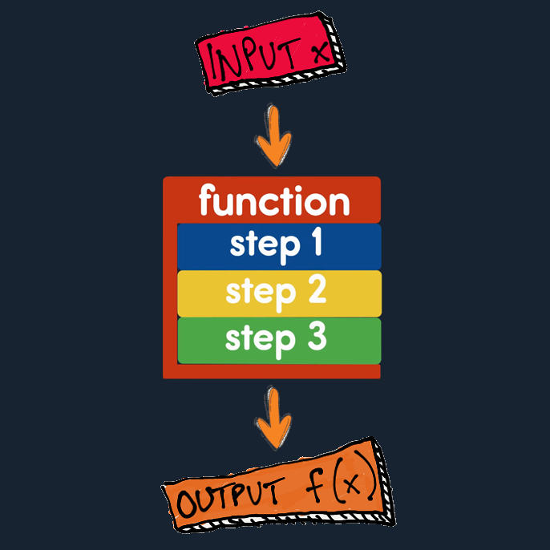
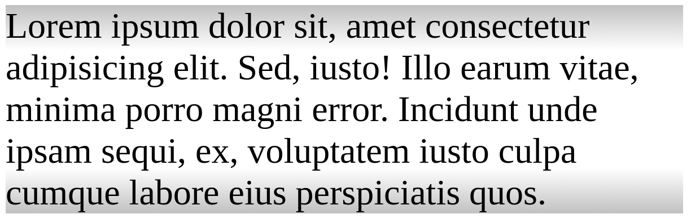
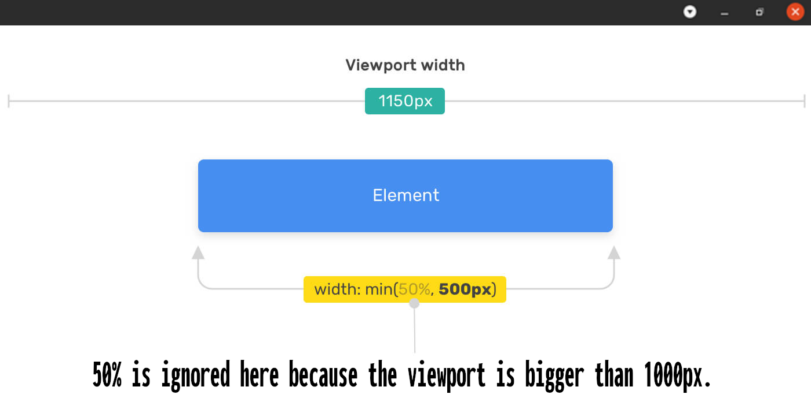

# [Function notations in CSS](https://drafts.csswg.org/css-values-4/#functional-notations)

- In programming functions:

  1. Usually accept a bunch of inputs.
  2. Then it will go through your predefined steps.
  3. After it is done it will usually return a value.

  

- CSS can be considered a declarative programming language.
  - A programming paradigm[^1] that expresses the logic of a computation without describing its control flow.
- When we say it is declarative language it means that you do not have to how do something we simply ask it to do something.
- In fact it is was one of CSS design choices ([ref](https://www.wiumlie.no/2006/phd/#h-321)).
- It could have give us more power if we were able to program in CSS but it is a trade off:
  - Readability.
  - Maintainability.
  - Security concerns.
- We also have keywords such as [`pi`](https://drafts.csswg.org/css-values-4/#valdef-calc-pi) number and [`e`](https://drafts.csswg.org/css-values-4/#valdef-calc-e) number.

## `calc`

- A math function that allows basic arithmetic to be performed on numerical values.
- It converts relative values to absolute values.
- E.g. a color transition only in the first and last 20px of the element:
  ```css
  .fade {
    background-image: linear-gradient(
      silver 0%,
      white 20px,
      white calc(100% - 20px),
      silver 100%
    );
  }
  ```
  

## `min`

- Find the minimum number between passed parameters and return it.



## `max`

- Find the largest number between passed parameters and return it.

## `clamp`

- Accepts three parameters:
  1. A minimum value.
  2. A central value.
  3. A maximum value.
- It will clamp/forces the central value to never be less than minimum value or greater than maximum value.
- E.g. Force the `font-size` to stay between 12px and 100px:
  ```css
  .type {
    font-size: clamp(12px, 10 * (1vw + 1vh) / 2, 100px);
  }
  ```
- If you skip the maximum number it will grow as large as it wants without restriction but cannot be less than the passed minimum value: `clamp(12px, 10 * (1vw + 1vh) / 2, none);`.

## `min`, `max`, and `clamp` example


## Footnotes

[^1]: A style of building the structure and elements of computer programs.
