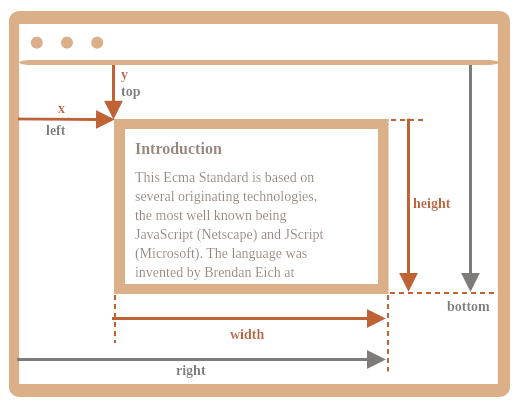

# `position`

| Name          | `position`                                               |
| ------------- | -------------------------------------------------------- |
| Value/schemes | `static`, `relative`, `absolute`, `sticky`, `fixed`.     |
| Initial       | `static`.                                                |
| Applies to    | All elements except table-column-group and table-column. |
| Inherited     | no.                                                      |

- The CSS layout algorithms, by default, size and position boxes in relation to each other so that nothing overlaps.
- But with this CSS property we can position boxes on top of each other in a way that overlap each other.
- It is a coordinate-based positioning and offsetting approaches/schemes.
- We are laying out boxes in a coordinate space.

  

- So now we can with `position` offset and coordinate our boxes.

## `position: static`

- Boxes are laid out according to the "normal flow" (block or inline).
- No overlapping.
- Not a "positioned" box.

## `position: relative`

- Boxes are laid out according to "normal flow". Then browser offset it from its position.
- A purely visual effect, unless otherwise specified.
- It does not affect the size or position of **any other non-descendant box** except insofar as it increases the scrollable overflow area of its ancestors.

## `position: absolute`

- The box that has absolute positioning will be laid out outside of normal flow of boxes.
- It is placed relative to its nearest non-static ancestor.
- The other boxes are completely unaffected by the absolutely positioned box as if it does not exit.

## `position: fixed`

- In a browser we have continuous media.
- So if say a box is fixed positioned it means that it is outside of the normal flow of boxes.
- Its containing block is the viewport.
  - It is laid out relative to viewport.
  - When attached to the viewport it does not move when the document is scrolled.

## `position: sticky`

- Laid out relative to its scrollable parent.
  - In our [examples.htm](./examples.htm) the `nav` element is laid out relative to the `body` since it is the nearest scrollable ancestor.
- Is positioned somewhere inside the web page but when it is about to leave the viewport it will offset relative to the viewport and like fixed stays inside the viewport.

