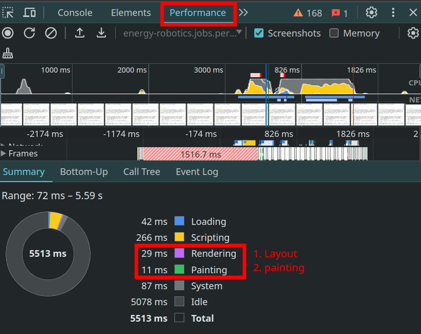
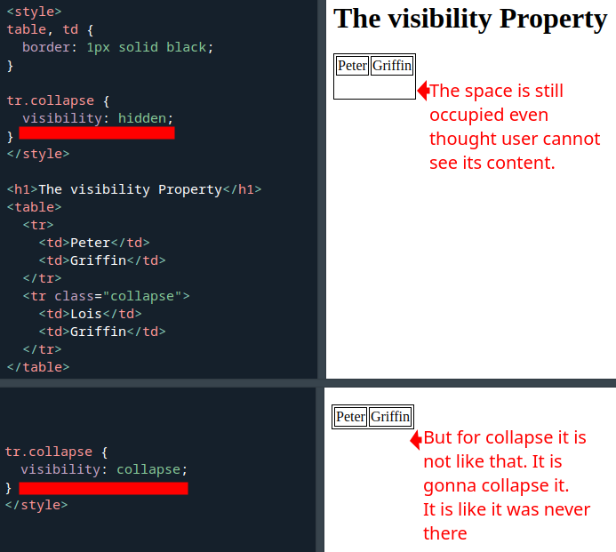
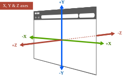
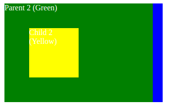
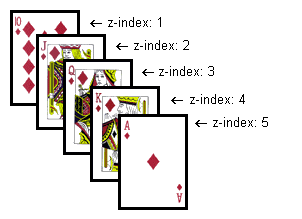

# Painting

We know that UA first decides which elements goes where (layout). And then we are painting (pixels should be colored how).

## [`visibility`](https://drafts.csswg.org/css-display/#visibility)

We can affect painting with `visibility` css property. E.g. we can skip it if we pass hidden to it.

| Name        | visibility                       |
| ----------- | -------------------------------- |
| Value       | `visible`, `hidden`, `collapse`. |
| Initial     | `visible`.                       |
| Applies to  | all elements.                    |
| Inherited   | yes.                             |
| Percentages | N/A.                             |

### `hidden` VS `collapse`

- Hidden is useful for when you do not wanna affect the normal flow of painting boxes in your page.

## [`z-index`](https://drafts.csswg.org/css2/#z-index)

When boxes are overlapping we decide which elements should stay on top of another element with `z-index`.

### Stacking context

- Boxes are painted in a particular order.
- In other word we are specifying _painting order_, meaning that boxes with lower `z-index` are painted first and then boxes with bigger `z-index` are painted afterward.
- Stacking context is a three-dimensional conceptualization of HTML elements along an imaginary z-axis relative to the user.
  - User is assumed to be facing the viewport or the webpage.
- The `root` element forms the root stacking context: all HTML elements are stacked in relation to this root element.
- But we can have different stacking context when we met a particular criteria:
  1. The `root` element of document.
  2. Any element with a `position` value of `absolute` and `z-index` value other than `auto`.
  3. Any element with a `position` value of `relative` and `z-index` value other than `auto`.
  4. Any element with a `position` value of `fixed`.
  5. Any element with a `position` value of `sticky` (**true only for mobile devices**).
  6. Any child of an element set with a `display: flex` where the child has a `z-index` value of anything other than `auto`.
  7. Any element with an `opacity` value less than 1.
  8. Any element with a `transform` value of anything other than `none`.
  9. Any element with a `filter` value of anything other than `none`.
  10. Any element with a `perspective` value of anything other than 0 or `none`.
  11. Any element with a `isolation: isolate`.

#### Example

You can open [this HTML file](./stacking-context-example.html) in your browser to see that different stacking context won't interfere with each other. Change the `top` and `left` defined for the `.parent2` to see what is painted under it.

| Name       | z-index                               |
| ---------- | ------------------------------------- |
| Value      | `auto`, an integer number, `inherit`. |
| Initial    | `auto`.                               |
| Applies to | positioned elements.                  |
| Inherited  | no.                                   |

### When `z-index` is `auto`

It sets the box's `z-index` to 0. And when boxes have same `z-index` they're gonna be stacked according to their tree order; which elements comes after the other one.

## [`isolation`](https://www.w3.org/TR/compositing-1/#isolation)

| Name       | isolation             |
| ---------- | --------------------- |
| Value      | `auto`, or `isolate`. |
| Initial    | `auto`.               |
| Applies to | All elements.         |
| Inherited  | no.                   |

- `auto` here means not isolated.
- Could not come up with an example so here is what I've found on the internet:
  - [Mozila](https://developer.mozilla.org/en-US/docs/Web/CSS/isolation#try_it).
  - [CSS tricks](https://css-tricks.com/almanac/properties/i/isolation/#aa-a-use-case).

# Learn more:

- [`z-index` and the stacking context](https://russmaxdesign.github.io/maxdesign-slides/02-css/211-css-zindex.html#/).
