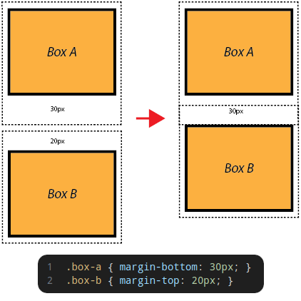
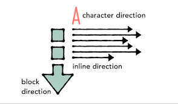
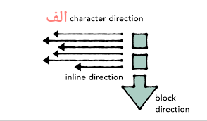
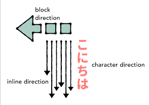
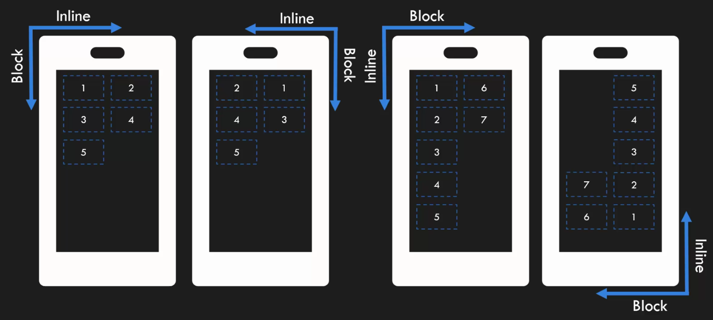
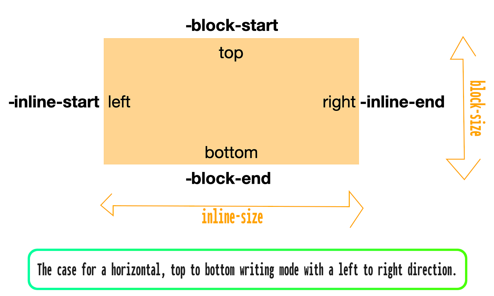
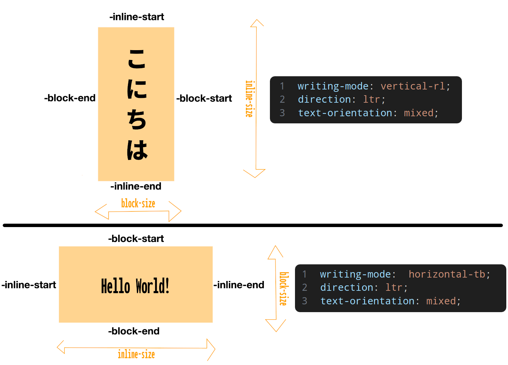
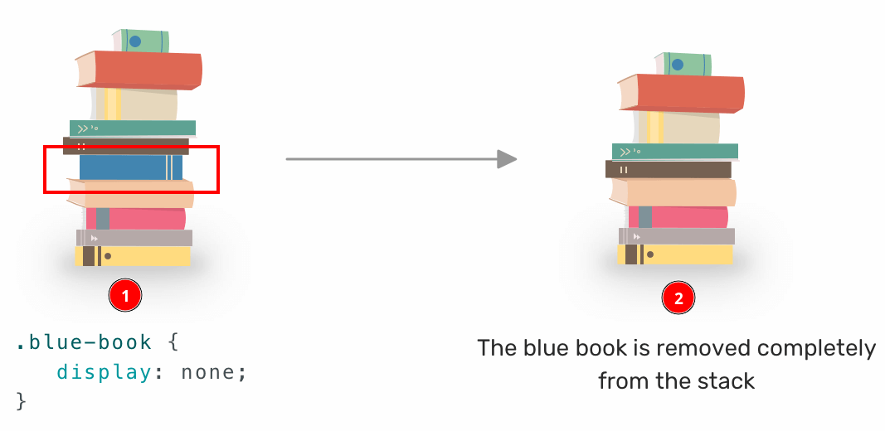

# Box layout

So far we've understood that we have different approaches to laying out boxes. And now we can look at the first for the most part most important CSS property in CSS that deals with layout of boxes; `display`.

## Display

| Name       | display                                        |
| ---------- | ---------------------------------------------- |
| Value      | `block inline`, `flow table`, `flex grid`, ... |
| Initial    | `inline`                                       |
| Applies to | all elements.                                  |
| Inherited  | no                                             |

- Element's display type.
- It consist of two basic qualities of how an element generates boxes:
  1. The inner display type: how children of an element is laid out.
  2. The outer display type: how the principal box[^1] itself participates in flow layout[^2].
- Furthermore the syntax that you usually see is the shorthand version of which specify both at the same time: `display: outer inner`

### [`display: block`](https://drafts.csswg.org/css-display/#the-display-properties)

- Fundamental display type for _normal flow_.
- Block [formatting context](../14-box-model/README.md#formattingContextDef).
- One on top of another vertically, beginning at the top of a containing block.
  - Vertically in the context of languages like Persian or English.
- Shorthand for `display: block inline;`.
- Vertical distance between two sibling boxes in **this formatting context** will collapse, AKA **margin collapse**.

  

  > As a special rule, margin areas are allowed to collapse (i.e., overlap) vertically to not create excessive vertical gaps between boxes.

  &mdash; [Ref](https://www.wiumlie.no/2006/phd/#h-305).

### `float`

| Name       | float                              |
| ---------- | ---------------------------------- |
| Value      | `left`, `right` ,`none`, `inherit` |
| Initial    | `none`.                            |
| Applies to | all.                               |
| Inherited  | no                                 |

- Old feature.
- It is part of normal flow.
- It is out of normal flow too since it is not exactly where it should be.
- There are better ways of doing this that we'll talk.
- Box will be floated to the left or right hand side of **its container**.
- `clear: both` is saying that the box is not allowed to have a floated element on its left or right.
- Open [this example](./float-example.html) in your browser.

### `display: inline`

- Formatting context.
- Boxes are laid our horizontally.
- Only horizontal margins/paddings/borders are considered.
  - No margin collapsing here ([example](./no-margin-collapse-in-inline.html)).
- Vertical margins/paddings are ignored (look at [this example](./no-vertical-margin-in-inline.html)).
- You can align boxes vertically though.
- _Line box_:

  - All the inline boxes are in a drawn line.
  - This line contains all of the inline boxes participating in an inline formatting context.
  - Its width is determined by the width of its containing block, but if we have a floated box next to them it'll affect width of _line box_.
  - We can change its height by `line-height`:

    | Name       | `line-height`                                           |
    | ---------- | ------------------------------------------------------- |
    | Value      | `normal`, `12px`                                        |
    | Initial    | `normal`                                                |
    | Applies to | non-replaced inline boxes and SVG text content elements |
    | Inherited  | yes                                                     |

    - The [logical height](https://drafts.csswg.org/css-writing-modes-4/#logical-height) of its _line box_.
    - Note: the width shrunk when we have a floating box ([example](./line-box.html)).

  - Use `vertical-align` to affect the vertical positioning inside a _line box_ of the boxes generated by an inline-level element.

    | Name       | vertical-align                                                                                              |
    | ---------- | ----------------------------------------------------------------------------------------------------------- |
    | Value      | `baseline`, `sub`, `super`, `top`, `text-top` , `middle`, `bottom`, `text-bottom`, `12%`, `12px`, `inherit` |
    | Initial    | `baseline`                                                                                                  |
    | Applies to | inline-level and table-cell elements                                                                        |
    | Inherited  | no                                                                                                          |

    - [Learn more](https://drafts.csswg.org/css2/#propdef-vertical-align).
    - How the individual element should be laid out.
    - **Note**: We did not give this css property to its parent but rather the element itself.
    - [Example](./vertical-align.html).
      - Here, we are applying the `vertical-align` to the `img` but UA will change the position of all inline elements inside the line box in relation to the newly assigned vertical alignment for the image.

  - Use `text-align` to specify the inline-level content inside a _line box_ if the content does not completely fill the _line box_.

    | Name       | text-align                                                                          |
    | ---------- | ----------------------------------------------------------------------------------- |
    | Value      | `start`, `end`, `left`, `right`, `center`, `justify`, `match-parent`, `justify-all` |
    | Initial    | `start`                                                                             |
    | Applies to | block containers.                                                                   |
    | Inherited  | yes                                                                                 |

    - How the entire group of inline boxes should be laid out inside the _line box_.
    - [Learn more](https://drafts.csswg.org/css-text/#text-align-property).
    - A shorthand property for the `text-align-all` and `text-align-last` css properties.
    - Note that this css property is assigned to the parent an not the inline-box element.
    - [Here](./text-align.html) we have an example.

  - What if the content of a line box is more than available width of its containing box? then it will wrap to the next line. AKA wrapping. And if we do not wrap it is called overflow.

### [`display: list-item`](https://drafts.csswg.org/css-display/#valdef-display-list-item)

- The element generates a `::marker` pseudo-element.
- Limited to `block`/`inline`/`run-in` for outer, and `flow`/f`low-root` for inner.

#### [`::marker` pseudo elements](https://www.w3.org/TR/css-pseudo-4/#selectordef-marker)

- Represents the automatically generated marker box of a list item.
- The contents of a `::marker` are ignored (not selected) by `::first-letter` ([example](./first-letter-marker-example.html)).
- [Example](./marker-example.html).

## BFC -- Block Formatting Context

- In [this example](./float-bfc-example.html) we have a floated element (`img`) which has floated outside of the boundaries of background color (float is not abiding by the rules of normal flow). And it is overlapping its container since they (floated element - `img` - and `section`) belong to the same BFC.
- The region in which the layout of block boxes occurs and in which floats interact with other elements.
- The element that primarily forms a BFC is the _root_ element.
- Walls that inside it all the elements are laid out. Nothing leaves the `html` container.
- Inside the `html` container all other boxes can overlap each other.
- But other elements can also form a BFC. Then everything lives inside it.
  - Like floated elements that form their own BFC.
  - An absolutely positioned elements.

## [`display: flow-root`](https://drafts.csswg.org/css-display/#valdef-display-flow-root)

- Shorthand version of `block flow-root`
- block-level block container that establishes a new block formatting context (BFC).
- Now in [this example](./float-bfc-example.html) you can see that by changing the display of `section` element to `flow-root` it is gonna act as its impenetrable walls where everything lives inside it and cannot go outside of it.

## Multilingual language web pages

- In languages such as English:

  - The inline direction is **left to right** on the X-axis.
  - And when the text wraps it goes in the block direction from top to bottom on the Y-axis.

  

- In languages such as Persian:

  - The inline direction is **right to left** on the X-axis.
  - And when you run out of space in the inline direction we move in the block direction from top to bottom in Y-axis.

  

- In languages such as Japanese:

  - The inline direction is **top to bottom** on the Y-axis.
  - And when we wanna go to the next line we move horizontally. Thus the block direction is **right to left** on the X-axis.

  

> [!NOTE]
>
> Our objective in the upcoming part is to build a proper mental model so that when we are discussing with other we ain't thinking only in one language but rather multilingual. And by doing so we are enabling our websites to be translated to a new language without the need to change the CSS.

### [`writing-mode`](https://drafts.csswg.org/css-writing-modes-3/#block-flow)

| Name       | writing-mode                                                                                                                            |
| ---------- | --------------------------------------------------------------------------------------------------------------------------------------- |
| Value      | `horizontal-tb`, `vertical-rl`, `vertical-lr`                                                                                           |
| Initial    | `horizontal-tb`                                                                                                                         |
| Applies to | All elements except table row groups, table column groups, table rows, table columns, ruby base containers, ruby annotation containers. |
| Inherited  | yes                                                                                                                                     |

- It determines in which direction blocks goes.

  

- Specifies whether lines of text are laid out horizontally or vertically and the direction in which blocks progress.
- CSS properties like `margin-top`, `padding-bottom` do not think multilingual (Look at [this example](./margin-top-issue-with-non-english-writing-mode.html)).

### [`direction`](https://drafts.csswg.org/css-writing-modes-3/#direction)

| Name       | direction     |
| ---------- | ------------- |
| Value      | `ltr`, `rtl`  |
| Initial    | `ltr`         |
| Applies to | all elements. |
| Inherited  | yes           |

- Bidirectionality or bidi: Characters in most scripts are written from left to right, but certain scripts are written from right to left. In some documents, in particular those written with the Arabic or Hebrew script, and in some mixed-language contexts, text in a single (visually displayed) block may appear with mixed directionality.
- The `writing-mode` only says that inline direction is either horizontal or vertical but not left to right or right to left. So this CSS property take care of that for us.
- Recommendation: HTML authors use the HTML `dir` attribute and `bdo` element in case CSS was disabled.
- Specifies the inline base direction or directionality of any bidi paragraph, embedding, isolate, or override established by the box.

> [!CAUTION]
>
> Here `float` can be troublesome since we are floating to right or left according to one language. So it is not a multilingual design. It won't reflect the `writing-mode`.

### [`text-orientation`](https://drafts.csswg.org/css-writing-modes-3/#propdef-text-orientation)

| Name       | text-orientation                                                        |
| ---------- | ----------------------------------------------------------------------- |
| Value      | `mixed`, `upright`, `sideways`                                          |
| Initial    | `mixed`                                                                 |
| Applies to | all elements except table row groups, rows, column groups, and columns. |
| Inherited  | yes                                                                     |

- Specifies the orientation of text within a line.
- [Example](./text-orientation.html).
- So we've learned that inline is not always horizontal and block is vertical.

### [Logical properties](https://drafts.csswg.org/css-logical-1/)

- Instead of physical dimensions we are talking about logical dimensions.
- So instead of talking about top, left, right, width and height we will use a new terminology which can be beneficial in designing multilingual website:

  

- Now if I add margin to each edge it is gonna work the same since they are gonna be working with different wiring modes and directions. look at [this example](./logical-properties-example.html).

  

- Sometimes browsers are not supporting the newest things written in the spec, so in these cases we can check caniuse. For example [`float: inline-start` browser support in caniuse](https://caniuse.com/?search=inline-start).

## [`display: inline-block`](https://drafts.csswg.org/css-display/#valdef-display-inline-block)

- Shorthand version of `display: inline flow-root;`.
- It sets outer display time to inline.
- But the inner display type is a new [BFC](#bfc----block-formatting-context), resulting in children participating in a normal flow.
- In other word we needed a box which was inline but its children was laid out in a more complex fashion.
- Nowadays we have better ways to do this. We'll not explore this topic in details for this reason.
- [Example](./inline-block-example.html).

## [`display: none`](https://drafts.csswg.org/css-display/#valdef-display-none)

- The box will never be laid out.
- It is excluded from _render tree_ (CSSOM + DOM).

  

## `display`

- Do not limit yourself to what is available by default.
- You can even change the display of `head` and `title` element.
- Look at the `blockquote` element, you can change its display to `list-item`.
- Possibilities are numerous and unlimited. You can change all elements' default style.
- They are just DOM and CSS + some default styles applied by browsers or spec. But these do not take priority over what you need to do and what you want to do.

# Footnotes

[^1]: The box drawn by the element, that is perceiving the property declaration.
[^2]: Block or inline layout. It's behavior in relation to other boxes around it.
