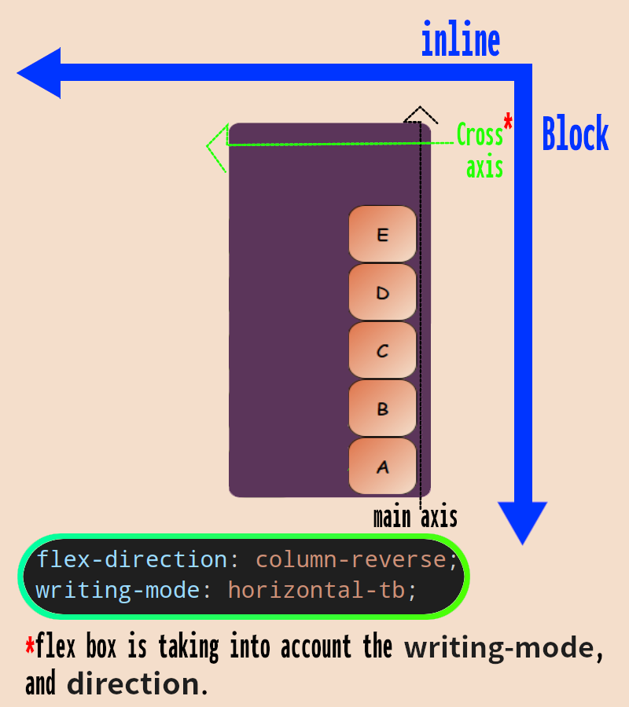

# [Flex box](https://drafts.csswg.org/css-flexbox-1/)

- After the previous introductory info we're ready to study flex boxes in CSS.
- Flex formatting context.
- Optimized for user interface design.
- Designed for laying out complex webpages.
- Here instead of _inline_ and _block_ axis we have _main_ and _cross_ axis.

  - These axis are related to, and relative to _inline_ and _block_ axis.
  - But if you change the _main start_ and _main end_ location it is not gonna affect _inline_ axis.

  

- But they can change, meaning that it is not necessary for a flex box to have same axis as _inline_ and _block_ axis.
- Spec says that flex box respects writing mode and multilingual concepts that where introduced [in CSS logical properties spec](https://drafts.csswg.org/css-logical-1/) and [CSS writing mode spec](https://drafts.csswg.org/css-writing-modes-3/).

## [`display: flex`](https://drafts.csswg.org/css-display-3/#valdef-display-flex)

- Establishes a flex formatting context.
- Shorthand for `block flex`:
  - Interacts with outer elements as a _block_ level element.
  - But its children are all laid out according to the _flex_ layout. In other word each child become a _flex_ item.
- 6 objectives of flex box for the contents of a flex container according to [CSS spec](https://drafts.csswg.org/css-flexbox-1/#overview):

  1. Can be laid out in any flow direction[^1]. [`flow-direction`](#flow-direction).
  2. Can be laid out linearly along a single axis (main), or wrapped into multiple lines along a secondary axis (cross). [`flex-wrap`](#flex-wrap)
  3. **Can change their sizes to respond to the available space**. [`flex`](#flex).
  4. Can have their display order reversed or rearranged. [`order`](#order).
  5. Can be aligned with respect to their container or each other on the secondary (cross). [`justify-content`](#justify-content), [`align-items`](#align-items), and [`align-self`](#align-self).
  6. Can be dynamically collapsed or uncollapsed along the main axis while preserving the container’s cross size ([example](./collapse.html)).

     [caniuse](https://caniuse.com/?search=visibility%3A%20collapse)

     

> [!TIP]
>
> When dealing with flex box you're gonna need to find an answer for these 2 question:
>
> 1. How do we wanna lay things out.
> 2. What do we wanna do with available space.

> [!IMPORTANT]
>
> CSS flex box has gone through major revisions. As such you might see different style of doing the same thing. You can learn about it [here](https://stackoverflow.com/a/16280118/8784518), [here](https://developer.mozilla.org/en-US/docs/Web/CSS/box-flex).

### [`flow-direction`](https://drafts.csswg.org/css-flexbox-1/#flex-direction-property)

| Name       | flex-direction                                   |
| ---------- | ------------------------------------------------ |
| Value      | `row`, `row-reverse`, `column`, `column-reverse` |
| Initial    | `row`                                            |
| Applies to | **flex containers** not flexed items.            |
| Inherited  | no                                               |

- Specifies how flex items are placed in the flex container.
- Sets the direction of the flex container’s main axis.
- Here we're assuming a `writing-mode: horizontal-tb;` with `direction: ltr;`.
- Items inside a flex container are always laid out from _main start_ to _main end_, from _cross start_ to _cross end_.

  

- And if we change the `writing-mode` to `vertical-rl` then we end up with this:

  

  **Note**: block direction is top to bottom, and inline direction is right to left. But since we are saying it should layout flex boxes inside that flex container in `column-reverse` then we are creating them from bottom to top.

- [Example](./flex-direction.html).

### [`flex-wrap`](https://drafts.csswg.org/css-flexbox-1/#propdef-flex-wrap)

| Name       | flex-wrap                        |
| ---------- | -------------------------------- |
| Value      | `nowrap`, `wrap`, `wrap-reverse` |
| Initial    | `nowrap`                         |
| Applies to | **flex containers**.             |
| Inherited  | no                               |

- Is flex container single-line or multi-line?
  - `nowrap`: flex container is single-line.
  - `wrap`: flex container is multi-line. Creates new flex lines if needed.
- What is the direction of the cross-axis? In other word in which direction new lines are stacked in.
- If it not wrapped then we have overflown content.
- [Example](./flex-wrap-example.html).

### [`flex`](https://drafts.csswg.org/css-flexbox-1/#flex-property)

| Name       | flex                                                      |
| ---------- | --------------------------------------------------------- |
| Value      | `none`, `flex-grow-factor flex-shrink-factor flex-basis`. |
| Initial    | `0 1 auto`                                                |
| Applies to | flex items                                                |
| Inherited  | no                                                        |

- Specifies the flex factors (`grow` and `shrink`) and the _flex basis_.
- Note: `inline-size` and `width` does not work for flex items.
  - Then reason is clear, because we wanna respond to the available space automatically. Design responsive websites.

#### [`flex-grow`](https://drafts.csswg.org/css-flexbox-1/#propdef-flex-grow)

| Name       | flex-grow   |
| ---------- | ----------- |
| Value      | number      |
| Initial    | 0           |
| Applies to | flex items. |
| Inherited  | no          |

- Negative values **AIN'T** allowed.
- No unit, just a number.
- This value is relative to the available positive free space.
- Note: Giving same value for this prop to all flex items does not necessarily mean that you'll get the same `inline-size`. But it is gonna just split the available positive free size equally between flex items. So if one of them has more content it might be bigger.
- In this [example](./flex-grow-factor-example.html) you're free space is divided between the three flex items when we are saying `flex-grow: 1`.

  `flex-grow: 0`, means that each flex item will occupy just the right amount of inline size that it needs for its content. Whereas `flex-grow: 1`, it will divide the available free space between the flex items

  

> [!IMPORTANT]
>
> We also could say that one of them has a `flex-grow` of 0 and the other flex items could also have different values as for their `flex-grow`. Resulting in different `inline-size`s.
> 

> [!TIP]
>
> Authors are encouraged to control flexibility using the `flex` shorthand rather than with `flex-grow` directly, as the shorthand correctly resets any unspecified components to accommodate [common uses](https://drafts.csswg.org/css-flexbox-1/#flex-common).

#### [`flex-shrink`](https://drafts.csswg.org/css-flexbox-1/#propdef-flex-shrink)

| Name       | flex-shrink |
| ---------- | ----------- |
| Value      | number      |
| Initial    | 1           |
| Applies to | flex items. |
| Inherited  | no          |

- Same thing here, use `flex` instead of this property.
- This value is relative to the available negative free space.
- Negative values are not allowed.
- In the following example we can see how `inline-size` of flex items will be decreased based on the flex-shrink-factor.

  

#### [`flex-basis`](https://drafts.csswg.org/css-flexbox-1/#propdef-flex-basis)

| Name       | flex-basis          |
| ---------- | ------------------- |
| Value      | `content`, `300px`. |
| Initial    | auto.               |
| Applies to | flex items.         |
| Inherited  | no                  |

- Same advise here, use `flex` shorthand version instead of this css prop.
- Same values as `inline-size`, `width`, `block-size`, and `height`.

### [`order`](https://drafts.csswg.org/css-flexbox-1/#order-property)

| Name       | order                      |
| ---------- | -------------------------- |
| Value      | integer                    |
| Initial    | `0`                        |
| Applies to | flex items and grid items. |
| Inherited  | no                         |

- Boxes are generally displayed and laid out in the same order as they appear in the source document (from HTML document UA generates DOM tree. DOM + CSSOM => render tree. And now UA layout boxes).
- But we can change the order of appearance visually.
- E.g. [a catalog item card](./order-example.html) which has within each entry:

  1. A title.
  2. A photo.
  3. A description.

  The source document content is ordered logically with the title first, followed by the description and the photo. This provides a sensible ordering for speech rendering and in non-CSS browsers.

  For a more compelling visual presentation, however, order is used to pull the image up from later in the content to the top of the card.

- Like it was explained in the previous example use it only for spatial reordering and not logical. So that non-visual media and non-CSS UAs, which typically present content linearly, can rely on a logical source order, while order is used to tailor the layout order.

### [`justify-content`](https://drafts.csswg.org/css-flexbox-1/#justify-content-property)

| Name       | justify-content                                                     |
| ---------- | ------------------------------------------------------------------- |
| Value      | `flex-start`, `flex-end`, `center`, `space-between`, `space-around` |
| Initial    | `flex-start`                                                        |
| Applies to | flex containers                                                     |
| Inherited  | no                                                                  |

- What should happens to the available positive free space on the **main axis** when we have `flex-grow: 0`.

  

### [`align-items`](https://drafts.csswg.org/css-flexbox-1/#align-items-property)

| Name       | align-items                                               |
| ---------- | --------------------------------------------------------- |
| Value      | `flex-start`, `flex-end`, `center`, `baseline`, `stretch` |
| Initial    | `stretch`                                                 |
| Applies to | flex containers.                                          |
| Inherited  | no                                                        |

- Specifies how flex items in **one** flex line in which they have probably different block-sizes should be laid out.
- Note: baseline line up all boxes according to the bottom of characters (Look at [this example](./align-items.html) for a better understanding).

  

### [`align-self`](https://drafts.csswg.org/css-flexbox-1/#propdef-align-self)

| Name       | align-self                                                        |
| ---------- | ----------------------------------------------------------------- |
| Value      | `auto`, `flex-start`, `flex-end`, `center`, `baseline`, `stretch` |
| Initial    | `auto`                                                            |
| Applies to | flex items.                                                       |
| Inherited  | no                                                                |

- `auto` here means get the value of your parent.
- Look at [this example](./align-self.html) for how it works.

### [`align-content`](https://drafts.csswg.org/css-flexbox-1/#align-content-property)

| Name       | align-content                                                                  |
| ---------- | ------------------------------------------------------------------------------ |
| Value      | `flex-start`, `flex-end`, `center`, `space-between`, `space-around`, `stretch` |
| Initial    | `stretch`                                                                      |
| Applies to | multi-line flex containers.                                                    |
| Inherited  | no                                                                             |

- What to do with the available space in the cross axis for the **flex lines**.

## [`display: inline-flex`](https://drafts.csswg.org/css-display-3/#valdef-display-inline-flex)

- We talked about it [inline-block](../19-box-layout/README.md#display-inline-block) and said that it is not something we wanna do in contemporary era. It's because we have more powerful and developer friendlier css props such as `inline-flex`.
- Short version of `inline flex`.
- inline-level flex container: outer inline, inner flex.
- [Example](./inline-flex-example.html).

> [!IMPORTANT]
>
> MDN calls this type of specifying value for `display` legacy: `display: inline-flex;`. And says that you should use the multi-keyword syntax: `display: inline flex;`.
>
> &mdash; [Ref](https://developer.mozilla.org/en-US/docs/Web/CSS/display#which_syntax_should_you_use).

## Footnotes

[^1]: Inline and block directions (rtl: rightwards, lrt: leftwards, tb: downwards, bt: upwards).
