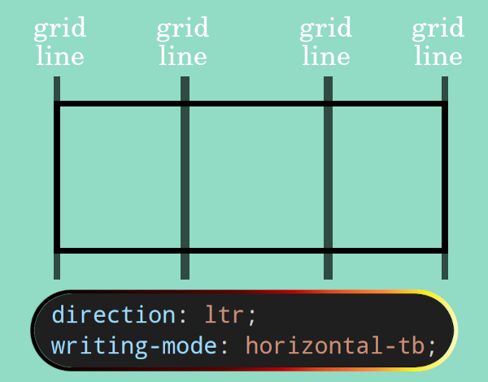
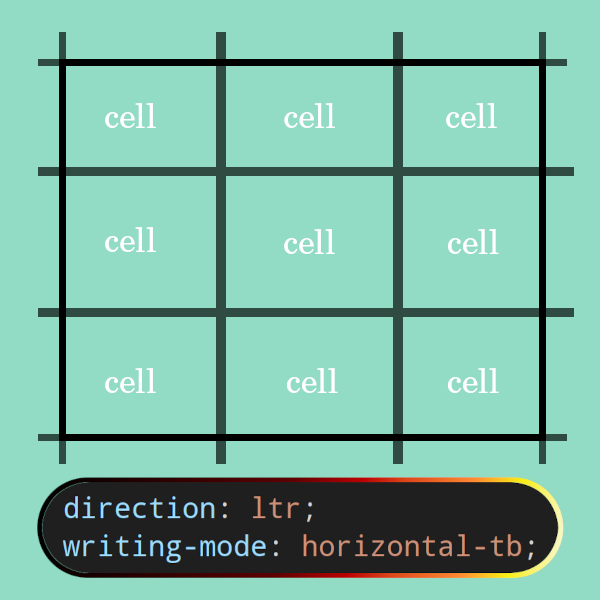

# [`display: grid`](https://drafts.csswg.org/css-grid-2/)

- Achieve complex layout that are dramatically different from our HTML document.
- Establishes a grid formatting context.
- Shorthand for `display: 	block grid;`.

## Grid VS flex?

**Use them as needed. Mix them even if it is necessary to have a specific layout.**

|                    | Grid layout model                                      | Flex layout model                     |
| ------------------ | ------------------------------------------------------ | ------------------------------------- |
| Optimized for      | 2-dimensional layouts.                                 | Single-axis–oriented layouts.         |
| Focuses            | On sizing and positioning of boxes and their contents. | Space distribution within an axis.    |
| Approach to layout | Top-down[^1].                                          | Bottom-up[^2].                        |
| Who layouts        | Lines drawn by CSS (tracks, ...).                      | Flex items inside the flex container. |

&mdash; [ref](https://drafts.csswg.org/css-grid-2/#overview).

## Creating a grid formatting context

- When we use `display: block grid` declaration for an element.
  - Grid container.
  - Grid children (**NOTE that we are calling them children not descendants**).
- We could also use `display: inline grid`/`display: inline-grid`.
- We have columns or what is also called tracks.

  

- We have grid lines, which can be drawn on different axis. **Note that we can also change the distance between these lines**.

  

- Next stop is rows. Fun fact, these are also called tracks.

  

- Now if we put together columns and rows we'll end up having what's called grid cell. It is the intersection of 4 lines.

  

> [!TIP]
>
> The items themselves **DO NOT** form the layout. But rather grid lines form the layout.

## [Fractional unit -- fr](https://drafts.csswg.org/css-grid-2/#fr-unit)

- It distributes the left over free space available for other boxes who do not have a fixed size.
- It represents a fraction of the leftover space in the grid container.

## 5 goals of grid layout

1. **Track sizing**: fixed, flexible, and content-based track sizing functions. AKA drawing lines; [`grid-template-rows`, and `grid-template-columns`](#grid-template-rows-and-grid-template-columns).
2. **Item placements**: How do we tell CSS where a grid item should be placed? [`grid-row-start`, `grid-row-end`, `grid-column-start`, `grid-column-end`](#grid-row-start-grid-column-start-grid-row-end-and-grid-column-end).
3. **Track repetition**: space-sensitive track repetition and automatic addition of rows or columns to accommodate additional content. [`grid-auto-flow`](#grid-auto-flow).
4. **Alignment and spacing**: control over alignment and spacing with margins, gutters, and the alignment properties. [`gap`](#gap), [`align-items`](#align-items), [`align-content`](#align-content), [`justify-content`](#justify-content), [`justify-items`]().
5. the ability to **overlap** content and control layering with `z-index`. **A very good alternative to `position`**.

### [`grid-template-rows`, and `grid-template-columns`](https://drafts.csswg.org/css-grid-2/#track-sizing)

| Name       | `grid-template-columns`, `grid-template-rows` |
| ---------- | --------------------------------------------- |
| Value      | `none`, `subgrid`, `100px 3rem 1fr [myline]`  |
| Initial    | `none`                                        |
| Applies to | grid containers                               |
| Inherited  | no                                            |

- `grid-template-columns` moves across the _block_ axis.
- `grid-template-rows` progresses across the _inline_ axis.
- `auto` here means: generate the `inline-size`/`block-size` based on the content.
- You can prevent repeating yourself by utilizing [`repeat`](https://drafts.csswg.org/css-grid/#funcdef-repeat) function.
  - If you use this function then you can name rows/columns like this: `repeat(2, [row-line] 1fr)`. And where you wanted to use it remember to add a number at the end of the name, e.g. `grid-row: row-line 1 / 3`.
- You can combine these two css properties into one: `grid-template: repeat(2, 1fr) / repeat(4, 1fr);`.

### [`gap`](https://drafts.csswg.org/css-align-3/#propdef-gap)

| Name       | gap                                                       |
| ---------- | --------------------------------------------------------- |
| Value      | `10px 20px`                                               |
| Initial    | See individual properties.                                |
| Applies to | multi-column containers, flex containers, grid containers |
| Inherited  | no.                                                       |

- Adds space between columns and rows.
- The first number is specifies the [row gap](https://drafts.csswg.org/css-align-3/#propdef-row-gap) and the second one [column gap](https://drafts.csswg.org/css-align-3/#propdef-column-gap).

### [`grid-row-start`, `grid-column-start`, `grid-row-end`, and `grid-column-end`](https://drafts.csswg.org/css-grid-2/#line-placement)

| Name       | `grid-row-start`, `grid-column-start`, `grid-row-end`, `grid-column-end`               |
| ---------- | -------------------------------------------------------------------------------------- |
| Value      | `1`, `myline`.                                                                         |
| Initial    | `auto`.                                                                                |
| Applies to | grid items and absolutely-positioned boxes whose containing block is a grid container. |
| Inherited  | no                                                                                     |

- Determines a grid item’s size and location within the grid.

#### Shorthands

| Complete syntax                        | Shorthand                       |
| -------------------------------------- | ------------------------------- |
| `grid-row-start`, `grid-row-end`       | `grid-row: 1 / myline`          |
| `grid-column-start`, `grid-column-end` | `grid-column: 1 / 5`            |
| `grid-row`, `grid-column`              | `grid-area: 1 / myline / 1 / 5` |
| `grid-row: 1 / 3`                      | `grid-row: 1 / span 2`          |
| `grid-column: 3 / 5`                   | `grid-column: 3 / span 2`       |

- What if I wanted my grid item to be placed against the far end and not start? This is also why CSS working group decided to enable you, reference lines by negative numbers.

#### [`grid-template-areas`](https://drafts.csswg.org/css-grid-2/#grid-template-areas-property)

| Name       | grid-template-areas          |
| ---------- | ---------------------------- |
| Value      | `none`, or multiple strings. |
| Initial    | `none`                       |
| Applies to | grid containers.             |
| Inherited  | no                           |

- In our example in [`resume.css`](./resume.css) you can see that instead of `grid-column: 1 / -1;` we could leverage named areas.
- When we use these they'll create named lines too. In our example we'll have `portfolio-start` and `portfolio-end`.

### [`grid-auto-flow`](https://drafts.csswg.org/css-grid-2/#propdef-grid-auto-flow)

| Name       | grid-auto-flow           |
| ---------- | ------------------------ |
| Value      | `row`, `column`, `dense` |
| Initial    | `row`                    |
| Applies to | grid containers          |
| Inherited  | no                       |

- Grid items that ain't explicitly placed, are automatically placed into an unoccupied space in the grid container.
- `row` means, create new rows when needed.
- `column` creates a new column if it is required.
- `dense` attempts to fill in holes earlier in the grid if smaller items come up later.

#### [`grid-auto-rows` and `grid-auto-columns`](https://drafts.csswg.org/css-grid-2/#propdef-grid-auto-rows)

| Name       | `grid-auto-columns`, `grid-auto-rows` |
| ---------- | ------------------------------------- |
| Value      | `190px`.                              |
| Initial    | auto                                  |
| Applies to | grid containers                       |
| Inherited  | no                                    |

- Specifies size of tracks which ain't assigned a size by `grid-template-rows` or `grid-template-columns`.
- Useful in cases where we do not know how many columns/rows we'll have (data comes from server) but we need to specify a size for them.

### [`align-items`](https://drafts.csswg.org/css-align-3/#propdef-align-items)

| Name       | align-items              |
| ---------- | ------------------------ |
| Value      | `normal`, `stretch`, ... |
| Initial    | `normal`                 |
| Applies to | Grid container.          |
| Inherited  | no.                      |

- All `align-*` css properties work on block dimension.

### [`align-content`](https://drafts.csswg.org/css-align-3/#propdef-align-content)

| Name       | align-content                                                                |
| ---------- | ---------------------------------------------------------------------------- |
| Value      | `normal`, ...                                                                |
| Initial    | `normal`                                                                     |
| Applies to | block containers, multicol containers, flex containers, and grid containers. |
| Inherited  | no                                                                           |

- Learn more about `align-content` and its implementation details in grid [here](https://drafts.csswg.org/css-grid-2/#grid-align).

### [`justify-content`](https://drafts.csswg.org/css-align-3/#propdef-justify-content)

| Name       | justify-content                                                |
| ---------- | -------------------------------------------------------------- |
| Value      | `normal`, ...                                                  |
| Initial    | `normal`                                                       |
| Applies to | multicol containers, flex containers, and **grid containers**. |
| Inherited  | no                                                             |

- All `justify-*` css properties works with inline axis.
- Learn more about this css property in the context of grid formatting context [here](https://drafts.csswg.org/css-grid-2/#grid-align).

### [`justify-items`](https://drafts.csswg.org/css-align-3/#propdef-justify-items)

| Name       | justify-items                     |
| ---------- | --------------------------------- |
| Value      | `normal`, `stretch`,`legacy`, ... |
| Initial    | `legacy`                          |
| Applies to | all elements                      |
| Inherited  | no                                |

- Learn more on [CSS spec for grid box](https://drafts.csswg.org/css-grid-2/#row-align).

# Practice

1. Visual change -- full bleed
   - Let's assume we got a request from our UI/UX designer stating that we need to add 50px space between the content of our page and the edges (inline axis). But we wanna have a full bleed "Bio", and "Mailing Address" section.
   - Uncomment css declarations block or css declaration to see the result.
   - Goals of this practice are:
     1. Showing you how a well marked up HTML document can help us to easily accommodate new changes.
     2. Demonstrating how sometimes we need to only change CSS since it is not a semantic change.
     3. Power of grid box and also thinking out of the box.
2. [Grid garden](https://cssgridgarden.com/).
3. [MDN skill appraiser](https://developer.mozilla.org/en-US/docs/Learn/CSS/CSS_layout/Grid_skills).
4. Implement [this picture](ishadeed-store.png).
5. **Optional**: there is this game called [Grid Attack](https://codingfantasy.com/games/css-grid-attack) which is a bit hard since it has too much reading involved but feel free to do it if you like it.

## Footnotes

[^1]: Explicitly stating where browsers should position elements.
[^2]: The layout is dictated as much by the items themselves and their size, and the surrounding spaces. No specific positioning, but rather giving guidelines.
