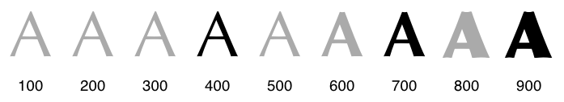

# [`font-family`](https://drafts.csswg.org/css-fonts-4/#font-family-prop)

| Name       | `font-family`          |
| ---------- | ---------------------- |
| Value      | `"Times New Roman"`    |
| Initial    | depends on user agent. |
| Applies to | all elements and text. |
| Inherited  | yes.                   |

- When there is space in the font name you need to put it inside a quotation mark.
- You can do font stack which tells the browser to look up for that font on the user's device from left to right and apply the first one it found.
  ```css
  h1 {
    font-family: Helvetica, Verdana, sans-serif;
  }
  ```
- Most of the times we need to have something else, thus usually we tend to use web fonts, services such as [Google Fonts](https://fonts.google.com/).

# [`font-weight`](https://drafts.csswg.org/css-fonts-4/#font-weight-prop)

| Name       | `font-weight`                                |
| ---------- | -------------------------------------------- |
| Value      | `900`, `bolder`, `lighter`, `bold`, `normal` |
| Initial    | normal                                       |
| Applies to | all elements and text                        |
| Inherited  | yes                                          |

- Text's degree of blackness, or stroke thickness.
- You can pic any number, ranging from 1 to 1000. Commonly used weight names:

  

- Sometimes there is not a face for the desired weight, in that case it will use the face for the nearby weight. For example in the following picture gray indicates that there is not a face for that weight.

  

  You can see it in action too, copy and paste the following markup in a HTML file and open it in your browser:

  ```html
  <style>
    P {
      font-family: Arial;
    }
  </style>
  <p style="font-weight: 100">
    <code>font-weight: 100;</code>
    Thin.
  </p>
  <p style="font-weight: 200">
    <code>font-weight: 200;</code>
    Extra Light (Ultra Light).
  </p>
  <p style="font-weight: 300">
    <code>font-weight: 300;</code>
    Light.
  </p>
  <p style="font-weight: 400">
    <code>font-weight: 400;</code>
    Normal.
  </p>
  <p style="font-weight: 500">
    <code>font-weight: 500;</code>
    Medium.
  </p>
  <p style="font-weight: 600">
    <code>font-weight: 600;</code>
    Semi Bold (Demi Bold).
  </p>
  <p style="font-weight: 700">
    <code>font-weight: 700;</code>
    Bold.
  </p>
  <p style="font-weight: 800">
    <code>font-weight: 800;</code>
    Extra Bold (Ultra Bold).
  </p>
  <p style="font-weight: 900">
    <code>font-weight: 900;</code>
    Black (Heavy).
  </p>
  ```

# [`text-transform`](https://drafts.csswg.org/css-text-4/#propdef-text-transform)

| Name       | `text-transform`                                                                            |
| ---------- | ------------------------------------------------------------------------------------------- |
| Value      | `none`, `capitalize`, `uppercase`, `lowercase`, `full-width`, `full-size-kana`, `math-auto` |
| Initial    | none                                                                                        |
| Applies to | text                                                                                        |
| Inherited  | yes                                                                                         |

- Usually we tend to use `uppercase` to transform our normal written text to all uppercase letter text.

## YouTube & Aparat

- https://youtu.be/YZM-vCZPJdo
- https://aparat.com/v/ygt9q49

# [`text-decoration`](https://drafts.csswg.org/css-text-decor-4/#text-decoration-property)

| Name       | `text-decoration`                                                                            |
| ---------- | -------------------------------------------------------------------------------------------- |
| Value      | `text-decoration-line text-decoration-thickness text-decoration-style text-decoration-color` |
| Initial    | see individual properties                                                                    |
| Applies to | see individual properties                                                                    |
| Inherited  | see individual properties                                                                    |

- Shorthand for all of those css properties.
- When we only say `text-decoration: none` we're only specifying `text-decoration-style`.
- Specify `text-underline-position` separately. It is related to `writing-mode`, and language specific.

## [`text-decoration-line`](https://drafts.csswg.org/css-text-decor-4/#propdef-text-decoration-line)

| Name       | `text-decoration-line`                                                             |
| ---------- | ---------------------------------------------------------------------------------- |
| Value      | `none`, `underline`, `overline`, `line-through`, `spelling-error`, `grammar-error` |
| Initial    | `none`                                                                             |
| Applies to | all elements                                                                       |
| Inherited  | no (but see prose, above)                                                          |

- `overline` acts the opposite way of `underline`.

## [`text-decoration-style`](https://drafts.csswg.org/css-text-decor-4/#propdef-text-decoration-style)

| Name       | `text-decoration-style`                       |
| ---------- | --------------------------------------------- |
| Value      | `solid`, `double`, `dotted`, `dashed`, `wavy` |
| Initial    | `solid`                                       |
| Applies to | all elements                                  |
| Inherited  | no                                            |

- Sets the line-drawing style of `underline`s, `overline`s, and `line-through`s.

## [`text-decoration-color`](https://drafts.csswg.org/css-text-decor-4/#propdef-text-decoration-color)

| Name       | `text-decoration-color` |
| ---------- | ----------------------- |
| Value      | `red`                   |
| Initial    | `currentcolor`          |
| Applies to | all elements            |
| Inherited  | no                      |

## [`text-decoration-thickness`](https://drafts.csswg.org/css-text-decor-4/#propdef-text-decoration-thickness)

| Name       | `text-decoration-thickness`      |
| ---------- | -------------------------------- |
| Value      | `auto`, `from-font`, `12%`, `12` |
| Initial    | `auto`                           |
| Applies to | all elements                     |
| Inherited  | no                               |

- `auto`: UA chooses an appropriate thickness for text decoration lines.
- For the `from-font` it tries to look at the first available font for metrics indicating a preferred underline width. If none it will fallback to `auto`.

# [`background-color`](https://drafts.csswg.org/css-backgrounds-3/#propdef-background-color)

| Name       | `background-color`                                                       |
| ---------- | ------------------------------------------------------------------------ |
| Value      | `red`, `#000`, `#ffaaff33`, `rgb(255, 0, 0)`, `rgba(123, 123, 123, 0.4)` |
| Initial    | `transparent`                                                            |
| Applies to | all elements                                                             |
| Inherited  | no                                                                       |

- Drawn behind any background images.

> [!NOTE]
>
> Margins have no influence on the `background` and `border`.

## [Colors](https://drafts.csswg.org/css-color-4/)

- A pixel consist of 3 colors: red, green, blue.

  

- Due to size of one pixel on a display we usually see a combined color of those **intensities**.

  

- The intensities ranges from 0 to 255. In other word these are specifying the amount of each color, making different colors.

### Base 10

- 255 is in base 10.
- In base 10 we count from 0 to 9. In other word we have only 10 digit to use.

  

- AKA decimal.
- To count more that 9 we'll reuse the same numbers; e.g. 10 is a combination of 1 and 0.

### Base 16

- We can write numbers in other basis as well.
- Here we can count up to 15: from 0 to 9 and then A to F.

  

- AKA hexadecimal.

#### Base 10 VS Base 16

 

- In CSS we add a pound sign (hash) in front of a hexadecimal number.

   

> [!TIP]
>
> For common colors we can use their name, e.g. `turquoise`, `cyan`, etc.

# [`opacity`](https://drafts.csswg.org/css-color-4/#transparency)

| Name       | opacity       |
| ---------- | ------------- |
| Value      | `0.3`         |
| Initial    | `1`           |
| Applies to | all elements. |
| Inherited  | no            |

- How hard something is to see through.
- The more something opaque is, the harder it gets to see through it.
- Can be specified using [`rgba` function](https://drafts.csswg.org/css-color-4/#funcdef-rgba). That `a` stands for [_alpha channel_](https://developer.mozilla.org/en-US/docs/Glossary/Alpha).

  

# [`background-image`](https://drafts.csswg.org/css-backgrounds-3/#background-image)

| Name       | background-image         |
| ---------- | ------------------------ |
| Value      | `url("./file/path.png")` |
| Initial    | none                     |
| Applies to | all elements             |
| Inherited  | no                       |

- Here we can use [`url`](https://drafts.csswg.org/css-values/#urls) function to tell browser from where it should download the image.

# [`background-size`](https://drafts.csswg.org/css-backgrounds-3/#background-size)

| Name       | background-size                             |
| ---------- | ------------------------------------------- |
| Value      | `contain`, `cover`, `15px 15px`, `10% auto` |
| Initial    | auto                                        |
| Applies to | all elements                                |
| Inherited  | no                                          |

- When we use 2 numbers, the first one is width and the second one is height:

  - You can use other [absolute](https://drafts.csswg.org/css-values-4/#absolute-lengths) or [relative](https://drafts.csswg.org/css-values-4/#relative-lengths) length units.
  - You can also use percentage.
  - `10% auto` will preserve the aspect ratio of height.

# [`background-repeat`](https://drafts.csswg.org/css-backgrounds-3/#background-repeat)

| Name       | background-repeat                                               |
| ---------- | --------------------------------------------------------------- |
| Value      | `repeat-x`, `repeat-y`, `repeat`, `space`, `round`, `no-repeat` |
| Initial    | repeat                                                          |
| Applies to | all elements                                                    |
| Inherited  | no                                                              |

- `repeat-x`: computes to `repeat no-repeat`.
- `repeat-y`: computes to `no-repeat repeat`.
- `repeat`: computes to `repeat repeat`.
- `space`: computes to `space space`.
- `round`: computes to `round round`.
- `no-repeat`: computes to `no-repeat no-repeat`.

## Practice time

- [Programiz](https://www.programiz.com/css/background-image).
- [Mimo](https://mimo.org/glossary/css/background-image)
- [Sitepoint](https://www.sitepoint.com/how-to-use-css-background-size-and-background-position/).
- [Parallel gallery](./practice/parallel.html).
- [Movie banner/poster=](./practice2/movie-banner.html).
- [Blog gallery](./practice3/blog-gallery.html).

## YouTube & Aparat

- https://youtu.be/s719ftEQH88
- https://aparat.com/v/hziwvla

# [`transition`](https://drafts.csswg.org/css-transitions-1/#transition-shorthand-property)

[The transition module](https://drafts.csswg.org/css-transitions-1) talks about how to transition between css property values. And we have [_easing function_](https://drafts.csswg.org/css-easing-2/) are used via transition to determine how the transition should happen over time (e.g. first it should transition fast and then slow).

| Name       | transition                |
| ---------- | ------------------------- |
| Value      | `opacity 1s`              |
| Initial    | see individual properties |
| Applies to | all elements              |
| Inherited  | no                        |

- In which order each individual css property appears in this shorthand:
  1. Transition property.
  2. Duration.
  3. Easing function.
  4. Delay.

## [`transition-property`](https://drafts.csswg.org/css-transitions-1/#propdef-transition-property)

| Name       | transition-property        |
| ---------- | -------------------------- |
| Value      | `none`, `background-color` |
| Initial    | all                        |
| Applies to | all elements               |
| Inherited  | no                         |

- The name of the CSS property to which the transition is applied.

## [`transition-duration`](https://drafts.csswg.org/css-transitions-1/#transition-duration-property)

| Name       | transition-duration |
| ---------- | ------------------- |
| Value      | `1s`                |
| Initial    | `0s`                |
| Applies to | all elements        |
| Inherited  | no                  |

- The length of time that a transition takes.

## [`transition-timing-function`](https://drafts.csswg.org/css-transitions-1/#transition-timing-function-property)

| Name       | transition-timing-function                          |
| ---------- | --------------------------------------------------- |
| Value      | `ease-in`, `ease-out`, `ease-in-out`, `linear`, etc |
| Initial    | ease                                                |
| Applies to | all elements                                        |
| Inherited  | no                                                  |

- How the intermediate values used during a transition will be calculated.
- Find the complete list of available values [here](https://drafts.csswg.org/css-easing/#easing-functions).

  

> [!IMPORTANT]
>
> Learn easing function [here](https://easings.net/).

> [!TIP]
>
> [Play with cubic-bezier](https://cubic-bezier.com).

## [`transition-delay`](https://drafts.csswg.org/css-transitions-1/#transition-delay-property)

| Name       | transition-delay |
| ---------- | ---------------- |
| Value      | `1s`             |
| Initial    | 0s               |
| Applies to | all elements     |
| Inherited  | no               |

- When the transition will start.

## YouTube & Aparat

- https://youtu.be/ECp0oqGbLRM
- https://aparat.com/v/mxef902

# [`keyframes`](https://drafts.csswg.org/css-animations/#keyframes)

- Animation describe a way to enable authors to animate CSS properties' values over time (similar to `transition`).
- There is a [CSS module for animation](https://drafts.csswg.org/css-animations-1/).
- You can specify what should happen at each percentage of completion of animation.
- A very good place to see what's possible with CSS animations is reading [animate.style](https://animate.style/).
- This is our first [_At-rules_](https://developer.mozilla.org/en-US/docs/Web/CSS/At-rule). They start with `@` followed by an identifier. These directives instruct CSS how to behave. Simply put, they enable us to implement functionalities beyond simple styling rules.
- [An example](./e.html).

# [`animation`](https://drafts.csswg.org/css-animations/#animation)

| Name       | animation                 |
| ---------- | ------------------------- |
| Value      | `1s ease-in 0.5s`         |
| Initial    | see individual properties |
| Applies to | all elements              |
| Inherited  | no                        |

- Shorthand property.
- comma-separated list of animation definitions.
- Values are in order:
  1. Animation duration.
  2. Animation easing function.
  3. Animation delay.
  4. Animation iteration count.
  5. Animation direction.
  6. Animation fill mode.
  7. Animation play state.
  8. Name of keyframes.

## [`animation-name`](https://drafts.csswg.org/css-animations/#animation-name)

| Name       | `animation-name`         |
| ---------- | ------------------------ |
| Value      | `none`, `spinning, move` |
| Initial    | `none`                   |
| Applies to | all elements             |
| Inherited  | no                       |

- A list of animations that apply.

## [`animation-duration`](https://drafts.csswg.org/css-animations/#animation-duration)

| Name       | `animation-duration` |
| ---------- | -------------------- |
| Value      | `2s`, `1s, 3s`       |
| Initial    | `0s`                 |
| Applies to | all elements         |
| Inherited  | no                   |

- A negative time is invalid.

## [`animation-timing-function`](https://drafts.csswg.org/css-animations/#animation-timing-function)

| Name       | `animation-timing-function` |
| ---------- | --------------------------- |
| Value      | `ease-in`                   |
| Initial    | `ease`                      |
| Applies to | all elements.               |
| Inherited  | no                          |

- The progression of the animation between the current keyframe and the next keyframe for the animating property in sorted keyframe selector order.

## [`animation-iteration-count`](https://drafts.csswg.org/css-animations/#propdef-animation-iteration-count)

| Name       | `animation-iteration-count` |
| ---------- | --------------------------- |
| Value      | `infinite`, `3`             |
| Initial    | `1`                         |
| Applies to | all elements.               |
| Inherited  | no                          |

- `infinite`: The animation will repeat itself forever.
- Number:
  - The animation will repeat the specified number of times.
  - If the number is not an integer, the animation will end partway through its last cycle.
  - Negative numbers are invalid.

## [`animation-direction`](https://drafts.csswg.org/css-animations/#animation-direction)

| Name       | `animation-direction`                                 |
| ---------- | ----------------------------------------------------- |
| Value      | `reverse`, `normal`, `alternate`, `alternate-reverse` |
| Initial    | `normal`                                              |
| Applies to | all elements                                          |
| Inherited  | no                                                    |

- Whether or not the animation should play in reverse on some or all cycles.

## [`animation-play-state`](https://drafts.csswg.org/css-animations/#propdef-animation-play-state)

| Name       | `animation-play-state` |
| ---------- | ---------------------- |
| Value      | `running`, `paused`    |
| Initial    | `running`              |
| Applies to | all elements           |
| Inherited  | no                     |

- Whether the animation is running or paused.

## [`animation-delay`](https://drafts.csswg.org/css-animations/#animation-delay)

| Name       | `animation-delay` |
| ---------- | ----------------- |
| Value      | `1s`              |
| Initial    | `0s`              |
| Applies to | all elements.     |
| Inherited  | no                |

## [`animation-fill-mode`](https://drafts.csswg.org/css-animations/#animation-fill-mode)

| Name       | `animation-fill-mode`                   |
| ---------- | --------------------------------------- |
| Value      | `forwards`, `backwards`, `both`, `none` |
| Initial    | `none`                                  |
| Applies to | all elements.                           |
| Inherited  | no                                      |

- What values are applied by the animation outside the time it is executing.

## Practice time

- [css-tricks](https://css-tricks.com/almanac/properties/a/animation/).

## YouTube & Aparat

- https://youtu.be/r2_DdeOHFek
- https://aparat.com/v/vlm65w0
