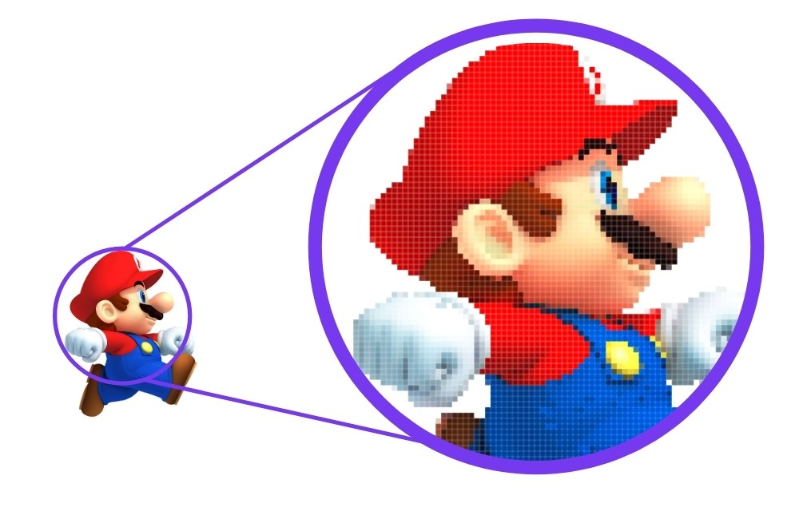
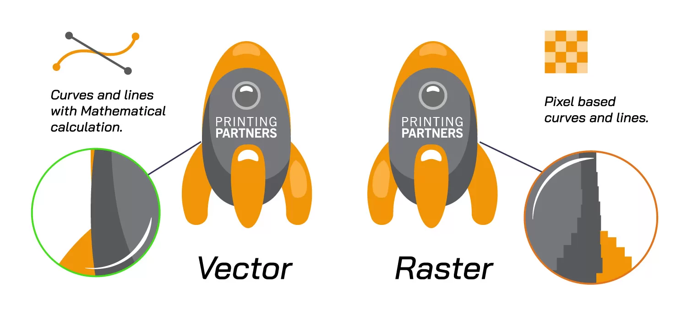

# Images

- There are different types of digital graphics used for representing visual content on screens, in print, and in various media.
- They differ in how they store and render images.

## Raster Images

- AKA bitmap images.
- Made up of a grid of pixels arranged to form the complete image within a canvas.
- The image's quality depends on the number of pixels (resolution).
- Common Formats: `jpeg`, `png`, `gif`, `bmp`, `tiff`.
- These images loss quality if you zoom in too much. We usually say image is pixelated:

  There is not enough information about what computer should do with the new pixels when we zoomed in.

  

## Vector Images

- Made up of mathematical paths (lines, shapes, curves) rather than pixels.
- Basically we are giving computer instruction on how to draw it. Thus when we increase the size of canvas it still knows what it should do.
- Can be scaled to any size without losing quality.
- Common Formats: `svg`, `ai`, `eps`, `pdf`.

### [`svg`](https://svgwg.org/svg2-draft/struct.html#NewDocument)

- `svg` element is the canvas for drawing.
- Category: embedded content, phrasing content, flow content, and palpable content.
- [HTML spec](https://html.spec.whatwg.org/multipage/embedded-content-other.html#svg-0).
- [MDN doc](https://developer.mozilla.org/en-US/docs/Web/SVG/Element/svg).
- You can use online tools such as [editor.method](https://editor.method.ac/) to draw your own vector images.

## Raster Image VS Vector Image

## YouTube & Aparat

- https://youtu.be/LppEex0ACzM
- https://aparat.com/v/ezv35b0
