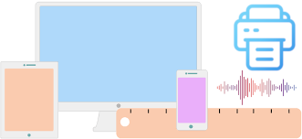
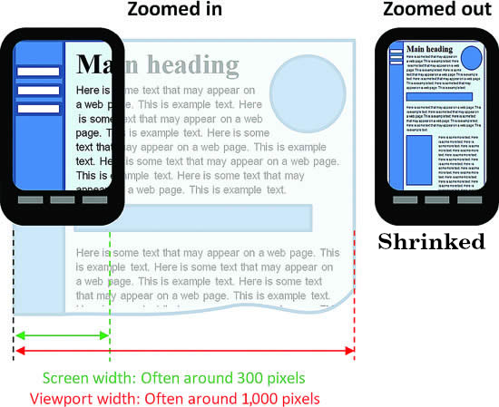

# Responsive web pages

Our web page might be opened on a cellphone, tablet, desktop computer, laptop, or a very big screen. That's where CSS shines with media queries.

## Media

- A means by which something is communicated or expressed.
- In web development we usually are talking about communicating an HTML document through a screen, printed on a paper, spoken out loud with a braille device, etc.

  

- UA is aware of which kind of media is user using to receive the HTML document.

## [Media queries in CSS](https://drafts.csswg.org/mediaqueries/)

Now that browser knows what kind of device user is using we can utilize this to present our HTML document differently.

### `media` attribute on `link` element

CSS file will be applied only if the document is being printed:

```html
<link href="./stylesheet.css" rel="stylesheet" media="print" />
```

This attribute's default value is `all`. Learn more about [Media queries on HTML spec](https://html.spec.whatwg.org/multipage/semantics.html#attr-link-media).

### [`@import`](https://drafts.csswg.org/css-cascade-5/#at-import)

- It is one of the at-rules.

```css
@import "./file.css" screen;
```

### [`@media`](https://drafts.csswg.org/css-conditional-3/#at-media)

- Instead of having separate CSS files you can add the to your main CSS file.
- [A very simple example](./a.html), try to comment and uncomment the media query at-rules.
- Another common use of media queries is adjusting css rules based on the size of the screen.
- You can see a complete list of different media query types [here](https://drafts.csswg.org/mediaqueries-4/#media-types).

#### [`<meta name="viewport" content="width=device-width, initial-scale=1" />`](https://html.spec.whatwg.org/multipage/semantics.html#the-meta-element)

- Category: Metadata content.
- Context in which it can be used: the `name` attribute is present, therefore where metadata content is expected.
- Content model: Nothing.
- It represents document-level metadata with the `name` attribute.
- Document metadata is expressed in terms of name-value pairs:
  1. `name` attribute on the meta element giving the _name_ (see complete list of valid names [here](https://html.spec.whatwg.org/multipage/semantics.html#standard-metadata-names) and [here](https://html.spec.whatwg.org/multipage/semantics.html#other-metadata-names)).
  2. `content` attribute on the same element giving the _value_.

> [!NOTE]
>
> Viewport is the area of the window in which web content can be seen.

- [Viewport `meta` element](https://drafts.csswg.org/css-viewport/#viewport-meta):
  - Recognized properties:
    - `width`: controls the (minimum) size of the viewport.
    - `height`: controls the (minimum) size of the viewport.
    - `initial-scale`:
      - Controls the zoom level when the page is first loaded.
      - Minimum: 0.1.
      - Maximum: 10.
      - Default: 1.
      - Negative values are ignored.
    - `minimum-scale`.
    - `maximum-scale`.
    - `user-scalable`.
    - `interactive-widget`.

> [!IMPORTANT]
>
> Mobile devices and other narrow screens, render pages in a virtual window or viewport, which is usually wider than the actual screen (your mobile's screen width). Then it shrinks the rendered result down (zoom out) so it can all be seen at once.
>
> This is good when you've not spend time on making your web page mobile-friendly. But if you did, this will get in your way. So we add this tag to our HTML document in order to tell the UA that it does not need to do the shrinking.



### Media features

- Add more details to a media query. Things like device width.

> [!NOTE]
>
> Breakpoint: It is the width at which we wanna change our approach.

#### `max-width`

- Apply CSS rules when the device width is less than the passed value.

  ```css
  @media screen and (max-width: 780px) {
    /* ... */
  }
  ```

> [!TIP]
>
> I also have a hard time to understand when I am using `max-width` what does it do. Therefore I prefer to use this CSS directive:
>
> ```css
> @media screen and (width <= 780px) {
>   /* … */
> }
> ```
>
> We call this syntax a range context. You can learn more about it [here](https://drafts.csswg.org/mediaqueries-4/#mq-range-context).

#### `min-width`

- UA will use it when the device width is at least that much.

  ```css
  @media screen and (min-width: 1900px) {
    /* ... */
  }
  ```

> [!TIP]
>
> I also have a hard time to understand when I am using `min-width` what does it do. Therefore I prefer to use this CSS directive:
>
> ```css
> @media screen and (width >= 1900px) {
>   /* … */
> }
> ```
>
> We call this syntax a range context. You can learn more about it [here](https://drafts.csswg.org/mediaqueries-4/#mq-range-context).

#### Adding multiple media features for a media query

```css
@media screen and (min-width: 30em) and (max-width: 50em) {
  /* … */
}
```

Or a much more readable version:

```css
@media screen and (30em <= width <= 50em) {
  /* … */
}
```

### Resume

- Where I find the ascii code for "downwards arrow with tip rightwards": https://www.compart.com/en/unicode.

## Mobile first

We kinda shift our mindset from focusing on mobile and then from there we will try to adjust our CSS to render a better UI for the users who will open our web page on a larger screen, e.g. a PC.

> [!TIP]
>
> Think of this approach that you'll use media queries for larger screens and by default you tend to build a web page that will be rendered beautifully on a mobile device.

## Responsive images

- You can use `srcset` attribute in you img element in order to tell UA to render images based on screen size.
- You can find more info [here](https://developer.mozilla.org/en-US/docs/Learn/HTML/Multimedia_and_embedding/Responsive_images).
- But it is not always mandatory to do this unless your project needs it.

## Printing a web page

- Most of the times you need to apply some styles for print media query. Like when you have a dark mode web app. Browser will not do a good job at making it look good.
- Then other thing is that you might wanna ignore some parts of your web page when printing.

# YouTube & Aparat

- https://youtu.be/qxR81-vuxQg
- https://aparat.com/v/kniowe0
