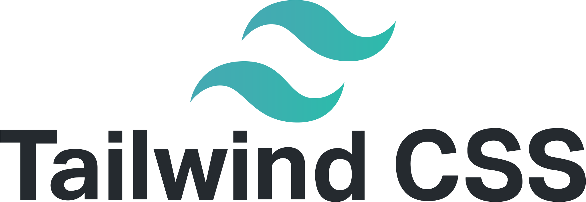

# 

- Utility first framework.
- Good for large teams building a web application.

# 

- A bunch of UI tools/components.

#  [Bootstrap](https://getbootstrap.com/)

- Someone else's CSS.
- First important thing, do not use their examples purely as they are. They are using `div`s and `span`s due to the fact that they do not have any meaning, and they are in no position to be opinionated about it. I mean how they can be, it is a document you're marking it up. So you know better which element makes the most sense.
- But as a good HTML author we know that we should use appropriate HTML elements.

> [!TIP]
>
> These are just tools, do not learn from them how to markup your document with HTML.
>
> And first learn how CSS works and then it is fine to use a utility first framework like tailwindcss.

# YouTube & Aparat

- https://youtu.be/40C8qfCZCz4
- https://aparat.com/v/dgn79to
