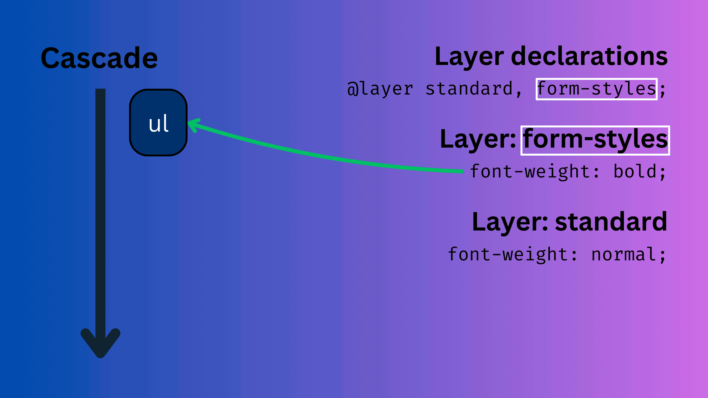
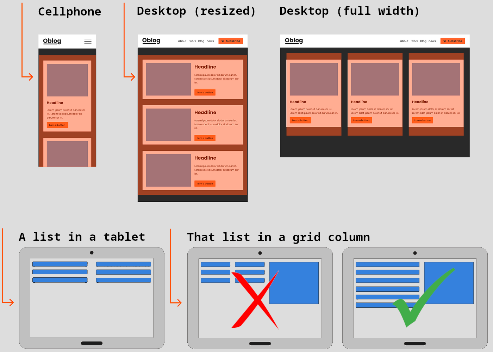

# [CSS Nesting](https://drafts.csswg.org/css-nesting-1/)

- No new features.
- Increases readability, modularity, and maintainability.
- Related styles can be aggregated; put together.
- Introduces new [_Parser_](../05-the-browser-and-the-dom/README.md#parser) rules; new way of writing CSS rules.
- Is possible through tools like SASS, Less, or other CSS preprocessors. A preprocessor would convert things that ain't supported in CSS to something that is.

```css
section {
  display: flex;
  flex-wrap: wrap;

  header {
    flex: 0 0 100%;
  }
}
```

## [Nesting selector](https://drafts.csswg.org/css-nesting-1/#nest-selector)

- `&`.
- It refers to the parent element.

These are equivalent:

```css
p {
  > span {
  }
  & > span {
  }
}
```

## Space matters

These are different:

```css
p {
  :hover {
    color: red;
  }
  &:hover {
    color: green;
  }
}
```

> [!NOTE]
>
> Here we are using the descendent selector implicitly!
>
> ```css
> p {
>   .author-name {
>     color: red;
>   }
> }
> ```
>
> Is equivalent to
>
> ```css
> p {
>   & .author-name {
>     color: red;
>   }
> }
> ```

So in case you do not wanna use descendent selector you can use nesting selector:

```css
.card {
  a {
    color: white;
    transition: all 1s ease-in 0s;

    &:hover {
      color: blue;
    }
  }
}
```

## Media query nesting

- You can also nest media queries.

  ```css
  .recommendation {
    inline-size: 50%;

    @media screen {
      @media (max-width: 780px) {
        inline-size: 100%;
      }
      @media (min-width: 1200px) {
        inline-size: 30%;
      }
    }
  }
  ```

  Note that the `inline-size` will be applied to an element with the `recommendation` class.

- It is not mandatory to nest media queries:

  ```css
  section {
    inline-size: 700px;

    @media screen and (300px <= width <= 500) {
      inline-size: 100vw;
    }
  }
  ```

> [!NOTE]
>
> Yes, we are repeating the media query part but the upside really out weight the downside.

# YouTube & Aparat

- https://youtu.be/XBeu2bUDQOY
- https://aparat.com/v/mce803i

# [`@layer`](https://drafts.csswg.org/css-cascade-5/#layering)

## Issue

The [original cascade](../09-cascade/README.md#cascade) relies heavily on heuristics (an educated-guess or assumption built into the code) rather than providing **direct and explicit control** to web authors. Selector specificity, e.g. is based on the assumption that more narrowly targeted styles (`id`s) are likely more important than more generic and reusable styles (classes and attributes).

> [!TIP]
>
> In short, how specific the selector is.

Assume we have have these CSS declaration blocks:

```css
.overly#powerful .framework.widget {
  color: maroon;
}

/* add some IDs to this ??? */
.my-single_class {
  color: rebeccapurple; /* add !important ??? */
}
```

## Solution: cascade layers provide control

- A structured way to organize and balance concerns within a single origin.
- Styles for a specific component, theme, or overrides can be grouped into distinct layers.
- Each layer will work in that origin. No need to concern yourself with other origins.
- Rules defined in a particular layer follow the normal cascading behavior, but they do not mix with rules from other layers.

> [!TIP]
>
> Spec says that "Cascade layers (like declarations) are sorted by order of appearance". This means that the later they are defined the higher their priority.

- You can also reorder and specify which layer overrides who.

  You can see this phenomena [here](./c.html) where we are telling UA which layer takes precedence over whom. Note that when we've defined the same layer name twice UA will merge them. So that is why we can define the same layer name more than once. Lastly, when you define a bunch of layers separated by comma. UA will override CSS properties defined in layers that comes later. Just try to comment and uncomment the `@layer second-layer, first-layer;`.

  When you comment it, UA will follow the normal order of appearance rule, as such the height of your input will become `200px`.

> [!IMPORTANT]
>
> CSS declaration blocks outside of any layer will takes precedence over all other layers. In [this example](./b.html) even though the specificity of the styles defined inside the layer is higher and also they appear later, UA will choose styles defined inside the "implicit outer layer".
>
> **Note**: if you're touching a CSS property that is not defined in the "implicit outer layer" then UA will apply styles defined in the layer, like `background-color`. But if you uncomment the `background-color` style inside the "implicit outer layer" then UA will apply that one.

- Can be defined through:

  | `@import`                                  | `@layer` with styles | `@layer` without style |
  | ------------------------------------------ | -------------------- | ---------------------- |
  | `@import url(./file.css) layer(LayerName)` | [Example](./b.html)  | `@layer someLayer;`    |

- You can have as many as anonymous layers, and they will be all treated separately:

  ```css
  @layer {
  }
  @layer {
  }
  @layer {
  }
  ```

- We said that UA will merge layers with the same name, but it will specify its order of appearance based on the very first time that it was defined, in the following example `section`'s `inline-size` will be `300px` and not `100px`:

  ```css
  @layer l1 {
    section {
      inline-size: 50px;
    }
  }
  @layer l2 {
    section {
      inline-size: 200px;
    }
  }
  @layer l3 {
    section {
      inline-size: 300px;
    }
  }
  @layer l1 {
    section {
      inline-size: 100px;
    }
  }
  ```

  You can see what will happens when `l1` merges [here](./d.html).

- Layers can be nested and they will not be merged with the layers with the same name outside:

  ```css
  @layer posts {
    @layer picture {
      /* Will not be combined with the picture layer that is defined outside of posts layer. */
    }
  }
  @layer picture {
    /* A new layer. */
  }
  ```

- You can access the nested layers like this, here styles defined in "posts.picture" will override the ones defined in "picture" layer:

  ```css
  @layer picture, posts.picture;

  @layer posts {
    @layer picture {
    }
  }
  @layer picture {
  }
  ```

## Cascade with `@layer`

Specificity is still applied to conflicts within each layer, but conflicts between layers are always resolved by using the higher-priority layer styles. Layers are ordered and grouped so that they don’t escalate in the same way that specificity and `!important` can.



## Use cases

When ever you need full control over which styles take priority in a project without relying on specificity hacks or `!important`, times like:

- Theming.
- Organizing CSS across teams.
- Dealing with CSS styles that others wrote.

# YouTube & Aparat

- https://youtu.be/lTqJ5e1_8PY
- https://aparat.com/v/kwj0rwd

# [`@container`](https://drafts.csswg.org/css-conditional-5/#container-queries)

- When we are thinking about layout most of the times it is all about viewport (i.e. we use [`@media`](../24-responsiveness/README.md)).
- But what if viewport does not change but rather the browser size (like when you resize the size of your browser window in your OS, or when you put that element next to another element in a grid or flexbox element).

  

  Here we need to adjust our layout according to the width of its container and not the width of browser window. **Container gets larger/smaller**.

- You can see how it works [here](./components/subscribe/subscribe.component.html).

> [!TIP]
>
> If you wanna define the size of some CSS property relative to the size of the container you can use [`cq*` units](https://drafts.csswg.org/css-conditional-5/#container-lengths). There are a bunch of them:
>
> | unit    | relative to                              |
> | ------- | ---------------------------------------- |
> | `cqw`   | 1% of a query container’s `width`.       |
> | `cqh`   | 1% of a query container’s `height`.      |
> | `cqi`   | 1% of a query container’s `inline-size`. |
> | `cqb`   | 1% of a query container’s `block-size`.  |
> | `cqmin` | The smaller value of `cqi` or `cqb`      |
> | `cqmax` | The larger value of `cqi` or `cqb`       |

## Containers can't be sized by their contents

- `container-type: inline-size` applies various types of 'containment' to the element, including `inline-size` containment ([ref](https://drafts.csswg.org/css-contain-1/#containment-size)). This has the following effects:
  1. The intrinsic size[^1]s of the size containment box are determined as if the element had no content, following the same logic as when sizing as if empty.
  2. Cannot use `min-content` or `max-content` keywords.
- Size containment 'turns off' the ability for an element to get size information from its contents. Important for container queries, since it breaks the 'infinite loop' where a container query changes the content size, which changes the query, which changes…

&mdash; [Stackoverflow Q&A](https://stackoverflow.com/a/73980194/8784518);

## Practice time

- Try to implement these examples: https://lab.ishadeed.com/container-queries/
- [Button component](./components/button/button.component.html).
  - Picked the color name from [this website](https://www.schemecolor.com/).
- And [These ones](https://css-tricks.com/css-container-queries/#aa-demos).

## YouTube & Aparat

- https://youtu.be/pn8LqOhh3Yc
- https://aparat.com/v/wlejj5g

# Footnotes

[^1]: A max-content size or min-content size, i.e. a size arising primarily from the size of the content.
