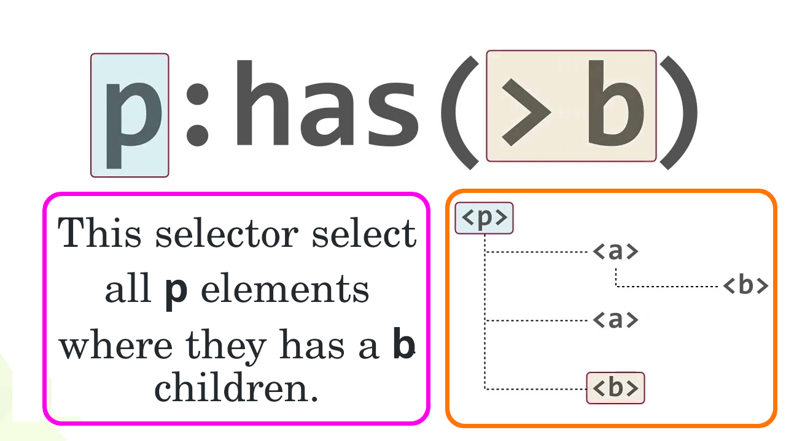
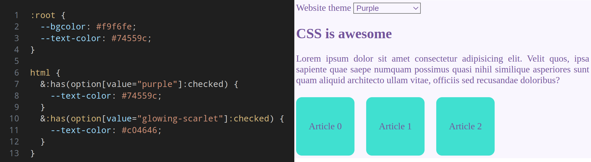

# [`:has`](https://drafts.csswg.org/selectors/#relational)

- It is a relational pseudo-class.
- Pseudo: something that is not real.

> [!IMPORTANT]
>
> Pseudo-class: something that your HTML doc does not convey directly. Take for instance the `:first-child` pseudo-class.
>
> **BUT** now we need to revise it a bit:
>
> It selects an element based on its state + its children's state or sibling's state.



- [One fun example](./color-picker/color-picker.html):

  

## Use cases

- [Select elements based on their children's state](./resume/resume.css).

  ```css
  &:has(input:focus, select:focus, textarea:focus) {
    border-inline-start: 2px solid gray;
    padding-inline-start: 1rem;
  }
  ```

- [Select elements based on their sibling's state](./resume/resume.css).

  ```css
  .form-label {
    &:has(~ input:focus, ~ .select-wrapper > select:focus, ~ textarea:focus) {
      font-weight: 900;
    }
  }
  ```

## Practice time

- [Using `:has()` as a CSS Parent Selector and much more](https://webkit.org/blog/13096/css-has-pseudo-class/).
- [More Real-World Uses for `:has()`](https://css-tricks.com/more-real-world-uses-for-has/).

### Practice `transform`

- https://github.com/Satyam4229/3d-Cube/tree/main
- https://www.w3schools.com/cssref/tryit.php?filename=trycss_anim_transform
- `text-shadow`.
- `box-shadow`.
- css transform `skew`.
- css transform `translate`.
- css transform `rotate`.
- css transform `scale`.

# YouTue & Aparat

- https://youtu.be/TQk0Xfo844s
- https://aparat.com/v/rjxxpj6
