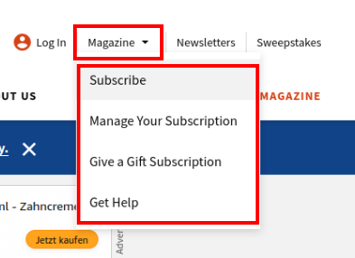

# Fun facts

## `menu` or `nav`

I was about to mark up the part that I draw a red rectangle around it with `menu` element but then I read the HTML spec and learned that it was not proper to use menu for that purpose.

> The menu element represents a toolbar consisting of its contents... ([ref](https://html.spec.whatwg.org/multipage/grouping-content.html#the-menu-element))


## `select` or `ul`

I was really puzzled by this, for a while I was thinking what should I do. So I asked ChatGPT and continued my search on Google. Then I found this content in [W3school](https://www.w3schools.com/howto/howto_js_dropdown.asp) on how to create a clickable dropdown. The only change that I made is that instead of `div` (element of last resort) I used `ul` to give it more meaning.



## Breadcrumb

I noticed something, previously I used `ul` instead of `ol` while now that I put it perspective I believe it should be marked up with ol. Because the order matters.

## `section`

I was confused at the time I was trying to markup the following part since I did think we can use `section` only when we wanna define a header for it (in other word it'll be listed in the outline). So that's when I read the HTML spec and learned that it is not a section. So I decided to wrap it with with a `div`.


## Advertisements or ads

I noticed that I was mistakenly using `section` element for advertisements. While the appropriate element is either an `iframe` tag ([ref](https://html.spec.whatwg.org/multipage/iframe-embed-object.html#the-iframe-element)), or `div` element. Read more:

- [Stackoverflow Q&A](https://stackoverflow.com/q/11002621/8784518)
- [Stackoverflow comment](https://stackoverflow.com/questions/14384431/html-element-for-ad/14405396#comment138856933_14405396)


## How to add icons?

There is a very fascinating discussion on [here](https://stackoverflow.com/a/25084573/8784518). And I jot down what I think is correct here.

### Why not `i`

> ... a span of text in an alternate voice or mood ... ([ref](https://html.spec.whatwg.org/multipage/text-level-semantics.html#the-i-element))

1. It is clearly stating it should be a text. Not empty string.
2. Alternate voice or mood, and I do not believe it fits that description either.
3. Just because majority of technologies are using something does not mean anything. We know that majority of people were using IE at some point. And same goes for **abusing** the `table` element to layout a web page.
4. Saying `i` stands for icon does not even worth arguing.

### Why not `img`

Though `img` as it's semantic is aligned with icons, and `alt` attribute can give it even more meaning. But,

1. We should not also use `img` because even empty `src` attribute sends a request to server ([learn more](https://humanwhocodes.com/blog/2009/11/30/empty-image-src-can-destroy-your-site/)).
2. This is what Google has to say on the matter, but the fact that at some point we were employing techniques like [CSS Sprites (not used anymore)](https://alistapart.com/article/sprites/) makes it clear that we wanna avoid having unnecessary images as much as possible:

   > Consider using CSS instead of images where possible.

   \- [Ref](https://developers.google.com/speed/docs/insights/PrioritizeVisibleContent)

### Why `span`

1. `span` has no meaning in itself.
2. The way that span adds the icon is exactly same as `i`.

#### We only wanna put an icon inside an `a` tag or a `button`

Inside the `a`/`button` we only have the icon (no text), thus `span`s _role_ is _img_.

```html
<a href="#">
  <span class="icon-fb" role="img" aria-label="facebook"></span>
</a>
```

#### We have text and icons next to each other

Since icon is used in a `button`/`a` along with text, then _role_ is presentation.

```html
<button type="button">
  Share
  <span class="icon-share" role="presentation" aria-label="Share"></span>
</button>
```

## Rating radio buttons

I found [this resource](https://www.w3.org/WAI/ARIA/apg/patterns/radio/examples/radio-rating/) regarding having accessible rating component but it is also stating that it is not the production ready code. But in general I think it is a good example and a good starting point.

And [this stackoverflow Q&A](https://stackoverflow.com/q/22569961/8784518). Although I change the `i` to span.

# Accessibility

If you're interested in accessibility, particularly _focus_, I highly recommend [this](https://www.youtube.com/watch?v=EFv9ubbZLKw) YouTube video. And after that take a look at `tabindex` [here](https://www.youtube.com/watch?v=Pe0Ce1WtnUM), explained in plain English by the same person.
