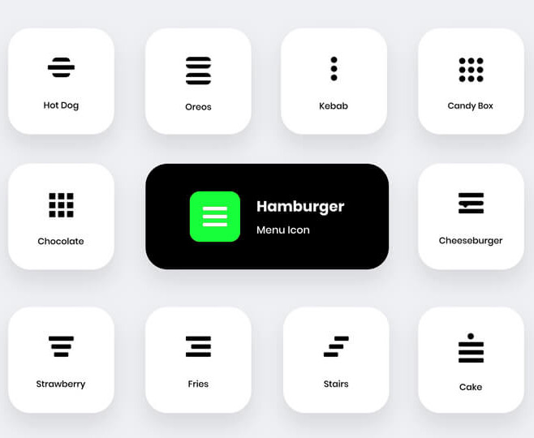

# Notes

The first thing I noticed when I started to markup the header section was that I did not know that what is the name of the type of icon they are using for their menu.



Then I started to dig into how should I properly use the `datetime` attribute for `time` element.

After that I reconsidered how I was sectioning my document. Instead of calling each post a section I believe they are closer to the definition of `article` element.

In the footer I have two thing in mind:

1. The `p` could contain normal text and we can change how it is presented via CSS,
2. Use `nav` element in the footer or you can remove it. In fact I think we could do something like this even:
   ```html
   <p>
     <a href="#">SITE MAP</a>
     <a href="#">PRIVACY POLICY</a>
     <a href="#">ABOUT US</a>
     <a href="#">EDITORIAL POLICY</a>
     <a href="#">TERMS OF USE</a>
     <a href="#">PRIVACY SETTINGS</a>
   </p>
   ```
