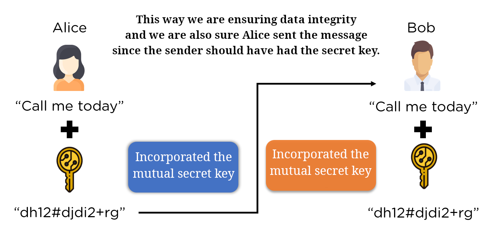

# What is SSL? What is TLS?

So let's start with the Internet; Internet usually is depicted as cloud. But Internet at its core is just a bunch of routers. And routers are owned by different ISPs[^1]. And our data travels from one side to another side by going though these routers.


As it is clear the moment you send your _packet_ (data) to the server and it goes through different routers (managed by those ISPs) you are no longer in control of what will happen to your data.

Assume you're sending a HTTP GET request to the https://www.dr-chuck.com/page1.htm:

```cmd
GET /page1.htm HTTP/1.1
Host: www.dr-chuck.com
```

Then a copy of this file is transferred back to you via HTTP as the response.

So what's the problem? It is simle, **no encryption**. Just **plain text**. So anyone between us could just look at what we are sending back and forth. And just remember last time that you entered your bank information to purchase something on the internet.


## TLS

Now our hero comes into the scene and perform their role. TLS creates a secure tunnel for us to connect to something else. And through this tunnel client and server can communicate safely. This is what we call it HTTPS.

### HTTPS

It is our HTTP + our secure tunnel. So when we are sending data across the internet via HTTP, and protect it from being accessed along the way with TLS.

Note that there are many more use cases for TLS and HTTPS is only one them.

### TLS vs SSL

- SSL: Secure Socket Layer
- TLS: Transport Layer Security

SSL was created, developed, and maintained by Netscape, but when IETF took over they renamed it to TLS. So we can use them interchangeably.

## How TLS protects data

So like we said, we are sending data over network to the server and we do not wanna anybody else except server knows **what is in the packet**.


> [!NOTE]
>
> We have not said something like preventing it from being captured. But rather we are not concerned about that. We are more concerned about who can see what is being transferred in plain text.

To that end TLS promise 3 thing:

- Confidentiality: Client and server only can make sense of what the message.
- Integrity: It allow us to detect any data modification. So that the client and server are sure that data was send by the other party.
- Authentication: Client and server are able to know the other party is who they claim to be.

And to do so we have 3 different cryptographic functions for each.


### Anti-Replay & Non-Repudiation

Often when we talk about confidentiality, integrity, and authentication we'll see these two terms too.

#### Anti-Replay

Assume a bank wants to inform HQ about that days transactions. Now that we have TLS we know attacker cannot:

1. pretend to be us because of authentication.
2. read transactions because of confidentiality.
3. tamper with our messages because of integrity.

But what if...


So here is how TLS solves the issue.

1. On the sender's side TLS adds a sequence number to each packet.
   - This number is usually incremented by each new packet.
   - This sequence number is a builtin feature of **Integrity** and **Authentication**.
2. Receiver receives packets and keep track of received packets.

#### Non-Repudiation

What does "repudiate" mean in general?

> To refuse to accept something or someone as true, good, or reasonable.

\- [Ref](https://dictionary.cambridge.org/dictionary/english/repudiate)

So the problems lies with having a criminal client :joy:. Let's imagine that your dishonest client sent your a packet, containing some evidences against their criminal actions. Then they might wanna deny sending it.

But TLS makes it impossible. In fact it is the result of Authentication and Integrity aspects of TLS.

### Key players

> [!TIP]
>
> You might come from various backgrounds, like myself who is a web developer. And the formal definitions provided here won't contradict the previous ones. Or at least that's the case for me. So when we say client and server you can still keep you mental model intact and only patch it to be more accurate, holistic, and inclusive.

In TLS we have 3 roles:

- Client:
  - They are the ones who initiate the TLS handshake.
  - E.g. google chrome, IoT devices, openssl, etc.
  - They might be authenticated.
- Server:
  - They are the ones receiving TLS handshake.
  - E.g. Nginx, Load balancer, etc.
  - They are always authenticated.
- Certification Authority (CA)


> [!NOTE]
>
> When you login to your online banking app by sending your username/password you're authenticating yourself. But as far as TLS is concerned you're still unauthenticated. That's where mechanisms like mutual authentication comes into picture.

So far we clarified who is client and who would be server. But we mentioned that server needs to provide some sort of certificate in order to prove its identity. Here is where CA plays its part in TLS protocol.

#### CA

- It issues certificates
- It is trusted by both client & server.
- It is trust anchor: client does not trust whatever server says but they trust CA. Thus they trust servers.
- 98% of the internet is secured by:

  

  \- [Ref](https://w3techs.com/technologies/overview/ssl_certificate)

[^1]: Internet Service Provider

# TLS version

We have different versions of TLS and each version is supported on different web servers. We can find out who is using which version of TLS and a lot more, learn more [here](https://www.ssllabs.com/ssl-pulse/).


We can have a website that supports different versions. So why bother choosing different versions? Because your users might be using a lower TLS version.

But in general most of the time you either need to get TLS version 1.2 or 1.3.

# Hashing

- An algorithm
- takes an input (message) of arbitrary (any) length.
- return a "finger" (representational sample) print of the original message.
  - We call it:
    - Digest.
    - Checksum.
    - Fingerprint.
    - Hash.
    - CRC.
    - and a few other names.

## Purpose of hashing algorithm

To realize that two message are the same. In other word, **ensuring data integrity**.

## Hashing algorithm requirements

- Infeasible to produce a given digest.
- Impossible to extract original message.

  - Hashing is one way encryption.

    

- Small change to the original message produce a drastic change. aka avalanche effect:

  

- Digest's length should stay the same no matter the input.
  ```bash
  echo hi | md5sum
  # 764efa883dda1e11db47671c4a3bbd9e  -
  echo "hi this is supper long and long and long and more long and even more, so do not think they are the same length. I am very very very very very long" | md5sum
  # bd3477c29a4380d7c4413fef8786058b  -
  ```

## Collision

- Two message result same digest.
- It is not good.
- But it is unavoidable.
  - It is the byproduct of having a fixed length digest.
- Hashing algorithms with higher bit digest are considered securer.
  - Just because they may have less collisions.


## Hashing algorithms

| Algorithm name | More info   | Digest bit |
| -------------- | ----------- | ---------- |
| MD5            |             | 128 bits   |
| SHA/SHA1       |             | 160 bits   |
| SHA-224        | SHA2 family | 224 bits   |
| SHA-256        | SHA2 family | 256 bits   |
| SHA-384        | SHA2 family | 384 bits   |
| SHA-512        | SHA2 family | 512 bits   |

# Data Integrity

We are making sure that we have data integrity with hashing.


## Why we need mutual secret key

1. Client produces a digest from the message.
2. Client sends the digest alongside the message to the server.
3. Server runs the hash function on the message.
4. Server compares the calculated digest with what was attached to the message.

### Now what's the issue?

Attacker can simply change both the digest and the message;

0. Intercept the message.
1. Change the message.
2. Calculate the digest of the modified message.
3. Send the modified version of the message alongside the new digest to the server.

## Message Authentication Code (MAC)

So to solve the issue we've had we came up with the idea of having a mutual secret key and incorporating it when we are producing the hash.



> [!NOTE]
>
> Sender and receiver should not only share this key in a secure way. but also to agree how to combine it with the message (e.g. `message + mutualSecretKey` or `mutualSecretKey + message`).
>
> And for this very reason we have HMAC standard. It stands for Hash Based Message Authentication Code and is defined in the [RFC 2104](https://datatracker.ietf.org/doc/html/rfc2104)

## Data Integrity

|                     | Hashing        | MAC                  |
| ------------------- | -------------- | -------------------- |
| **Input**           | message        | message + secret key |
| **Output**          | digest         | digest               |
| **Implementations** | MD5, SHA1, etc | HMAC                 |

# Encryption

- Addresses confidentiality.
  - Only the intended recipient can interpret the message.

## Simple encryption

It is transforming the plain text into something else.


### Issues with simple encryption

If I wanna send the same message to another user

- Either I should use same method to encrypt my message which means same message same encrypted data. My recipients can decipher each others message. Bad idea :x:.
- Either I should use different method to encrypt my message which means same message different encrypted data but at the cost of coming up with new methods for each recipient.
  - Cannot scale (proper encryption algorithms are hard to come up with).
  - Cannot do it securely (it is just scrambling text).
  - Cannot use publicly known algorithms (then everyone knows how to decrypt it).

## Key based encryption

A vetted (appraised) encryption algorithm + a secret key.


- I can use a battle tested encryption algorithm.
- And I can just generate numerous secret keys to send data to numerous recipients.

### Symmetric encryption

Encrypt and decrypt using the same key.


### Asymmetric encryption

Encrypt and decrypt using the different keys.

- It is a two direction street; I can encrypt with either keys and decrypt with the other one.
  - They are related mathematically.
- Now we can expose one of them publicly (public key).
- And keep the other one to ourselves privately (private key).


### Comparison

|                          | Symmetric encryption                       | Asymmetric encryption                    |
| ------------------------ | ------------------------------------------ | ---------------------------------------- |
| Speed                    | Faster.                                    | Slower.                                  |
| Length of generated text | Approximately the same size as plain text. | Cipher text expansion.                   |
| Secret keys              | Shared secret key.                         | Private/Public key.                      |
| Algorithms               | 3DES, AES, ChaCha20                        | DSA, RSA, Diffie-Hellman, ECDSA, ECDH    |
| Key sizes                | ChaCha20: **128** or **256** bit keys      | RSA: recommended key size: **2048** bits |
| Ideal for                | Bulk data                                  | Limited data                             |

https://youtu.be/_zyKvPvh808?si=jw9Ho_BZ4FIH7yX7

Maybe watch it if needed:

- https://www.youtube.com/watch?v=cuR05y_2Gxc
- https://www.youtube.com/watch?v=ZM3tXhPV8v0
